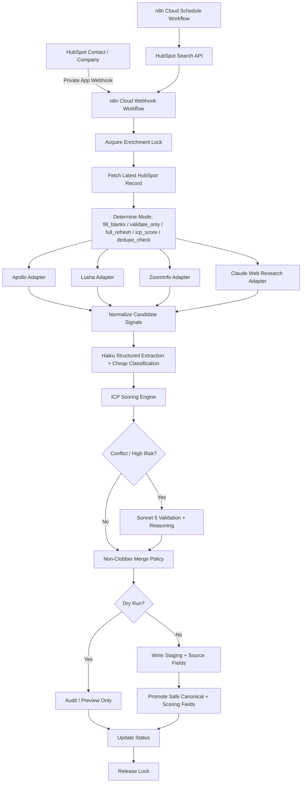

# HubSpot Sales Hub Pro → n8n Cloud Waterfall Enrichment + ICP Scoring System

## 0. Executive Summary

Build a HubSpot Sales Hub Pro-compatible enrichment and ICP-scoring system that:

- Allows on-demand enrichment of HubSpot contacts and companies.
- Uses HubSpot private-app webhooks where available.
- Uses n8n Cloud as the orchestration layer.
- Uses Anthropic Haiku for cheap classification and structure extraction.
- Uses Claude web-research workflows where provider data is insufficient.
- Escalates to Sonnet 5 for conflict resolution, validation, and reasoning-heavy arbitration.
- Waterfalls across ZoomInfo, Apollo, Lusha, and optional Claude web research.
- Writes source-specific enrichment fields before updating canonical CRM fields.
- Computes ICP fit score, ICP tier, and anti-ICP flags.
- Prevents clobbering of manually maintained or higher-confidence HubSpot properties.
- Provides scheduled cleanup, dedupe, pruning, retry, reconciliation, and stale-data refresh.
- Starts with a local-first MVP using mock providers, mock web-research results, and optional HubSpot test records.

This implementation assumes:

- HubSpot plan: Sales Hub Professional.
- No HubSpot Data Hub / Operations Hub programmable automation.
- n8n: paid cloud-hosted instance, not self-hosted.
- LLMs:
  - Haiku for low-cost classification, normalization, structured extraction.
  - Sonnet 5 for validation, conflict reasoning, and higher-risk field arbitration.
  - Optional web-enabled Claude research step via an external research/orchestrator endpoint.
- CRM source of truth: HubSpot.
- Runtime orchestration: n8n Cloud.
- Durable audit/state: HubSpot custom properties first, optional external DB later.

---

## 1. Critical Platform Constraints

### 1.1 Sales Hub Pro-compatible design

Sales Hub Pro should be used as:

- CRM system of record.
- Control plane via custom properties.
- Event source via private-app webhooks.
- Destination for enrichment results.
- Audit and review surface via properties, notes, views, and lists.

### 1.2 Avoid these HubSpot dependencies

Do not rely on:

- HubSpot workflow "Send webhook" action.
- HubSpot workflow custom-code actions.
- HubSpot Data Hub data-formatting actions.
- HubSpot programmable automation.
- HubSpot-native waterfall enrichment logic.

All complex orchestration, classification, enrichment, and scoring logic belongs outside HubSpot in n8n or a small decision service.

### 1.3 Chosen pattern

| Layer                 | Responsibility                                                                       |
| --------------------- | ------------------------------------------------------------------------------------ |
| HubSpot               | CRM records, custom properties, manual trigger flags, scoring outputs, review queues |
| HubSpot private app   | API token, scopes, private-app webhook subscriptions                                 |
| n8n Cloud             | Webhook receiver, schedules, provider waterfall, retry, routing, writeback           |
| Haiku                 | Cheap structured classification, field extraction, scoring support                   |
| Sonnet 5              | Conflict validation, reasoning-heavy decisions, high-risk arbitration                |
| Claude web research   | Website/news/source research where provider data is incomplete                       |
| ZoomInfo/Apollo/Lusha | Contact/company enrichment and firmographic/provider signals                         |
| Optional local MVP    | Mock providers, mock research, dry-run HubSpot PATCH payloads                        |

---

# 2. Target Architecture



---

# 3. Implementation Phases

## Phase 0: Local-First MVP

Goal:

Prove that enrichment, source attribution, web-research classification, Sonnet validation, ICP scoring, and non-clobber writeback work before production webhooks.

Success criteria:

- Local script accepts a fake HubSpot contact/company payload.
- Mock ZoomInfo/Apollo/Lusha adapters return conflicting values.
- Mock Claude web research returns structured firmographic and ICP signals.
- Haiku produces structured extraction/classification JSON.
- Sonnet 5 validates conflicts only when required.
- Merge engine stages all provider/research values.
- ICP scoring engine computes:
  - `lv_icp_fit_score`
  - `lv_icp_tier`
  - `lv_anti_icp_flag`
  - score breakdown JSON
- Canonical fields are only promoted when policy allows.
- Source, confidence, timestamp, model, and evidence URL are stamped.
- Dry-run mode prints exact HubSpot PATCH payloads.
- Optional live mode writes only to test HubSpot records.

Recommended local project:

```text
hubspot-enrichment-icp-mvp/
  README.md
  .env.example
  requirements.txt
  main.py
  config/
    field_policy.yaml
    provider_priority.yaml
    icp_scoring.yaml
    escalation_policy.yaml
    source_registry.yaml
  src/
    hubspot_client.py
    providers.py
    web_research.py
    normalizer.py
    classifier_haiku.py
    validator_sonnet.py
    merge_policy.py
    icp_scoring.py
    validator.py
    audit.py
    schemas.py
  tests/
    test_merge_policy.py
    test_icp_scoring.py
    test_validator.py
    fixtures/
      company_current.json
      contact_current.json
      provider_zoominfo_company.json
      provider_apollo_company.json
      provider_lusha_company.json
      claude_web_research_company.json
```

---

# 4. HubSpot Data Model

## 4.0 As-built delta (verified live 2026-08-10) — READ BEFORE USING §4/§5 NAMES

The tables in §4 and §5 are the **original target design**. The portal and the deployed n8n
flows diverged from them. Verified by listing live HubSpot properties and reading the deployed
`n8n/wf_scheduled_maintenance_cloud.json`:

**Two naming conventions coexist, and both are correct in their own lane:**

| Lane | Convention | Example |
| --- | --- | --- |
| Live HubSpot portal + n8n Cloud flows | `lv_`-prefixed | `lv_enrichment_requested` |
| Local Python MVP (§11/§12 fixtures, `src/ingest.py`, `src/merge_policy.py`) | bare | `enrichment_requested` |

Every `enrichment_*` control property in the live portal carries the `lv_` prefix; **no bare
`enrichment_requested` / `enrichment_status` property exists in HubSpot at all.** Code examples
under §11–§12 (local MVP) legitimately use bare names and are left unchanged.

**Control properties that exist live** (companies): `lv_enrichment_requested`,
`lv_enrichment_status`, `lv_enrichment_needs_review`, `lv_enrichment_review_reason`,
`lv_enrichment_provenance`, `lv_enrichment_review_approved`,
`lv_enrichment_review_candidate_json`, `lv_enrichment_reviewed_at`, `lv_enrichment_reviewed_by`.

**Documented in §4 but never created:** `enrichment_mode`, `enrichment_priority`,
`enrichment_lock_until`, `last_enrichment_run_id`, `last_enriched_at`, `enrichment_confidence`,
`enrichment_error`, `enrichment_last_sources`, `enrichment_last_decision`.

**Documented in §5 but never created:** `lv_has_broadcast_or_streaming_signals`,
`lv_has_sports_media_fit`, `lv_cloud_fear_risk`, `lv_price_sensitivity_risk`,
`lv_icp_scored_at`, `lv_icp_scoring_version`, `lv_icp_confidence`, `lv_recommended_motion`,
`lv_named_account_priority`.

`lv_named_account_priority` stays roadmap-only: calculation formulas cannot read
enumerations on this portal -- D-20 reconfirmed live 2026-08-23 (quick 260823-ono CP1:
`string(<enum>)` parses but computes null once the enum has a value; 5 variants, evidence
in `260823-ono-PROBE-VERDICT.json`). Any operator-facing vocabulary that must drive a
formula has to be a number.

**`lv_named_account_score_floor` now exists live (created 2026-08-23, quick 260823-ono, CP2
surface 1).** A `number` company property. When set to `60` on a record, it floors that
record's `lv_icp_fit_score` at 60 in the calculated property's formula (`max(base, floor)`,
no cap on a base already above the floor). Blank/`0` = no override. Live on exactly 5
records as of this task: ATC `9605284724`, MRC `9604614548`, SSR `18756544344`, BRC
`9605284723`, Perth Racing `9604794662` -- all confirmed at score 60 / `lv_icp_tier_derived`
`B` by independent post-write poll. Mirrored in the Python oracle
(`src/icp_scoring.py`) only, deliberately not in n8n (§10's floor entry explains why).

Treat §4/§5 as the roadmap, not an inventory. Re-list the portal before writing to any property
named there.

## 4.1 Company control properties

Create these custom company properties.

| Property internal name       | Type                  | Example values                                                                        | Purpose                           |
| ---------------------------- | --------------------- | ------------------------------------------------------------------------------------- | --------------------------------- |
| `enrichment_requested`     | Boolean               | true/false                                                                            | User-controlled on-demand trigger |
| `enrichment_mode`          | Enumeration           | `fill_blanks`, `validate_only`, `full_refresh`, `icp_score`, `dedupe_check` | Controls workflow behavior        |
| `enrichment_status`        | Enumeration           | `queued`, `running`, `complete`, `failed`, `needs_review`, `skipped`      | Runtime status                    |
| `enrichment_priority`      | Enumeration           | `low`, `normal`, `high`                                                         | Batch prioritization              |
| `enrichment_lock_until`    | DateTime              | ISO timestamp                                                                         | Prevent overlapping runs          |
| `last_enrichment_run_id`   | Text                  | UUID                                                                                  | Idempotency and traceability      |
| `last_enriched_at`         | DateTime              | ISO timestamp                                                                         | Staleness detection               |
| `enrichment_confidence`    | Number                | 0-100                                                                                 | Aggregate confidence              |
| `enrichment_needs_review`  | Boolean               | true/false                                                                            | Human review flag                 |
| `enrichment_error`         | Multi-line text       | error summary                                                                         | Last failure                      |
| `enrichment_last_sources`  | Text / multi-checkbox | Apollo,Lusha,ZoomInfo,ClaudeWeb                                                       | Sources used                      |
| `enrichment_last_decision` | Multi-line text       | compact JSON                                                                          | Explanation of decisions          |
| `enrichment_review_reason` | Multi-line text       | conflict summary                                                                      | Why human review is needed        |

## 4.2 Contact control properties

Mirror the same control properties on contacts:

| Property internal name       | Type                  |
| ---------------------------- | --------------------- |
| `enrichment_requested`     | Boolean               |
| `enrichment_mode`          | Enumeration           |
| `enrichment_status`        | Enumeration           |
| `enrichment_priority`      | Enumeration           |
| `enrichment_lock_until`    | DateTime              |
| `last_enrichment_run_id`   | Text                  |
| `last_enriched_at`         | DateTime              |
| `enrichment_confidence`    | Number                |
| `enrichment_needs_review`  | Boolean               |
| `enrichment_error`         | Multi-line text       |
| `enrichment_last_sources`  | Text / multi-checkbox |
| `enrichment_last_decision` | Multi-line text       |
| `enrichment_review_reason` | Multi-line text       |

---

# 5. ICP-Specific HubSpot Properties

## 5.1 Company ICP input properties

These are first-class scoring inputs.

| Property internal name                    | Type                  | Values                                                                                                                                                                        | Owner                                     |
| ----------------------------------------- | --------------------- | ----------------------------------------------------------------------------------------------------------------------------------------------------------------------------- | ----------------------------------------- |
| `lv_org_type`                           | Enumeration           | `governing_body_league`, `content_producer`, `individual_club_team`, `broadcaster`, `gambling_operator`, `hardware_vendor`, `regulator`, `other`, `unknown` | Enrichment                                |
| `lv_produces_content`                   | Boolean               | true/false                                                                                                                                                                    | Enrichment                                |
| `lv_content_type`                       | Multi-checkbox / text | `live_broadcast`, `streaming`, `near_live`, `highlights`, `none`, `unknown`                                                                                       | Enrichment                                |
| `lv_content_evidence_url`               | URL / text            | source URL                                                                                                                                                                    | Enrichment                                |
| `lv_content_evidence_summary`           | Multi-line text       | short reason                                                                                                                                                                  | Enrichment                                |
| `lv_country_region_normalized`          | Enumeration           | `AU`, `NZ`, `ANZ`, `US`, `UK`, `EU`, `Other`, `Unknown`                                                                                                       | Enrichment / normalization                |
| `lv_revenue_band`                       | Enumeration           | `<1M`, `1-5M`, `5-50M`, `50-500M`, `500-750M`, `750M-1B`, `1B-1.2B`, `1.2B+`, `unknown`                                                                     | Enrichment                                |
| `lv_employee_band`                      | Enumeration           | `1-9`, `10-50`, `51-200`, `201-500`, `501-1000`, `1001+`, `unknown`                                                                                             | Enrichment                                |
| `lv_sponsorship_reliant`                | Boolean               | true/false/unknown                                                                                                                                                            | Enrichment                                |
| `lv_has_broadcast_or_streaming_signals` | Boolean               | true/false                                                                                                                                                                    | Enrichment                                |
| `lv_has_sports_media_fit`               | Boolean               | true/false                                                                                                                                                                    | Enrichment                                |
| `lv_is_hardware_vendor`                 | Boolean               | true/false                                                                                                                                                                    | Enrichment                                |
| `lv_is_gambling_operator`               | Boolean               | true/false                                                                                                                                                                    | Enrichment                                |
| `lv_cloud_fear_risk`                    | Enumeration           | `low`, `medium`, `high`, `unknown`                                                                                                                                    | Discovery / Claude from notes/transcripts |
| `lv_price_sensitivity_risk`             | Enumeration           | `low`, `medium`, `high`, `unknown`                                                                                                                                    | Discovery / Claude from notes/transcripts |

## 5.2 Company ICP output properties

These are written by the scoring engine.

| Property internal name        | Type            | Purpose                                                                                         |
| ----------------------------- | --------------- | ----------------------------------------------------------------------------------------------- |
| `lv_icp_fit_score`          | Number          | Computed ICP score                                                                              |
| `lv_icp_tier`               | Enumeration     | `A`, `B`, `C`, `D`, `Unscored`, `Needs Review`                                      |
| `lv_anti_icp_flag`          | Boolean         | True only for hard veto cases                                                                   |
| `lv_anti_icp_reason`        | Multi-line text | Reason hard veto fired                                                                          |
| `lv_icp_score_breakdown`    | Multi-line text | Compact JSON score explanation                                                                  |
| `lv_icp_scored_at`          | DateTime        | Last score timestamp                                                                            |
| `lv_icp_scoring_version`    | Text            | Rubric version                                                                                  |
| `lv_icp_confidence`         | Number          | Confidence in score                                                                             |
| `lv_icp_needs_review`       | Boolean         | Manual review flag                                                                              |
| `lv_recommended_motion`     | Enumeration     | `work_direct`, `work_via_league`, `nurture`, `disqualify`, `research_more`            |
| `lv_named_account_priority` | Enumeration     | `core_racing`, `non_racing_best_fit`, `producer_secondary`, `low_priority`, `unknown` |

## 5.3 Hygiene properties

| Property internal name         | Object         | Type               | Purpose                                                 |
| ------------------------------ | -------------- | ------------------ | ------------------------------------------------------- |
| `lv_closed_lost_reason`      | Deal           | Enumeration        | Captures actual loss reasons for future rubric revision |
| `deal_source`                | Deal           | Enumeration / text | Channel attribution                                     |
| `lv_loss_reason_detail`      | Deal           | Multi-line text    | Free-text supporting context                            |
| `lv_qualitative_fit_summary` | Deal / Company | Multi-line text    | Call/transcript-derived fit notes                       |
| `lv_budget_timeline_signal`  | Deal / Company | Enumeration        | `strong`, `moderate`, `weak`, `unknown`         |

Suggested `lv_closed_lost_reason` picklist:

```text
price_affordability
cloud_fear
incumbent_satisfied
no_broadcast_streaming_content
sub_professional_production_kit
not_priority_now
wrong_buyer
no_budget
lost_to_competitor
duplicate_or_bad_fit
unknown
```

---

# 6. Source-of-Enrichment Tracking

## 6.1 Source registry

Every enriched field should have source metadata.

For each enriched signal, create metadata fields using this pattern:

```text
<field>_source
<field>_source_detail
<field>_confidence
<field>_evidence_url
<field>_evidence_summary
<field>_verified_at
<field>_verified_by_model
<field>_validation_status
```

Example:

```text
lv_org_type_source
lv_org_type_source_detail
lv_org_type_confidence
lv_org_type_evidence_url
lv_org_type_evidence_summary
lv_org_type_verified_at
lv_org_type_verified_by_model
lv_org_type_validation_status
```

Recommended validation statuses:

```text
provider_only
web_researched
llm_classified
sonnet_validated
human_review_required
human_approved
conflicting
rejected
stale
request_echo
```

`request_echo` (added 2026-09-04, quick task 260904-pav): an identity echo of the caller's
own request — the value the caller asked us to create the record WITH, recorded so a later
run can tell a system-parked value from a human-curated one. Never evidence: it carries
confidence 0 and no source ever researched or verified it.

## 6.2 Global source properties

Add these to companies and contacts.

| Property internal name         | Type            | Purpose                                                                                                         |
| ------------------------------ | --------------- | --------------------------------------------------------------------------------------------------------------- |
| `enrichment_source_summary`  | Multi-line text | Compact JSON of sources used in last run                                                                        |
| `enrichment_source_count`    | Number          | Number of sources contributing                                                                                  |
| `enrichment_primary_source`  | Enumeration     | `hubspot`, `apollo`, `lusha`, `zoominfo`, `claude_web`, `haiku`, `sonnet`, `human`, `unknown` |
| `enrichment_evidence_urls`   | Multi-line text | JSON array of URLs                                                                                              |
| `enrichment_model_trace`     | Multi-line text | Compact model usage trace                                                                                       |
| `enrichment_validation_path` | Enumeration     | `deterministic_only`, `haiku_only`, `haiku_plus_sonnet`, `provider_consensus`, `human_review`         |

## 6.3 Source registry config

```yaml
# config/source_registry.yaml

sources:
  hubspot:
    type: crm
    trust_rank: 90
    can_promote_directly: true
    notes: Existing CRM data; manual values usually protected.

  zoominfo:
    type: provider
    trust_rank: 85
    can_promote_directly: false
    supported_signals:
      - revenue
      - employees
      - company_domain
      - industry
      - contact_title
      - seniority
      - phone
      - intent

  apollo:
    type: provider
    trust_rank: 75
    can_promote_directly: false
    supported_signals:
      - company_domain
      - employee_count
      - revenue
      - linkedin
      - contact_title
      - email
      - phone

  lusha:
    type: provider
    trust_rank: 80
    can_promote_directly: false
    supported_signals:
      - phone
      - mobilephone
      - email
      - contact_identity

  claude_web:
    type: research
    trust_rank: 78
    can_promote_directly: false
    supported_signals:
      - org_type
      - content_output
      - sports_media_fit
      - sponsorship_reliance
      - gambling_operator
      - hardware_vendor
      - evidence_url

  haiku:
    type: model_classifier
    trust_rank: 70
    can_promote_directly: false
    supported_signals:
      - structured_extraction
      - cheap_classification
      - normalization
      - first_pass_scoring

  sonnet_5:
    type: model_validator
    trust_rank: 88
    can_promote_directly: false
    supported_signals:
      - conflict_resolution
      - evidence_reasoning
      - high_risk_validation
      - anti_icp_reasoning

  human:
    type: reviewer
    trust_rank: 100
    can_promote_directly: true
```

---

# 7. Company Provider-Staging Properties

## 7.1 Existing provider staging fields

| Canonical / ICP field       | Apollo staging                  | Lusha staging                  | ZoomInfo staging                  | Claude web staging                  |
| --------------------------- | ------------------------------- | ------------------------------ | --------------------------------- | ----------------------------------- |
| `domain`                  | `apollo_domain`               | `lusha_domain`               | `zoominfo_domain`               | `claude_web_domain`               |
| `industry`                | `apollo_industry`             | `lusha_industry`             | `zoominfo_industry`             | `claude_web_industry`             |
| `numberofemployees`       | `apollo_employee_count`       | `lusha_employee_count`       | `zoominfo_employee_count`       | `claude_web_employee_count`       |
| `annualrevenue`           | `apollo_annual_revenue`       | `lusha_annual_revenue`       | `zoominfo_annual_revenue`       | `claude_web_revenue_estimate`     |
| `linkedin_company_url`    | `apollo_company_linkedin_url` | `lusha_company_linkedin_url` | `zoominfo_company_linkedin_url` | `claude_web_company_linkedin_url` |
| `lv_org_type`             | `apollo_org_type`             | `lusha_org_type`             | `zoominfo_org_type`             | `claude_web_org_type`             |
| `lv_produces_content`     | `apollo_produces_content`     | `lusha_produces_content`     | `zoominfo_produces_content`     | `claude_web_produces_content`     |
| `lv_content_type`         | `apollo_content_type`         | `lusha_content_type`         | `zoominfo_content_type`         | `claude_web_content_type`         |
| `lv_sponsorship_reliant`  | `apollo_sponsorship_reliant`  | `lusha_sponsorship_reliant`  | `zoominfo_sponsorship_reliant`  | `claude_web_sponsorship_reliant`  |
| `lv_is_hardware_vendor`   | `apollo_is_hardware_vendor`   | `lusha_is_hardware_vendor`   | `zoominfo_is_hardware_vendor`   | `claude_web_is_hardware_vendor`   |
| `lv_is_gambling_operator` | `apollo_is_gambling_operator` | `lusha_is_gambling_operator` | `zoominfo_is_gambling_operator` | `claude_web_is_gambling_operator` |

## 7.2 ICP signal metadata fields

Create metadata fields for the highest-value ICP signals.

```text
lv_org_type_source
lv_org_type_confidence
lv_org_type_evidence_url
lv_org_type_evidence_summary
lv_org_type_verified_at
lv_org_type_verified_by_model
lv_org_type_validation_status

lv_produces_content_source
lv_produces_content_confidence
lv_produces_content_evidence_url
lv_produces_content_evidence_summary
lv_produces_content_verified_at
lv_produces_content_verified_by_model
lv_produces_content_validation_status

lv_revenue_band_source
lv_revenue_band_confidence
lv_revenue_band_evidence_url
lv_revenue_band_evidence_summary
lv_revenue_band_verified_at
lv_revenue_band_verified_by_model
lv_revenue_band_validation_status

lv_is_hardware_vendor_source
lv_is_hardware_vendor_confidence
lv_is_hardware_vendor_evidence_url
lv_is_hardware_vendor_evidence_summary
lv_is_hardware_vendor_verified_at
lv_is_hardware_vendor_verified_by_model
lv_is_hardware_vendor_validation_status

lv_is_gambling_operator_source
lv_is_gambling_operator_confidence
lv_is_gambling_operator_evidence_url
lv_is_gambling_operator_evidence_summary
lv_is_gambling_operator_verified_at
lv_is_gambling_operator_verified_by_model
lv_is_gambling_operator_validation_status
```

---

# 8. Contact Provider-Staging Properties

## 8.1 Contact enrichment staging

| Canonical field   | Apollo staging           | Lusha staging           | ZoomInfo staging           | Claude web staging           |
| ----------------- | ------------------------ | ----------------------- | -------------------------- | ---------------------------- |
| `jobtitle`      | `apollo_jobtitle`      | `lusha_jobtitle`      | `zoominfo_jobtitle`      | `claude_web_jobtitle`      |
| `phone`         | `apollo_phone`         | `lusha_phone`         | `zoominfo_phone`         | `claude_web_phone`         |
| `mobilephone`   | `apollo_mobilephone`   | `lusha_mobilephone`   | `zoominfo_mobilephone`   | `claude_web_mobilephone`   |
| `email`         | `apollo_email`         | `lusha_email`         | `zoominfo_email`         | `claude_web_email`         |
| `linkedin_url`  | `apollo_linkedin_url`  | `lusha_linkedin_url`  | `zoominfo_linkedin_url`  | `claude_web_linkedin_url`  |
| `seniority`     | `apollo_seniority`     | `lusha_seniority`     | `zoominfo_seniority`     | `claude_web_seniority`     |
| `persona_group` | `apollo_persona_group` | `lusha_persona_group` | `zoominfo_persona_group` | `claude_web_persona_group` |

## 8.2 Contact source metadata

```text
jobtitle_enriched_source
jobtitle_enriched_confidence
jobtitle_verified_at
jobtitle_verified_by_model
jobtitle_validation_status

phone_enriched_source
phone_enriched_confidence
phone_verified_at
phone_verified_by_model
phone_validation_status

mobilephone_enriched_source
mobilephone_enriched_confidence
mobilephone_verified_at
mobilephone_verified_by_model
mobilephone_validation_status

linkedin_url_enriched_source
linkedin_url_enriched_confidence
linkedin_url_verified_at
linkedin_url_verified_by_model
linkedin_url_validation_status

seniority_enriched_source
seniority_enriched_confidence
seniority_verified_at
seniority_verified_by_model
seniority_validation_status

persona_group_enriched_source
persona_group_enriched_confidence
persona_group_verified_at
persona_group_verified_by_model
persona_group_validation_status
```

---

# 9. Field Governance Rules

## 9.1 Property ownership classes

| Class                 | Meaning                                     | Default overwrite rule                        |
| --------------------- | ------------------------------------------- | --------------------------------------------- |
| `manual_protected`  | Sales/CS/user-maintained field              | Never overwrite automatically — **except a value the pipeline itself parked, under §17.2.1's four conjuncts** |
| `system_owned`      | Enrichment/scoring pipeline owns this field | Can overwrite if confidence threshold passes  |
| `fill_blank_only`   | Pipeline may populate blanks                | Only write if current value is empty          |
| `stale_refreshable` | Pipeline can refresh after TTL              | Overwrite only if stale and higher confidence |
| `review_required`   | Sensitive/high-risk field                   | Stage only, require review                    |
| `append_only`       | Notes/multi-source context                  | Append; never replace                         |
| `score_output`      | Derived score/tier fields                   | Recompute from current inputs                 |
| `veto_output`       | Derived anti-ICP fields                     | Recompute from hard-veto rules                |

## 9.2 Updated field policy

```yaml
# config/field_policy.yaml

companies:
  domain:
    class: manual_protected
    promote_to_canonical: false
    stage_only: true
    min_confidence: 95

  industry:
    class: stale_refreshable
    promote_to_canonical: true
    min_confidence: 75
    stale_after_days: 365

  numberofemployees:
    class: stale_refreshable
    promote_to_canonical: true
    min_confidence: 70
    stale_after_days: 180

  annualrevenue:
    class: review_required
    promote_to_canonical: false
    stage_only: true
    min_confidence: 85

  lv_revenue_band:
    class: system_owned
    promote_to_canonical: true
    min_confidence: 75
    allow_sonnet_escalation: true

  lv_employee_band:
    class: system_owned
    promote_to_canonical: true
    min_confidence: 70

  lv_org_type:
    class: system_owned
    promote_to_canonical: true
    min_confidence: 80
    allow_web_research: true
    allow_sonnet_escalation: true
    require_evidence_url_for:
      - governing_body_league
      - content_producer
      - hardware_vendor
      - gambling_operator

  lv_produces_content:
    class: system_owned
    promote_to_canonical: true
    min_confidence: 85
    allow_web_research: true
    allow_sonnet_escalation: true
    require_evidence_url: true

  lv_content_type:
    class: system_owned
    promote_to_canonical: true
    min_confidence: 75
    allow_web_research: true

  lv_sponsorship_reliant:
    class: system_owned
    promote_to_canonical: true
    min_confidence: 70
    allow_web_research: true
    allow_sonnet_escalation: true

  lv_is_hardware_vendor:
    class: system_owned
    promote_to_canonical: true
    min_confidence: 85
    allow_web_research: true
    allow_sonnet_escalation: true

  lv_is_gambling_operator:
    class: system_owned
    promote_to_canonical: true
    min_confidence: 85
    allow_web_research: true
    allow_sonnet_escalation: true

  lv_icp_fit_score:
    class: score_output
    promote_to_canonical: true
    recompute_always: true

  lv_icp_tier:
    class: score_output
    promote_to_canonical: true
    recompute_always: true

  lv_anti_icp_flag:
    class: veto_output
    promote_to_canonical: true
    recompute_always: true

  lv_anti_icp_reason:
    class: veto_output
    promote_to_canonical: true
    recompute_always: true

contacts:
  email:
    class: manual_protected
    promote_to_canonical: false
    stage_only: true
    min_confidence: 95

  phone:
    class: fill_blank_only
    promote_to_canonical: true
    min_confidence: 80
    protect_if_current_present: true

  mobilephone:
    class: fill_blank_only
    promote_to_canonical: true
    min_confidence: 85
    protect_if_current_present: true

  jobtitle:
    class: stale_refreshable
    promote_to_canonical: true
    min_confidence: 75
    stale_after_days: 180
    protect_if_current_present: false
    allow_sonnet_escalation: true

  linkedin_url:
    class: fill_blank_only
    promote_to_canonical: true
    min_confidence: 85
    protect_if_current_present: true

  seniority:
    class: system_owned
    promote_to_canonical: true
    min_confidence: 75

  persona_group:
    class: system_owned
    promote_to_canonical: true
    min_confidence: 75
```

---

# 10. ICP Scoring Rubric

## 10.1 Scoring config

```yaml
# config/icp_scoring.yaml

version: "lv-icp-v0.1"

base_score:
  org_type:
    governing_body_league: 40
    content_producer: 20
    broadcaster: 20
    individual_club_team: 15
    regulator: -20
    gambling_operator: 0
    hardware_vendor: 0
    other: 0
    unknown: 0

  produces_content:
    true: 20
    false: 0
    unknown: 0

  geography:
    ANZ: 10
    AU: 10
    NZ: 10
    non_anz: 0
    unknown: 0

  revenue_band:
    "<1M": 0
    "1-5M": 0
    "5-50M": 10
    "50-500M": 10
    "500-750M": -5
    "750M-1B": -15
    "1B-1.2B": -30
    "1.2B+": -50
    unknown: 0

graduated_deductions: {}

hard_vetoes:
  non_anz:
    enabled: true
    reason: "Non-ANZ geography"

  no_content:
    enabled: true
    reason: "No broadcast or streaming content"

  hardware_vendor:
    enabled: true
    reason: "Hardware/AV/LED vendor, not sports-media buyer"

tier_rules:
  A:
    min_score: 70
    max_score: 999
    requires_no_hard_veto: true

  B:
    min_score: 40
    max_score: 69
    requires_no_hard_veto: true

  C:
    min_score: 15
    max_score: 39
    requires_no_hard_veto: true

  D:
    hard_veto: true

  Unscored:
    missing_required_inputs: true

recommended_motion:
  A: work_direct
  B: work_direct
  C: nurture_or_work_via_league
  D: disqualify
  Needs Review: research_more
  Unscored: research_more
```

## 10.2 Scoring interpretation

| Tier         | Rule                         | Recommended motion                         |
| ------------ | ---------------------------- | ------------------------------------------ |
| A            | Score >= 70 and no hard veto | Prioritize direct outreach                 |
| B            | Score 40-69 and no hard veto | Work directly if account context is strong |
| C            | Score 15-39 and no hard veto | Nurture, or work via league/governing body |
| D            | Hard veto fired              | Suppress or disqualify                     |
| Needs Review | Conflicting critical data    | Human or Sonnet review                     |
| Unscored     | Missing required inputs      | Run enrichment/research first              |

## 10.3 Hard veto behavior

Hard vetoes set:

```text
lv_anti_icp_flag = true
lv_icp_tier = D
lv_recommended_motion = disqualify
```

Hard vetoes fire only for:

```text
non-ANZ
no broadcast/streaming content
hardware/AV/LED vendor
```

Graduated deductions do not set `lv_anti_icp_flag`.

Graduated deductions include:

```text
revenue above 500M
```

### 10.3.1 As-built delta — the hardware veto's trigger (verified live 2026-08-12)

The three veto *names* above are correct. The hardware veto's **trigger field** is not what
§5.1 / §12.7 imply. As decided in Phase 47.5 workstream C (`or-retroactive`, operator,
2026-08-12) and landed in both engines in one commit `f817ec5`, the predicate is an **OR**:

```js
if (isHardwareVendor === true || orgType === "hardware_vendor")
    vetoReasons.push("Hardware/AV/LED vendor, not sports-media buyer");
```

`lv_is_hardware_vendor` alone was effectively unreachable — 1 of 66 companies had it set, while
`lv_org_type` is what enrichment actually writes. The change is additive (no record loses a
veto) and **retroactive**: Simtech LED `18047161864` moved Tier B → D on execution `11861`.
`lv_is_gambling_operator` was checked and needs no equivalent change (zero divergent records;
gambling is a graduated deduction, and `graduated_deductions` is `{}` since Phase 46 D-03).

The two engines carrying the predicate are `src/icp_scoring.py` and the `Decide Company Action`
node built by `scripts/build_cloud_workflows.py`. Any change lands in both, in one commit
(Phase 46 parity rule). Never hand-edit `n8n/wf_enrichment_cloud.json`.

**§12.7's `compute_icp_score` listing is the local-MVP prototype, not the live rule** — it keys
the hardware veto off the boolean only, and its `graduated_deductions["gambling_operator"]`
lookup would now `KeyError` against the shipped config.

### 10.3.2 Named-account score floor (live 2026-08-23, quick 260823-ono)

An operator-editable `number` company property, `lv_named_account_score_floor`, floors
`lv_icp_fit_score` for named accounts whose org-type weighting under-represents them (metro
racing peak bodies that govern/own tracks for smaller clubs and influence broadcasting via
partner connections — `individual_club_team` at 15 pts alone under-weights that).

```text
if lv_named_account_score_floor > 0 then max(base_score, lv_named_account_score_floor)
else base_score
```

- **Floor only, no cap.** A record whose earned base already exceeds the floor keeps its
  earned score untouched (proved live: Tier A control base 80, floor 60 → stays 80).
- **A fired hard veto still wins.** The floor raises the *score*; it never clears
  `lv_anti_icp_flag` or moves tier D back to B.
- **Blank inputs still floor.** The floor branch coalesces every component score to 0
  before taking `max`, so an all-blank-inputs record (never enriched) reaches the floor
  value instead of staying blank — this is the mechanism, not a side effect (Perth Racing,
  all inputs blank, floored to 60/B).
- **Blank floor changes nothing.** `coalesce(lv_named_account_score_floor, 0) > 0` is false
  for `null`/`""`/`0`, so the else-branch — byte-identical to the pre-floor formula — runs
  for the other ~707 companies.
- **Set 60 on exactly 5 records to date:** ATC `9605284724`, MRC `9604614548`, SSR
  `18756544344`, BRC `9605284723`, Perth Racing `9604794662`. Operator tool:
  `scripts/set_named_account_score_floor.py` (`--plan`/`--execute`/`--verify`; edit
  `NAMED_ACCOUNTS` to add a 6th).
- **Lives in the HubSpot calculated property and `src/icp_scoring.py` only — not in n8n.**
  The `Decide Company Action` n8n node computes no score and no tier at all (Approach C,
  Phase 15 removed the canonical `lv_icp_fit_score`/`lv_icp_tier` write there), so there is
  nothing on that lane for the floor to mirror; the Phase 46 parity rule binds the two
  *scoring* engines only where a shared predicate exists, and the floor is not a veto
  predicate. Zero n8n changes, zero n8n executions for this feature.
- Enum readability was tried first and rejected: `string(<enum>)` parses in a
  `calculation_equation` on this portal but computes null once the enum has a value (D-20,
  reconfirmed live 2026-08-23, `260823-ono-PROBE-VERDICT.json`) — any operator-facing
  vocabulary driving a formula on this portal has to be a plain number.

---

# 11. Local-First MVP

## 11.1 Local MVP objective

The local MVP proves:

- Provider waterfall abstraction.
- Claude web research abstraction.
- Source attribution.
- Haiku structured extraction.
- Sonnet conflict validation.
- ICP scoring.
- Non-clobber merge.
- Safe dry-run HubSpot PATCH output.
- Optional writeback to HubSpot test records.

## 11.2 `.env.example`

```bash
# HubSpot
HUBSPOT_PRIVATE_APP_TOKEN=pat-na1-xxxxxxxxxxxxxxxx
HUBSPOT_PORTAL_ID=00000000

# Anthropic
ANTHROPIC_API_KEY=sk-ant-xxxxxxxxxxxxxxxx
ANTHROPIC_HAIKU_MODEL=claude-3-5-haiku-latest
ANTHROPIC_RESEARCH_MODEL=claude-haiku-4-5
ANTHROPIC_JUDGE_MODEL=claude-sonnet-5
# Claude web research uses the NATIVE web_search tool on the standard Messages API
# (authenticated by ANTHROPIC_API_KEY above) — no separate endpoint or key needed.
WEB_RESEARCH_MAX_SEARCHES=5

# Providers
ZOOMINFO_API_KEY=
APOLLO_API_KEY=
LUSHA_API_KEY=

# Runtime
DRY_RUN=true
USE_MOCK_PROVIDERS=true
USE_MOCK_WEB_RESEARCH=true
ALLOW_WEB_RESEARCH=true
ALLOW_JUDGE_ESCALATION=true
ALLOW_CANONICAL_WRITES=false
ALLOW_ICP_SCORE_WRITES=true
ALLOW_STAGING_WRITES=true
LOG_LEVEL=INFO
LOCK_TTL_MINUTES=15
DEFAULT_ENRICHMENT_MODE=icp_score

# Safety
ALLOW_TEST_RECORD_WRITES=true
TEST_CONTACT_IDS=123,456
TEST_COMPANY_IDS=789
MAX_WEB_RESEARCH_PER_RUN=10
MAX_JUDGE_VALIDATIONS_PER_RUN=50
MAX_PROVIDER_CREDITS_PER_RUN=50
```

## 11.3 `requirements.txt`

```txt
anthropic>=0.34.0
requests>=2.32.0
pydantic>=2.8.0
python-dotenv>=1.0.1
PyYAML>=6.0.2
phonenumbers>=8.13.40
email-validator>=2.2.0
pytest>=8.2.0
```

## 11.4 Fixture: current company

```json
// tests/fixtures/company_current.json
{
  "object_type": "companies",
  "id": "789",
  "properties": {
    "name": "Example Racing League",
    "domain": "exampleracing.example",
    "website": "https://exampleracing.example",
    "country": "Australia",
    "industry": "Sports",
    "annualrevenue": "",
    "numberofemployees": "",
    "lv_org_type": "",
    "lv_produces_content": "",
    "lv_content_type": "",
    "lv_revenue_band": "",
    "lv_sponsorship_reliant": "",
    "lv_is_hardware_vendor": "",
    "lv_is_gambling_operator": "",
    "lv_icp_fit_score": "",
    "lv_icp_tier": "",
    "lv_anti_icp_flag": "",
    "enrichment_requested": "true",
    "enrichment_mode": "icp_score",
    "enrichment_status": "queued"
  }
}
```

## 11.5 Fixture: Claude web research result

```json
// tests/fixtures/claude_web_research_company.json
{
  "provider": "claude_web",
  "object_type": "companies",
  "matched": true,
  "confidence": 88,
  "data": {
    "lv_org_type": "governing_body_league",
    "lv_produces_content": true,
    "lv_content_type": ["live_broadcast", "streaming"],
    "lv_sponsorship_reliant": true,
    "lv_is_hardware_vendor": false,
    "lv_is_gambling_operator": false,
    "lv_country_region_normalized": "AU",
    "lv_has_sports_media_fit": true,
    "lv_has_broadcast_or_streaming_signals": true
  },
  "evidence": {
    "last_seen": "2026-07-06",
    "match_basis": ["website", "about_page", "broadcast_page"],
    "evidence_urls": [
      "https://exampleracing.example/about",
      "https://exampleracing.example/watch-live"
    ],
    "evidence_summary": "The organisation appears to govern racing events and publishes live or near-live video content."
  },
  "model_trace": {
    "research_model": "claude-web",
    "classifier_model": "haiku",
    "validator_model": null
  }
}
```

## 11.6 Fixture: conflicting provider company results

```json
// tests/fixtures/provider_apollo_company.json
{
  "provider": "apollo",
  "object_type": "companies",
  "matched": true,
  "confidence": 74,
  "data": {
    "domain": "exampleracing.example",
    "industry": "Sports",
    "numberofemployees": 80,
    "annualrevenue": 12000000,
    "lv_revenue_band": "5-50M",
    "lv_employee_band": "51-200"
  },
  "evidence": {
    "last_seen": "2026-06-15",
    "match_basis": ["domain", "company_name"],
    "evidence_urls": []
  }
}
```

```json
// tests/fixtures/provider_zoominfo_company.json
{
  "provider": "zoominfo",
  "object_type": "companies",
  "matched": true,
  "confidence": 83,
  "data": {
    "domain": "exampleracing.example",
    "industry": "Sports & Entertainment",
    "numberofemployees": 220,
    "annualrevenue": 65000000,
    "lv_revenue_band": "50-500M",
    "lv_employee_band": "201-500"
  },
  "evidence": {
    "last_seen": "2026-06-20",
    "match_basis": ["domain", "firmographic_database"],
    "evidence_urls": []
  }
}
```

```json
// tests/fixtures/provider_lusha_company.json
{
  "provider": "lusha",
  "object_type": "companies",
  "matched": false,
  "confidence": 0,
  "data": {},
  "evidence": {
    "last_seen": null,
    "match_basis": [],
    "evidence_urls": []
  }
}
```

---

# 12. Local MVP Python Skeleton

## 12.1 `src/schemas.py`

```python
from typing import Any, Dict, List, Optional, Literal
from pydantic import BaseModel, Field

ObjectType = Literal["contacts", "companies"]
Decision = Literal["promote", "stage_only", "reject", "needs_review"]

class HubSpotRecord(BaseModel):
    object_type: ObjectType
    id: str
    properties: Dict[str, Any]

class ProviderEvidence(BaseModel):
    last_seen: Optional[str] = None
    match_basis: List[str] = Field(default_factory=list)
    evidence_urls: List[str] = Field(default_factory=list)
    evidence_summary: Optional[str] = None

class ProviderResult(BaseModel):
    provider: str
    object_type: ObjectType
    matched: bool
    confidence: int
    data: Dict[str, Any]
    evidence: ProviderEvidence
    model_trace: Dict[str, Any] = Field(default_factory=dict)

class CandidateValue(BaseModel):
    canonical_field: str
    provider: str
    value: Any
    normalized_value: Any
    confidence: int
    evidence: ProviderEvidence
    model_trace: Dict[str, Any] = Field(default_factory=dict)

class FieldDecision(BaseModel):
    field: str
    current_value: Any
    chosen_value: Any = None
    source_provider: Optional[str] = None
    decision: Decision
    confidence: int = 0
    reason: str
    evidence_url: Optional[str] = None
    evidence_summary: Optional[str] = None
    validation_path: str = "deterministic_only"
    verified_by_model: Optional[str] = None
    staging_updates: Dict[str, Any] = Field(default_factory=dict)
    canonical_update: Dict[str, Any] = Field(default_factory=dict)
    metadata_updates: Dict[str, Any] = Field(default_factory=dict)

class ICPScoreResult(BaseModel):
    score: int
    tier: str
    anti_icp_flag: bool
    anti_icp_reason: Optional[str] = None
    recommended_motion: str
    confidence: int
    breakdown: Dict[str, Any]
    scoring_version: str

class MergeResult(BaseModel):
    object_type: ObjectType
    record_id: str
    run_id: str
    field_decisions: List[FieldDecision]
    icp_score: Optional[ICPScoreResult] = None
    staging_patch: Dict[str, Any]
    canonical_patch: Dict[str, Any]
    metadata_patch: Dict[str, Any]
    status_patch: Dict[str, Any]
    full_patch: Dict[str, Any]
```

## 12.2 `src/providers.py`

```python
import json
from pathlib import Path
from typing import List
from .schemas import HubSpotRecord, ProviderResult

FIXTURE_DIR = Path("tests/fixtures")

class ProviderAdapter:
    name: str

    def enrich(self, record: HubSpotRecord) -> ProviderResult:
        raise NotImplementedError

class MockApolloCompanyAdapter(ProviderAdapter):
    name = "apollo"

    def enrich(self, record: HubSpotRecord) -> ProviderResult:
        return ProviderResult(**json.loads((FIXTURE_DIR / "provider_apollo_company.json").read_text()))

class MockLushaCompanyAdapter(ProviderAdapter):
    name = "lusha"

    def enrich(self, record: HubSpotRecord) -> ProviderResult:
        return ProviderResult(**json.loads((FIXTURE_DIR / "provider_lusha_company.json").read_text()))

class MockZoomInfoCompanyAdapter(ProviderAdapter):
    name = "zoominfo"

    def enrich(self, record: HubSpotRecord) -> ProviderResult:
        return ProviderResult(**json.loads((FIXTURE_DIR / "provider_zoominfo_company.json").read_text()))

def get_mock_provider_waterfall() -> List[ProviderAdapter]:
    return [
        MockZoomInfoCompanyAdapter(),
        MockApolloCompanyAdapter(),
        MockLushaCompanyAdapter()
    ]
```

## 12.3 `src/web_research.py`

```python
import json
import os
import re
from pathlib import Path
from .schemas import HubSpotRecord, ProviderResult

FIXTURE_DIR = Path("tests/fixtures")

REQUIRED_FIELDS = [
    "lv_org_type", "lv_produces_content", "lv_content_type", "lv_sponsorship_reliant",
    "lv_is_hardware_vendor", "lv_is_gambling_operator", "lv_country_region_normalized",
    "lv_has_sports_media_fit", "lv_has_broadcast_or_streaming_signals",
]

RESEARCH_SYSTEM = (
    "You are an ICP research analyst. Use web search to research the company, then return "
    "ONLY a single JSON object (no prose, no fences) matching the ProviderResult schema "
    "(provider=claude_web, object_type, matched, confidence 0-100, data{required fields}, "
    "evidence{last_seen,match_basis,evidence_urls,evidence_summary}, model_trace). "
    "Prefer unknown/null over guessing; include evidence_urls for org_type and content output."
)

def mock_claude_web_research(record: HubSpotRecord) -> ProviderResult:
    return ProviderResult(**json.loads((FIXTURE_DIR / "claude_web_research_company.json").read_text()))

def _extract_json(text: str) -> dict:
    t = re.sub(r"^```(?:json)?\s*|\s*```$", "", text.strip(), flags=re.MULTILINE).strip()
    try:
        return json.loads(t)
    except json.JSONDecodeError:
        m = re.search(r"\{.*\}", t, re.DOTALL)
        if not m:
            raise
        return json.loads(m.group(0))

def claude_web_research(record: HubSpotRecord) -> ProviderResult:
    if os.getenv("USE_MOCK_WEB_RESEARCH", "true").lower() == "true":
        return mock_claude_web_research(record)

    # Native web search: standard Messages API + the web_search server tool. Uses the
    # ambient ANTHROPIC_API_KEY (no dedicated research endpoint or key).
    from anthropic import Anthropic

    client = Anthropic()
    model = os.getenv("ANTHROPIC_RESEARCH_MODEL", "claude-sonnet-5")
    max_uses = int(os.getenv("WEB_RESEARCH_MAX_SEARCHES", "5"))
    props = record.properties
    user_payload = {
        "task": "company_icp_research",
        "company": {k: props.get(k) for k in ("name", "domain", "website", "country", "industry")},
        "required_fields": REQUIRED_FIELDS,
        "return_only_json": True,
    }

    msg = client.messages.create(
        model=model,
        max_tokens=2000,
        system=RESEARCH_SYSTEM,
        tools=[{"type": "web_search_20250305", "name": "web_search", "max_uses": max_uses}],
        messages=[{"role": "user", "content": json.dumps(user_payload)}],
    )

    text = "".join(b.text for b in msg.content if getattr(b, "type", None) == "text")
    data = _extract_json(text)
    data.setdefault("provider", "claude_web")
    data.setdefault("object_type", record.object_type)
    return ProviderResult(**data)
```

## 12.4 `src/normalizer.py`

```python
from typing import Any, List
from .schemas import ProviderResult, CandidateValue

def normalize_text(value: Any) -> Any:
    if isinstance(value, str):
        return " ".join(value.strip().split())
    return value

def normalize_bool(value: Any):
    if isinstance(value, bool):
        return value
    if value in ["true", "True", "yes", "Yes", "1", 1]:
        return True
    if value in ["false", "False", "no", "No", "0", 0]:
        return False
    return None

def normalize_revenue_band(value: Any):
    if value is None or value == "":
        return "unknown"
    if isinstance(value, str):
        return value
    try:
        v = float(value)
    except Exception:
        return "unknown"

    if v < 1_000_000:
        return "<1M"
    if v < 5_000_000:
        return "1-5M"
    if v < 50_000_000:
        return "5-50M"
    if v < 500_000_000:
        return "50-500M"
    if v < 750_000_000:
        return "500-750M"
    if v < 1_000_000_000:
        return "750M-1B"
    if v < 1_200_000_000:
        return "1B-1.2B"
    return "1.2B+"

def normalize_employee_band(value: Any):
    if value is None or value == "":
        return "unknown"
    if isinstance(value, str) and not value.isdigit():
        return value
    try:
        v = int(value)
    except Exception:
        return "unknown"

    if v <= 9:
        return "1-9"
    if v <= 50:
        return "10-50"
    if v <= 200:
        return "51-200"
    if v <= 500:
        return "201-500"
    if v <= 1000:
        return "501-1000"
    return "1001+"

def normalize_country_region(value: Any):
    if not value:
        return "Unknown"
    v = str(value).strip().lower()
    if v in ["australia", "au", "aus"]:
        return "AU"
    if v in ["new zealand", "nz"]:
        return "NZ"
    return "Other"

def normalize_field(field: str, value: Any) -> Any:
    if field in [
        "lv_produces_content",
        "lv_sponsorship_reliant",
        "lv_is_hardware_vendor",
        "lv_is_gambling_operator",
        "lv_has_broadcast_or_streaming_signals",
        "lv_has_sports_media_fit"
    ]:
        return normalize_bool(value)

    if field in ["annualrevenue", "lv_revenue_band"]:
        return normalize_revenue_band(value)

    if field in ["numberofemployees", "lv_employee_band"]:
        return normalize_employee_band(value)

    if field in ["country", "lv_country_region_normalized"]:
        return normalize_country_region(value)

    return normalize_text(value)

def provider_to_candidates(result: ProviderResult) -> List[CandidateValue]:
    candidates = []
    if not result.matched:
        return candidates

    for field, value in result.data.items():
        if value is None or value == "":
            continue

        candidates.append(
            CandidateValue(
                canonical_field=field,
                provider=result.provider,
                value=value,
                normalized_value=normalize_field(field, value),
                confidence=result.confidence,
                evidence=result.evidence,
                model_trace=result.model_trace
            )
        )

    return candidates
```

## 12.5 `src/classifier_haiku.py`

```python
import json
import os
from anthropic import Anthropic

SYSTEM_PROMPT = """
You are a deterministic CRM and ICP data classifier.
Return only valid JSON.
Do not invent facts.
Use only the provided candidate values and evidence.
Prefer non-clobbering behavior.
Manual CRM values are authoritative unless blank, stale, system-owned, or low-confidence.
For ICP fields, classify conservatively and flag uncertainty.
"""

def classify_field_with_haiku(record, field, current_value, candidates, policy):
    api_key = os.getenv("ANTHROPIC_API_KEY")
    model = os.getenv("ANTHROPIC_HAIKU_MODEL", "claude-3-5-haiku-latest")

    if not api_key:
        return {
            "decision": "stage_only",
            "confidence": 50,
            "reason": "No Anthropic API key configured; conservative fallback."
        }

    client = Anthropic(api_key=api_key)

    payload = {
        "record": {
            "object_type": record.object_type,
            "id": record.id,
            "selected_properties": {
                "name": record.properties.get("name"),
                "domain": record.properties.get("domain"),
                "website": record.properties.get("website"),
                "country": record.properties.get("country"),
                "industry": record.properties.get("industry")
            }
        },
        "field": field,
        "current_value": current_value,
        "policy": policy,
        "candidates": [c.model_dump() for c in candidates],
        "allowed_decisions": ["promote", "stage_only", "reject", "needs_review"],
        "required_json_schema": {
            "decision": "promote|stage_only|reject|needs_review",
            "chosen_provider": "string|null",
            "chosen_value": "any|null",
            "confidence": "integer 0-100",
            "reason": "short explanation",
            "requires_sonnet_validation": "boolean"
        }
    }

    msg = client.messages.create(
        model=model,
        max_tokens=700,
        temperature=0,
        system=SYSTEM_PROMPT,
        messages=[{"role": "user", "content": json.dumps(payload)}]
    )

    return json.loads(msg.content.text)
```

## 12.6 `src/validator_sonnet.py`

```python
import json
import os
from anthropic import Anthropic

SYSTEM_PROMPT = """
You are a senior CRM data validation and ICP reasoning analyst.
Return only valid JSON.
Use only provided evidence.
Do not invent sources.
Your job is to resolve conflicting enrichment data and identify whether a field is safe to promote, should be staged, rejected, or requires human review.
Be especially cautious with anti-ICP, no-content, hardware vendor, gambling operator, and org-type decisions.
"""

def validate_conflict_with_sonnet(record, field, current_value, candidates, haiku_result, policy):
    allow = os.getenv("ALLOW_JUDGE_ESCALATION", "true").lower() == "true"
    api_key = os.getenv("ANTHROPIC_API_KEY")
    model = os.getenv("ANTHROPIC_JUDGE_MODEL", "claude-sonnet-5")

    if not allow or not api_key:
        return {
            "decision": "needs_review",
            "chosen_provider": None,
            "chosen_value": None,
            "confidence": 50,
            "reason": "Sonnet escalation disabled or unavailable; conservative needs_review.",
            "validation_status": "human_review_required"
        }

    client = Anthropic(api_key=api_key)

    payload = {
        "task": "validate_conflicting_icp_or_enrichment_field",
        "record": record.model_dump(),
        "field": field,
        "current_value": current_value,
        "policy": policy,
        "candidates": [c.model_dump() for c in candidates],
        "haiku_result": haiku_result,
        "required_json_schema": {
            "decision": "promote|stage_only|reject|needs_review",
            "chosen_provider": "string|null",
            "chosen_value": "any|null",
            "confidence": "integer 0-100",
            "reason": "short explanation",
            "validation_status": "sonnet_validated|conflicting|human_review_required|rejected",
            "evidence_url": "string|null",
            "evidence_summary": "string|null"
        }
    }

    msg = client.messages.create(
        model=model,
        max_tokens=1200,
        temperature=0,
        system=SYSTEM_PROMPT,
        messages=[{"role": "user", "content": json.dumps(payload)}]
    )

    return json.loads(msg.content.text)
```

## 12.7 `src/icp_scoring.py`

```python
import yaml
from .schemas import HubSpotRecord, ICPScoreResult

def load_yaml(path: str) -> dict:
    with open(path, "r") as f:
        return yaml.safe_load(f)

def boolish(value):
    if isinstance(value, bool):
        return value
    if value in ["true", "True", "yes", "Yes", "1", 1]:
        return True
    if value in ["false", "False", "no", "No", "0", 0]:
        return False
    return None

def get_signal(record: HubSpotRecord, patch: dict, key: str, default=None):
    if key in patch:
        return patch.get(key)
    return record.properties.get(key, default)

def compute_icp_score(record: HubSpotRecord, candidate_patch: dict) -> ICPScoreResult:
    cfg = load_yaml("config/icp_scoring.yaml")
    version = cfg.get("version", "unknown")

    org_type = get_signal(record, candidate_patch, "lv_org_type", "unknown") or "unknown"
    produces_content = boolish(get_signal(record, candidate_patch, "lv_produces_content"))
    region = get_signal(record, candidate_patch, "lv_country_region_normalized", None)
    if not region:
        region = get_signal(record, candidate_patch, "country", "Unknown")
    revenue_band = get_signal(record, candidate_patch, "lv_revenue_band", "unknown") or "unknown"

    is_hardware_vendor = boolish(get_signal(record, candidate_patch, "lv_is_hardware_vendor"))
    is_gambling_operator = boolish(get_signal(record, candidate_patch, "lv_is_gambling_operator"))

    score = 0
    breakdown = {
        "version": version,
        "components": [],
        "hard_vetoes": [],
        "graduated_deductions": []
    }

    org_points = cfg["base_score"]["org_type"].get(org_type, 0)
    score += org_points
    breakdown["components"].append({"signal": "org_type", "value": org_type, "points": org_points})

    content_points = cfg["base_score"]["produces_content"].get(str(produces_content).lower(), 0)
    score += content_points
    breakdown["components"].append({"signal": "produces_content", "value": produces_content, "points": content_points})

    region_key = region if region in ["AU", "NZ", "ANZ"] else "non_anz"
    geo_points = cfg["base_score"]["geography"].get(region_key, 0)
    score += geo_points
    breakdown["components"].append({"signal": "geography", "value": region, "points": geo_points})

    revenue_points = cfg["base_score"]["revenue_band"].get(revenue_band, 0)
    score += revenue_points
    breakdown["components"].append({"signal": "revenue_band", "value": revenue_band, "points": revenue_points})

    if is_gambling_operator:
        deduction = cfg["graduated_deductions"]["gambling_operator"]
        score += deduction
        breakdown["graduated_deductions"].append({"signal": "gambling_operator", "points": deduction})

    anti_icp_flag = False
    anti_reasons = []

    if region_key == "non_anz":
        anti_icp_flag = True
        anti_reasons.append(cfg["hard_vetoes"]["non_anz"]["reason"])

    if produces_content is False:
        anti_icp_flag = True
        anti_reasons.append(cfg["hard_vetoes"]["no_content"]["reason"])

    if is_hardware_vendor:
        anti_icp_flag = True
        anti_reasons.append(cfg["hard_vetoes"]["hardware_vendor"]["reason"])

    breakdown["hard_vetoes"] = anti_reasons

    if anti_icp_flag:
        tier = "D"
    elif score >= 70:
        tier = "A"
    elif score >= 40:
        tier = "B"
    elif score >= 15:
        tier = "C"
    else:
        tier = "Unscored"

    motion_map = cfg["recommended_motion"]
    recommended_motion = motion_map.get(tier, "research_more")

    confidence = 85
    if org_type == "unknown" or produces_content is None:
        confidence = 55
        tier = "Needs Review" if score >= 15 else "Unscored"
        recommended_motion = "research_more"

    return ICPScoreResult(
        score=score,
        tier=tier,
        anti_icp_flag=anti_icp_flag,
        anti_icp_reason="; ".join(anti_reasons) if anti_reasons else None,
        recommended_motion=recommended_motion,
        confidence=confidence,
        breakdown=breakdown,
        scoring_version=version
    )
```

## 12.8 `src/merge_policy.py`

```python
import uuid
import json
from datetime import datetime, timezone
from collections import defaultdict
from typing import Dict, List
import yaml

from .schemas import HubSpotRecord, CandidateValue, FieldDecision, MergeResult
from .classifier_haiku import classify_field_with_haiku
from .validator_sonnet import validate_conflict_with_sonnet
from .icp_scoring import compute_icp_score

def now_iso():
    return datetime.now(timezone.utc).isoformat()

def load_yaml(path: str) -> dict:
    with open(path, "r") as f:
        return yaml.safe_load(f)

def is_blank(value):
    return value is None or value == "" or value == []

def staging_property(provider: str, field: str) -> str:
    return f"{provider}_{field}"

def source_metadata(field: str, candidate, validation_path: str, status: str, model: str | None = None) -> dict:
    url = None
    if candidate.evidence.evidence_urls:
        url = candidate.evidence.evidence_urls

    return {
        f"{field}_source": candidate.provider,
        f"{field}_source_detail": json.dumps({
            "provider": candidate.provider,
            "match_basis": candidate.evidence.match_basis,
            "evidence_urls": candidate.evidence.evidence_urls,
            "model_trace": candidate.model_trace
        })[:60000],
        f"{field}_confidence": candidate.confidence,
        f"{field}_evidence_url": url,
        f"{field}_evidence_summary": candidate.evidence.evidence_summary,
        f"{field}_verified_at": now_iso(),
        f"{field}_verified_by_model": model,
        f"{field}_validation_status": status
    }

def group_candidates(candidates: List[CandidateValue]) -> Dict[str, List[CandidateValue]]:
    grouped = defaultdict(list)
    for c in candidates:
        grouped[c.canonical_field].append(c)
    return grouped

def choose_best(candidates: List[CandidateValue], priority_order: list[str]):
    return sorted(
        candidates,
        key=lambda c: (
            priority_order.index(c.provider) if c.provider in priority_order else 999,
            -c.confidence
        )
    ) if candidates else None

def has_conflict(candidates: List[CandidateValue]) -> bool:
    values = set([str(c.normalized_value).lower() for c in candidates])
    return len(values) > 1

def deterministic_gate(record, field, current_value, candidates, policy, provider_priority):
    if not candidates:
        return {
            "decision": "reject",
            "chosen": None,
            "confidence": 0,
            "reason": "No candidates available."
        }

    best = choose_best(candidates, provider_priority)
    field_class = policy.get("class", "fill_blank_only")
    min_confidence = policy.get("min_confidence", 80)

    if best.confidence < min_confidence:
        return {
            "decision": "needs_review",
            "chosen": best,
            "confidence": best.confidence,
            "reason": f"Best confidence {best.confidence} below threshold {min_confidence}."
        }

    if has_conflict(candidates) and policy.get("allow_sonnet_escalation", False):
        return {
            "decision": "needs_review",
            "chosen": best,
            "confidence": best.confidence,
            "reason": "Conflicting candidate values require validation."
        }

    if field_class == "manual_protected":
        return {
            "decision": "stage_only",
            "chosen": best,
            "confidence": best.confidence,
            "reason": "Field is manual_protected."
        }

    if field_class == "review_required":
        return {
            "decision": "needs_review",
            "chosen": best,
            "confidence": best.confidence,
            "reason": "Field requires review."
        }

    if field_class in ["system_owned", "score_output", "veto_output"]:
        return {
            "decision": "promote",
            "chosen": best,
            "confidence": best.confidence,
            "reason": "System-owned field passed confidence threshold."
        }

    if field_class == "fill_blank_only":
        if is_blank(current_value):
            return {
                "decision": "promote",
                "chosen": best,
                "confidence": best.confidence,
                "reason": "Current value blank and candidate passed threshold."
            }
        return {
            "decision": "stage_only",
            "chosen": best,
            "confidence": best.confidence,
            "reason": "Current value exists and field is fill_blank_only."
        }

    if field_class == "stale_refreshable":
        if is_blank(current_value):
            return {
                "decision": "promote",
                "chosen": best,
                "confidence": best.confidence,
                "reason": "Current value blank and candidate passed threshold."
            }
        return {
            "decision": "needs_review",
            "chosen": best,
            "confidence": best.confidence,
            "reason": "Refresh candidate requires review in MVP."
        }

    return {
        "decision": "stage_only",
        "chosen": best,
        "confidence": best.confidence,
        "reason": "Default conservative behavior."
    }

def build_merge_result(record: HubSpotRecord, candidates: List[CandidateValue]) -> MergeResult:
    run_id = str(uuid.uuid4())
    field_policy = load_yaml("config/field_policy.yaml")
    provider_priority = load_yaml("config/provider_priority.yaml")

    object_policy = field_policy.get(record.object_type, {})
    object_priority = provider_priority.get(record.object_type, {})

    grouped = group_candidates(candidates)
    decisions = []

    staging_patch = {}
    canonical_patch = {}
    metadata_patch = {}

    for field, field_candidates in grouped.items():
        current_value = record.properties.get(field)
        policy = object_policy.get(field, {"class": "fill_blank_only", "min_confidence": 80})
        priority = object_priority.get(field, ["zoominfo", "apollo", "lusha", "claude_web"])

        for c in field_candidates:
            staging_patch[staging_property(c.provider, field)] = c.normalized_value

        gate = deterministic_gate(
            record=record,
            field=field,
            current_value=current_value,
            candidates=field_candidates,
            policy=policy,
            provider_priority=priority
        )

        chosen = gate["chosen"]

        haiku_result = classify_field_with_haiku(
            record=record,
            field=field,
            current_value=current_value,
            candidates=field_candidates,
            policy=policy
        )

        final_result = haiku_result
        validation_path = "haiku_only"
        verified_by_model = "haiku"
        validation_status = "llm_classified"

        needs_sonnet = (
            gate["decision"] == "needs_review"
            or haiku_result.get("requires_sonnet_validation") is True
            or (has_conflict(field_candidates) and policy.get("allow_sonnet_escalation", False))
        )

        if needs_sonnet:
            final_result = validate_conflict_with_sonnet(
                record=record,
                field=field,
                current_value=current_value,
                candidates=field_candidates,
                haiku_result=haiku_result,
                policy=policy
            )
            validation_path = "haiku_plus_sonnet"
            verified_by_model = "sonnet_5"
            validation_status = final_result.get("validation_status", "sonnet_validated")

        final_decision = final_result.get("decision", gate["decision"])

        if gate["decision"] in ["reject", "stage_only"] and final_decision == "promote":
            final_decision = gate["decision"]

        if chosen:
            metadata_patch.update(
                source_metadata(
                    field=field,
                    candidate=chosen,
                    validation_path=validation_path,
                    status=validation_status,
                    model=verified_by_model
                )
            )

        field_decision = FieldDecision(
            field=field,
            current_value=current_value,
            chosen_value=chosen.normalized_value if chosen else None,
            source_provider=chosen.provider if chosen else None,
            decision=final_decision,
            confidence=int(final_result.get("confidence", gate["confidence"])),
            reason=final_result.get("reason", gate["reason"]),
            evidence_url=chosen.evidence.evidence_urls if chosen and chosen.evidence.evidence_urls else None,
            evidence_summary=chosen.evidence.evidence_summary if chosen else None,
            validation_path=validation_path,
            verified_by_model=verified_by_model,
            staging_updates={
                staging_property(c.provider, field): c.normalized_value
                for c in field_candidates
            },
            canonical_update={
                field: chosen.normalized_value
            } if final_decision == "promote" and chosen else {},
            metadata_updates=source_metadata(field, chosen, validation_path, validation_status, verified_by_model) if chosen else {}
        )

        decisions.append(field_decision)

        if final_decision == "promote" and chosen:
            canonical_patch[field] = chosen.normalized_value

    icp_score = None
    if record.object_type == "companies":
        score_input_patch = {}
        score_input_patch.update(canonical_patch)
        score_input_patch.update(staging_patch)
        icp_score = compute_icp_score(record, score_input_patch)

        canonical_patch.update({
            "lv_icp_fit_score": icp_score.score,
            "lv_icp_tier": icp_score.tier,
            "lv_anti_icp_flag": icp_score.anti_icp_flag,
            "lv_anti_icp_reason": icp_score.anti_icp_reason,
            "lv_icp_score_breakdown": json.dumps(icp_score.breakdown)[:60000],
            "lv_icp_scored_at": now_iso(),
            "lv_icp_scoring_version": icp_score.scoring_version,
            "lv_icp_confidence": icp_score.confidence,
            "lv_icp_needs_review": icp_score.tier in ["Needs Review", "Unscored"],
            "lv_recommended_motion": icp_score.recommended_motion
        })

    needs_review = any(d.decision == "needs_review" for d in decisions)
    if icp_score and icp_score.tier in ["Needs Review", "Unscored"]:
        needs_review = True

    aggregate_confidence = int(sum(d.confidence for d in decisions) / len(decisions)) if decisions else 0

    source_names = sorted(set([c.provider for c in candidates]))

    status_patch = {
        "enrichment_requested": False,
        "enrichment_status": "needs_review" if needs_review else "complete",
        "last_enrichment_run_id": run_id,
        "last_enriched_at": now_iso(),
        "enrichment_confidence": aggregate_confidence,
        "enrichment_needs_review": needs_review,
        "enrichment_last_sources": ",".join(source_names),
        "enrichment_primary_source": source_names if source_names else "unknown",
        "enrichment_source_count": len(source_names),
        "enrichment_validation_path": "haiku_plus_sonnet" if any(d.validation_path == "haiku_plus_sonnet" for d in decisions) else "haiku_only",
        "enrichment_last_decision": json.dumps({
            "run_id": run_id,
            "decisions": [d.model_dump() for d in decisions],
            "icp_score": icp_score.model_dump() if icp_score else None
        })[:60000]
    }

    full_patch = {}
    full_patch.update(staging_patch)
    full_patch.update(metadata_patch)
    full_patch.update(canonical_patch)
    full_patch.update(status_patch)

    return MergeResult(
        object_type=record.object_type,
        record_id=record.id,
        run_id=run_id,
        field_decisions=decisions,
        icp_score=icp_score,
        staging_patch=staging_patch,
        canonical_patch=canonical_patch,
        metadata_patch=metadata_patch,
        status_patch=status_patch,
        full_patch=full_patch
    )
```

## 12.9 `src/hubspot_client.py`

```python
import os
import json
import requests

BASE_URL = "https://api.hubapi.com"

def hs_headers():
    token = os.getenv("HUBSPOT_PRIVATE_APP_TOKEN")
    return {
        "Authorization": f"Bearer {token}",
        "Content-Type": "application/json"
    }

def get_record(object_type: str, record_id: str, properties: list[str]):
    url = f"{BASE_URL}/crm/v3/objects/{object_type}/{record_id}"
    params = {"properties": ",".join(properties)}
    r = requests.get(url, headers=hs_headers(), params=params, timeout=30)
    r.raise_for_status()
    return r.json()

def patch_record(object_type: str, record_id: str, properties: dict, dry_run=True):
    payload = {"properties": properties}

    if dry_run:
        print(json.dumps({
            "dry_run": True,
            "method": "PATCH",
            "url": f"{BASE_URL}/crm/v3/objects/{object_type}/{record_id}",
            "payload": payload
        }, indent=2, default=str))
        return {"dry_run": True, "payload": payload}

    url = f"{BASE_URL}/crm/v3/objects/{object_type}/{record_id}"
    r = requests.patch(url, headers=hs_headers(), json=payload, timeout=30)
    r.raise_for_status()
    return r.json()

def search_records(object_type: str, filters: list[dict], properties: list[str], limit=100):
    url = f"{BASE_URL}/crm/v3/objects/{object_type}/search"
    payload = {
        "filterGroups": [{"filters": filters}],
        "properties": properties,
        "limit": limit
    }
    r = requests.post(url, headers=hs_headers(), json=payload, timeout=30)
    r.raise_for_status()
    return r.json()
```

## 12.10 `main.py`

```python
import json
import os
from pathlib import Path
from dotenv import load_dotenv

from src.schemas import HubSpotRecord
from src.providers import get_mock_provider_waterfall
from src.web_research import claude_web_research
from src.normalizer import provider_to_candidates
from src.merge_policy import build_merge_result
from src.hubspot_client import patch_record

load_dotenv()

def load_fixture(path):
    return json.loads(Path(path).read_text())

def run_local_mvp():
    dry_run = os.getenv("DRY_RUN", "true").lower() == "true"
    allow_canonical = os.getenv("ALLOW_CANONICAL_WRITES", "false").lower() == "true"
    allow_icp_score_writes = os.getenv("ALLOW_ICP_SCORE_WRITES", "true").lower() == "true"
    allow_staging = os.getenv("ALLOW_STAGING_WRITES", "true").lower() == "true"

    record = HubSpotRecord(**load_fixture("tests/fixtures/company_current.json"))

    provider_results = []
    all_candidates = []

    providers = get_mock_provider_waterfall()

    for provider in providers:
        result = provider.enrich(record)
        provider_results.append(result)
        all_candidates.extend(provider_to_candidates(result))

    web_result = claude_web_research(record)
    provider_results.append(web_result)
    all_candidates.extend(provider_to_candidates(web_result))

    merge_result = build_merge_result(record, all_candidates)

    patch = {}

    if allow_staging:
        patch.update(merge_result.staging_patch)
        patch.update(merge_result.metadata_patch)

    patch.update(merge_result.status_patch)

    if allow_canonical:
        patch.update(merge_result.canonical_patch)
    else:
        if allow_icp_score_writes and merge_result.icp_score:
            for key in [
                "lv_icp_fit_score",
                "lv_icp_tier",
                "lv_anti_icp_flag",
                "lv_anti_icp_reason",
                "lv_icp_score_breakdown",
                "lv_icp_scored_at",
                "lv_icp_scoring_version",
                "lv_icp_confidence",
                "lv_icp_needs_review",
                "lv_recommended_motion"
            ]:
                if key in merge_result.canonical_patch:
                    patch[key] = merge_result.canonical_patch[key]

    print("\n=== Provider + Research Results ===")
    print(json.dumps([r.model_dump() for r in provider_results], indent=2, default=str))

    print("\n=== Field Decisions ===")
    print(json.dumps([d.model_dump() for d in merge_result.field_decisions], indent=2, default=str))

    print("\n=== ICP Score ===")
    print(json.dumps(merge_result.icp_score.model_dump() if merge_result.icp_score else None, indent=2, default=str))

    print("\n=== HubSpot Patch Payload ===")
    print(json.dumps(patch, indent=2, default=str))

    patch_record(
        object_type=record.object_type,
        record_id=record.id,
        properties=patch,
        dry_run=dry_run
    )

if __name__ == "__main__":
    run_local_mvp()
```

## 12.11 Run local MVP

```bash
python -m venv .venv
source .venv/bin/activate

pip install -r requirements.txt
cp .env.example .env

# Local dry-run with mock providers and mock Claude web research
DRY_RUN=true \
USE_MOCK_PROVIDERS=true \
USE_MOCK_WEB_RESEARCH=true \
ALLOW_CANONICAL_WRITES=false \
ALLOW_ICP_SCORE_WRITES=true \
ALLOW_JUDGE_ESCALATION=false \
python main.py

# Dry-run with judge (Sonnet) validation enabled — this is the default now, shown
# explicitly for clarity
DRY_RUN=true \
USE_MOCK_PROVIDERS=true \
USE_MOCK_WEB_RESEARCH=true \
ALLOW_CANONICAL_WRITES=false \
ALLOW_ICP_SCORE_WRITES=true \
ALLOW_JUDGE_ESCALATION=true \
python main.py

# Live write to HubSpot test company only
DRY_RUN=false \
USE_MOCK_PROVIDERS=true \
USE_MOCK_WEB_RESEARCH=true \
ALLOW_TEST_RECORD_WRITES=true \
ALLOW_CANONICAL_WRITES=false \
ALLOW_ICP_SCORE_WRITES=true \
python main.py
```

---

# 13. n8n Cloud Production Workflows

## 13.0 As-built delta — the veto recompute lane (verified live 2026-08-12) — READ BEFORE USING §13/§18/§19.1

§13.3's node list, §18.2's parser sample and §19.1's refresh story all predate Phase 47.5.
Verified against the deployed `LV Enrichment (Cloud template)` (`950HPb7a1GgSAIyZ`) and live
executions `11858`–`11861`.

**The defect this closed.** `Company Gate` returns `action: "skip"` for a company whose
enrichment inputs are all present, fresh and valid. `Normalize + Score Company` opened by
dropping every skipped row, so the branch ended there and **`Decide Company Action` — the sole
writer of `lv_anti_icp_flag` / `lv_anti_icp_reason` — never ran.** A record with complete inputs
therefore could not have its veto recomputed by any trigger: the better a record's data, the
less able the system was to correct its scoring. Phase 47 worked around it by blanking
`lv_org_type` to force an enrich. That workaround is now prohibited and unnecessary.

**Two nodes were added to the company branch** (both between `Company Gate`'s successors and the
rest of the lane):

| Node | Routes when | To |
| --- | --- | --- |
| `IF Company Recompute` | `$('Parse HubSpot Event').first().json.recompute === true` | straight to `Decide Company Action` |
| `IF Company Skip` | gate said `skip` and no recompute intent | `Build Response`, which returns the gate's reason instead of a bare 200 |

**How to ask for a recompute.** It is a **request-level boolean** on the D-18 webhook POST body
(`recompute: true`), normalized in `Parse HubSpot Event` *after* the event spread. It is
deliberately **not** a `mode` value — `isReturnOnly()` treats any non-`"write"` mode as
return-only, so a mode-borne intent would report success and write nothing. Helper:
`scripts/remediate_veto_companies.py::post_webhook_event(..., recompute=True)` (300s default
read timeout). **Amended 2026-08-30:** `recompute` is no longer the only request-level flag —
Phase 61 added two more on the same idiom. **Amended 2026-09-09 (Phase 70, D-70-07):** one of
those two, `async_ack`, is RETIRED — the ack is now unconditional on both row-outcome lanes, so
there is nothing left to opt into. Three request-level flags remain. See §13.0.2.

**Amended 2026-09-09 (Phase 70, D-70-01/D-70-04):** the recompute lane's node table above still
names the right two IF nodes, but `IF Company Recompute`'s condition no longer reads
`$('Parse HubSpot Event')` by name — every by-name read on this lane was retired in favour of a
Merge that carries the row (D-70-03/04), and `IF Company Skip` now reaches `Build Response`
through `Build Response Merge` rather than by a direct edge. The routing is unchanged; the
mechanism underneath it is not.

**What it costs: nothing.** The lane reaches `Decide` with no provider, research, judge, merge
or normalize node on it — 0 provider credits, 0 Anthropic calls, 1 n8n execution per POST
(measured over executions 11858–11861).

**What it does not change.**

- `Decide Company Action` remains the **single** writer of the two veto fields. Do not add a second.
- **Arming is still required to PATCH.** Execution `11858` ran the whole lane, derived the
  correct veto, and returned `action: "write_blocked"` because the allowlist was empty. Deriving
  is free; writing still needs a deliberately armed, record-scoped window.
- **The scheduled poller does not carry the intent.** SJ-3 and every other scheduled path still
  hit `Company Gate` with no `recompute` flag, so a *complete* record is still skipped on a
  poller tick. The recompute lane is on-demand only. See §19.1.
- A recompute for a request that resolves to no existing company is **refused**
  (`action: "recompute_refused"`), never turned into a create.

Regression coverage: `node --test tests/n8n/*.test.mjs` (glob form — the directory form is broken
on node 24). Acceptance test: `tests/test_scoring_parity.py::test_veto_clear_after_correction`
(`@live`), green since 2026-08-12 after being red since Phase 40-07.

### 13.0.1 As-built delta — contact->company association (ingest lane, 2026-08-25)

Operator ruling: **a contact must ALWAYS be associated with a company, and a company that
already exists must NEVER be recreated.** §13.1's node list for the ingest lane predates it.

`wf_contact_ingest_cloud` (built by `scripts/build_cloud_workflows.py::build_cloud`, never
hand-edited) now carries eight more nodes:

| Node | Does |
| --- | --- |
| `Build Company Link` | derives the row's company search keys (`.invalid` sentinels when absent) |
| `HubSpot Company Search by Domain` | companies search, `domain` EQ |
| `HubSpot Company Search by Name` | companies search, `name` EQ — reads its key from `Build Company Link` by node name (its own `$json` is the prior search's response) |
| `Adapt Company Link` | `n8n/code/companyLink.js::resolveCompanyLink` -> `company_id` + `company_match` + `company_hold_reason` |
| `Build Association Request` | joins each write RESPONSE back to its row **by value** (update by `id`, create by `properties.email`) — index alignment is gone downstream of the write IFs |
| ~~`HubSpot Associate Company Write Gate`~~ | **REMOVED by Phase 70 (D-70-15, 2026-09-09).** The association no longer has a gate of its own: ONE verdict is taken at `HubSpot Update Write Gate` and covers both the update and the association it implies. An `update` is never held for lack of a company. `Associate Lane Sentinel` duplicates that gate's predicate purely for Merge plumbing — `n8n_arming.set_write_safety` rewrites it too, and an arming run that misses it drops associations on a real batch. |
| `HubSpot Associate Company` | `PUT /crm/v4/objects/contacts/{id}/associations/default/companies/{id}` — idempotent, no body, no `onError` |
| `Build Ingest Response` | one row-identifying item per decided row: `action`, `contact_id`, `company_id`, `association`, `reason` |
| `Build Ingest Ack` | **Phase 70 (D-70-07):** the lane's ONE responder — `{run_id, accepted, row_ids}` and nothing else. `Build Ingest Response`'s rows no longer reach the wire; they are read from the settled execution's runData (D-70-05). |

Resolution order: **manual `company_id` column, then exact email-domain match (freemail and
AU ISP domains resolve nothing), then exact company-name match** (a name matching two
companies is ambiguity, not a match). The lane **resolves only — it never creates a
company**: a `create` that resolves no company is downgraded to `review` at `Decide Action`
with the reason kept. An `update` is never held — it may already carry an association this
lane cannot see — it simply has nothing to associate.

The **companies branch resolves the same two keys** as of the same date: `HubSpot Company
Search` (domain EQ) then, on the search branch only, `HubSpot Company Name Search` ->
`Adapt Company Name Search` (exact name, single hit, never overriding a domain hit, never
firing when `lookup_failed`). Before that it resolved on domain alone, and a company held
in the portal under a different domain read as absent — live proof: Harness Racing NSW,
company `18756544347` under `www.harnessmediacentre.com.au`, would have been duplicated by
a `hrnsw.com.au` request (execution `11922`).

Company creation stays where dedupe already lives: the companies branch of
`wf_enrichment_cloud`, now reachable from the plugin via the `{"companies": [{"name",
"domain"}]}` spec form (`enrichment.build_envelope`, domain mandatory, no `mode`).

~~**Known gap:** `wf_enrichment_cloud`'s own contact create does not associate. The rule is
implemented in the ingest lane only.~~

**Gap closed 2026-08-30 (Phase 61, plan 61-06 Task 1) — by REFUSAL, not duplication.**
`wf_enrichment_cloud`'s contacts branch still has no company-resolution or association
mechanism, and deliberately never gained one: `ENRICH_DECIDE_CLOUD` in
`scripts/build_cloud_workflows.py` (see its "Phase 61 Plan 06 Task 1" comment block) now
downgrades **every** `create` on that lane to `action: "review"` — even an armed one — and
stamps `lv_enrichment_needs_review=true`, `lv_enrichment_status=needs_review` and an
`lv_enrichment_review_reason` naming the contact-upload ingest lane as the route to take
instead. Rather than land an unassociated contact, the lane holds it.

The load-bearing property is unchanged and is the reason the gap was closed this way: the
association rule still has **exactly ONE operational implementation**, in
`wf_contact_ingest_cloud`. Copying the resolve+associate subgraph into the enrichment lane
would have created a second, driftable copy of the same rule. Coverage:
`tests/n8n/pairPipelineAssociationFlow.test.mjs` (resolved / held / update in one batch call,
with the held case asserted NOT landed).

### 13.0.2 As-built delta — the request-level flags: TWO, not three (Phase 61 / 62; `async_ack` retired by Phase 70, 2026-09-09; `scale_up` retired by Phase 70 gap closure round 2, 2026-09-10)

§13.0 documents `recompute` as **the** request-level boolean. Phase 61 added two more following
the identical idiom, and Phase 62 added a fourth (`source_by_field`, 2026-09-02). **Phase 70
(D-70-07, 2026-09-09) RETIRED `async_ack`**, and **Phase 70 gap closure round 2 (D-70-24,
2026-09-10) RETIRED `scale_up`** (see below), so §13.0's "a request-level boolean, deliberately
not a `mode` value" reasoning now covers **two** signals: `recompute` and `source_by_field`.
Read this before treating §13.3's input schema or §18.2's parser sample as the complete request
contract — both predate all of them.

| Flag | Added by | Default | Does |
| --- | --- | --- | --- |
| `recompute` | 47.5 | off | §13.0's veto recompute lane |
| `scale_up` | 61-06 Task 5 | **RETIRED 2026-09-10 (executions 12211-12348)** | was substrate-3 sub-workflow fan-out via a self-referencing `Execute Workflow` node; now refused as a row, see below |
| `source_by_field` | 62-04 (D-62-17) | off | per-field provenance map for a suggestion round — which source supplied each field |

**`async_ack` was retired by Phase 70 Plan 03 Task 2 (D-70-07) on 2026-09-09** and is listed
here only to record that retirement: the ack is now UNCONDITIONAL on both row-outcome lanes.
`Build Ack` (enrichment) and `Build Ingest Ack` (contact ingest) are each their lane's ONE
responder, each answering `{run_id, accepted, row_ids}` and nothing else, under `responseMode:
"responseNode"` — there is no longer a row-carrying response body to opt out of, so there is
nothing left for a flag to switch. Every row's real outcome is read from the settled execution's
runData (D-70-05). A caller still passing `async_ack` is silently ignored
(`dispatch_plan`'s `**_ignored_legacy_kwargs`); it opts into nothing. Coverage:
`tests/n8n/asyncAck.test.mjs`, `tests/n8n/enrichmentBatchRefusal.test.mjs`,
`tests/n8n/ingestWebhookRespondsAllEntries.test.mjs`.

**`recompute` and `scale_up` are booleans normalized in `Parse HubSpot Event`** after the event
spread, from the envelope with a per-event fallback, and both normalize **strictly** to `true` —
a truthy non-boolean never opts in. They describe the REQUEST, not a row.

**`scale_up` is RETIRED (D-70-24, 2026-09-10) — the fan-out lane was DELETED, not disabled.**
It used to work as described in the paragraph below (kept for a reader who meets the name in
old code or an old commit); it no longer exists in any form. On 2026-09-10, four disarmed
proof sends against the freshly redeployed gap-closure enrichment body triggered 135
self-dispatched `Execute Workflow` child executions (`12211`–`12348`) in six minutes, ~3 in
flight continuously, 138 enrichment executions consumed in total (`12209`–`12348`) against the
Starter 2.5K/month budget — even though every send carried `scale_up: false` and the two
independent termination guards described below were both present and, on every OTHER
execution, correct. The mechanism that let a child dispatch anyway was never isolated (see
§13.0.3's new row). Operator ruling: **after this observation, no in-graph guard on this engine
is trusted to bound a self-referencing dispatch** — the feature is removed, not re-guarded.
`scripts/build_cloud_workflows.py`'s enrichment build now contains **zero** `executeWorkflow`
nodes (down from one), and a build-time assertion (`assert_no_self_dispatch`) refuses
generation if one ever returns, with a single keyed exemption for SJ-3's unrelated
cross-workflow dispatch in `wf_scheduled_maintenance_cloud.json` (untouched, still 1 node).
A request carrying `scale_up: true` (envelope or event) is now refused as a row — the same
refusal shape the pre-existing unsupported-object-type case uses — naming the retirement and
these execution ids; a caller still passing the keyword is silently ignored, not rejected. The
plugin has no parameter left to ask for it. Full record: `70-13-SUMMARY.md`
(`requirements-completed: [D-70-24, D-70-26]`), `tests/n8n/scaleUpRefused.test.mjs`,
`operator-claude-plugin/tests/test_scale_up_retired.py`. The feature may return in a later
phase once the engine rule behind this observation is understood.

*What it did, for history:* OFF by default, and the off path was test-asserted rather than
assumed. Termination had two independent stops: `IF Scale Up Route` and `Build Scale Up
Fan-Out` tested the identical predicate (`scale_up === true && fan_depth < 1`), and each
dispatched child was re-written with `scale_up: false` and `fan_depth: depth + 1`, so a child
could never fan again even if one guard were wrong. `Dispatch Self` ran `mode: "each"`,
`waitForSubWorkflow: false` (detached); `Build Scale Up Ack` reported what was *dispatched*,
never a business outcome. Both guards held on every execution except the ones that produced
the runaway — see §13.0.3's row for what was actually observed.

**Nodes added to `wf_enrichment_cloud` by the ORIGINAL Phase 61 change (verified by counting
the committed `n8n/wf_enrichment_cloud.json` at the time: 123 nodes as of 2026-08-30; 218 as of
2026-09-09):** `Build Async Ack` (renamed `Build Ack` and made unconditional by Phase 70),
`IF Linkedin Searchable`, `HubSpot Linkedin Search`, `Adapt Linkedin Search`,
`Adapt Company Create`, `IF Scale Up Route`, `Build Scale Up Fan-Out`, `Dispatch Self`,
`Build Scale Up Ack`. **Four of those nine — `IF Scale Up Route`, `Build Scale Up Fan-Out`,
`Dispatch Self`, `Build Scale Up Ack` — no longer exist**, deleted by the retirement above; the
other five (the linkedin-search and company-create additions, and `Build Ack`) stand unchanged.
The re-pointed edge from the original change (`Parse HubSpot Event`'s first fan target moved to
`IF Scale Up Route`) is also gone: `Parse HubSpot Event`'s first fan target is `IF Object Type
Supported` again — the exact edge the original splice re-pointed, restored to its pre-Phase-61
shape. As always, never hand-edit the JSON; regenerate with `scripts/build_cloud_workflows.py`.

**`source_by_field` differs mechanically from the other three — read this before assuming the
same wiring.** It is not a boolean normalized in `Parse HubSpot Event`. It rides as a **multipart
form field** on the `dispatch.py` POST and is read downstream by the `Merge Contacts` node
(`n8n/code/mergeContacts.js`, emitted by `MERGE_CONTACTS` in `scripts/build_cloud_workflows.py`),
where it selects the per-field provenance map. What it shares with the other three — and the
reason it belongs in this table — is the load-bearing part: it describes the **REQUEST, not a
row**, and it is deliberately not a `mode` value. `write_dispatch_csv` raises on non-canonical
row keys, so per-row provenance is impossible by construction; request-level is the only shape
available. `dispatch.py`'s own comment cites this section by number.

**No scheduled path carries any of the four signals.** SJ-3 and every other schedule trigger
POST no `recompute`, no `scale_up` and no `source_by_field`, so §19.1's statement stands
unchanged and generalizes: all three are on-demand only.

**Identity: `linkedin_url` is now a third identity group.** `required_identity.any_of` in
`config/column_mapping.yaml` is `[email]`, `[firstname, lastname, company]`, `[linkedin_url]`,
mirrored in `n8n/code/columnMap.js::requiredIdentity` and in the plugin's shipped copy
(`operator-claude-plugin/config/column_mapping.yaml`), pinned by a
YAML/JS parity test (`tests/n8n/columnMapIdentityParity.test.mjs`) and derived — not
re-hardcoded — in `operator-claude-plugin/scripts/extraction.py`. A LinkedIn-URL-only row
therefore resolves through match then enrich without being asked for a company, via a dedicated
`linkedin` lane in `n8n/code/matchProposal.js::laneOf` ranked between `email` and weak `name`.
**Unchanged:** a name-only row still routes to the weak-key `needs_review` path and is never
promoted to a confident write (`summarizeMatch`'s `name` arm returns `auto: false` always).

**Deployment state as of 2026-08-30 — read this before assuming autonomy is live.** All five
cloud workflows were deployed and bounced on 2026-08-30, and **disarmed** runs were performed
(execution `12040` for the async ack; `12044`–`12047` for the scale-up proof). **Nothing is
armed. The first live UNATTENDED, credit-spending batch has NOT run** — it remains gated on
Phase 57 per D-61-08, which also defers RUN-05 (per-run ceilings), AFTER-01 (refusal before
start) and AFTER-03 (full end-of-run report).

> **Amended 2026-09-02 (Phase 62) — the committed JSON is now AHEAD of the live instance.**
> Phase 57 completed 2026-09-01, so it is no longer the pending gate; the standing fact it
> guarded is unchanged — **the first live unattended, credit-spending batch still has NOT run,
> and nothing is armed.** What changed is deployment parity: Phase 62 regenerated
> `wf_enrichment_cloud.json`, `wf_enrichment_local.json`, `wf_enrichment_local_live.json`,
> `wf_contact_ingest_cloud.json`, `wf_contact_ingest_local.json` and
> `wf_review_decision_cloud.json` via `scripts/build_cloud_workflows.py` and **committed them
> without deploying**. The running n8n Cloud instance therefore lacks Phase 62's
> `num_associated_contacts` search property and its `sourceByField` provenance wiring. Do not
> read the 2026-08-30 "deployed and bounced" line as current parity. Node count is unchanged at
> 123 — Phase 62 edited existing nodes' `jsonBody`/`jsCode` strings, adding and removing none.
>
> **Extended 2026-09-04 (quick tasks 260904-5a8 and 260904-pav).** Two more regenerate-and-
> commit-without-deploying rounds land on the same JSON, so the undeployed delta is now
> larger, not stale: `summarizeMatch`'s `lane === "company"` arm and its call-site literal
> in `ENRICH_DECIDE_CO_CLOUD` (5a8), and provenance-aware `manual_protected` plus the
> create-seed provenance stamp and the additive `lv_enrichment_provenance` write (pav).
> **Node count is still 123** — both rounds edited existing nodes only, verified by
> counting the committed file. Nothing deployed, nothing armed.
>
> **Deployed 2026-09-09 (operator, disarmed).** Every round below is now live: five PUTs at
> 200 via `scripts/deploy_n8n_workflows.py`, then `scripts/bounce_n8n_workflows.py` — all
> five active, node counts 17/29/123/26/39 equal to the committed JSON, both write flags
> `"false"` wherever they appear. Read back through the plugin key: `Build Response`
> `contactability`, `Company Gate` 13-field `REQUIRED`, `Enrichment Gate` `lv_linkedin_url`,
> `SJ-2 Search` narrow `REQUIRED`. **Committed and live are level. Nothing armed.** The
> first live supervised batch is the UAT in `docs/OPERATOR-AUTONOMOUS-BATCH-UAT.md`.
>
> **Corrected 2026-09-09:** Phase 62's round above WAS deployed and bounced on 2026-09-02
> by Phase 63 plan 05 (`63-DEPLOY-RECORD.md`, five PUTs at 200, disarmed execution `12070`).
> The undeployed delta is therefore Phase 66 plus the two 2026-09-04 quick tasks only; the
> live `updatedAt` of `950HPb7a1GgSAIyZ` is 2026-09-03T23:10Z.
>
> **Extended 2026-09-04 (Phase 66, backend `0.21.0`).** A fourth regenerate-and-commit
> round: both gates' `REQUIRED` widened to the full policy-promotable set (contacts 12,
> companies 13 — D-66-01), `phone` chased end to end, `lv_linkedin_url` given an Apollo
> producer, `Build Response` stamping per-row `contactability`, and every feeding search
> node's fetch list widened to match its gate (66 review WR-01/02/03; SJ-2 in
> `wf_scheduled_maintenance_cloud.json` keeps its own narrower two-field `REQUIRED`). Files:
> `wf_enrichment_cloud.json`, `wf_enrichment_local_live.json`,
> `wf_scheduled_maintenance_cloud.json`. **Node count still 123**, re-counted 2026-09-07.
> Phases 65, 67 and 68 (2026-09-05..07) are plugin-only — `operator-claude-plugin` `0.41.0`,
> autonomy levels defaulting ON — and touched no n8n JSON. Nothing deployed, nothing armed.
>
> **Extended 2026-09-09 (Phase 70 — one Merge, one result channel).** A fifth
> regenerate-and-commit-without-deploying round, and by far the largest: native `Merge` nodes
> at every convergence point and at every HTTP hop, IF-shaped write gates that EMIT their
> refusals as rows, an ack-only responder on both row-outcome lanes, and every by-name run
> read retired. **Node counts moved, and the move is an expected consequence of that design,
> not a regression.** Counted from the committed JSON on 2026-09-09:
>
> | Workflow | Before Phase 70 | Committed now |
> | --- | --- | --- |
> | `wf_enrichment_cloud.json` | 123 | **218** |
> | `wf_contact_ingest_cloud.json` | 29 | **50** |
> | `wf_review_decision_cloud.json` | 26 | **45** |
> | `wf_scheduled_maintenance_cloud.json` | 39 | **43** |
> | `wf_backend_status_cloud.json` | 17 | **30** |
> | `wf_enrichment_local_live.json` | 46 | **70** |
> | `wf_enrichment_local.json` | 10 | **10** |
> | `wf_contact_ingest_local.json` | 12 | **13** |
>
> The growth is Merges plus their starved-lane sentinels: a Merge only fires when EVERY input
> has data, so each way a producer can legitimately be silent needs a node that says so.
>
> **NOT DEPLOYED. NOTHING ARMED.** The committed JSON is AHEAD of the live instance by the whole
> of Phase 70 (plus Phase 66 and the two 2026-09-04 quick tasks). The deploy + bounce is the
> operator's step and is deferred to this phase's end-of-phase UAT — Gate 3 in
> `.planning/phases/70-one-merge-one-result-channel-n8n-runtime-truth/70-DEFERRED-GATES.md`.
> Until that gate runs, **no committed workflow in this repo has ever had a native Merge node
> observed on the real engine**, and this document's Merge-behaviour claims stay `[documented]`
> under §13.0.3's tagging rule. The `[observed live]` upgrade — together with the live
> `settings.executionOrder` read (D-70-02) — is Gate 3's job and no earlier.
>
> **Carried caveat, `[documented]` only, RESOLVED below — see the 2026-09-10 addendum.**
> `Build Response Merge` on the enrichment lane has **15 inputs**, and n8n's own published
> documentation describes 2–10 for the Merge node. The committed graph is generated, not
> hand-wired, and the walker models 15 inputs without complaint; whether the live engine
> accepts a 15-input Merge is one of the things Gate 3 observes first. Flagged, deliberately
> not resolved offline as of 2026-09-09 — resolved by regeneration (split into 3 stage Merges,
> plan 70-11) before the run that would have tested it live.

> **Extended 2026-09-10 (Gate 1 / Gate 3 UAT, then gap-closure plans 70-08..70-12).** The
> `[documented]`-only state above lasted less than a day. The operator DID deploy and bounce
> the Phase 70 JSON disarmed on 2026-09-10 (Gate 1, Gate 3 in `70-DEFERRED-GATES.md`) — the
> first native Merge node this repo ever ran live. It found three real defects (G-70-1
> resolved in-session; G-70-2/G-70-3 blocker, fixed offline by plans 70-09/70-10/70-11; G-70-4
> minor, fixed by plan 70-12). See §13.0.3's platform-facts table for the engine rules those
> executions established, each tagged `[observed live]` with its execution id.
>
> **The node counts moved again, past what the live instance is running.** The gap-closure
> waves (70-09 walker-fidelity, 70-10 gated sentinels, 70-11 Merge-input-contract/stage-split)
> regenerated three of the five cloud workflows a second time, all committed, none deployed:
>
> | Workflow | Committed 2026-09-09 (live 2026-09-10) | Committed now (gap closure) |
> | --- | --- | --- |
> | `wf_enrichment_cloud.json` | 218 | **291** |
> | `wf_contact_ingest_cloud.json` | 50 | **69** |
> | `wf_review_decision_cloud.json` | 45 | **55** |
> | `wf_scheduled_maintenance_cloud.json` | 43 | 43 (unchanged) |
> | `wf_backend_status_cloud.json` | 30 | 30 (unchanged) |
> | `wf_enrichment_local_live.json` | 70 | **82** |
> | `wf_enrichment_local.json` | 10 | 10 (unchanged) |
> | `wf_contact_ingest_local.json` | 13 | 13 (unchanged) |
>
> **Deployment state as of 2026-09-10, corrected: NOT "not deployed" — deployed, disarmed,
> and now one gap-closure generation behind again.** The 218/50/45/43/30 JSON (the row above
> labelled "Committed 2026-09-09 (live 2026-09-10)") IS what n8n Cloud is running right now —
> deployed and bounced disarmed on 2026-09-10 for Gates 1 and 3, and still live: nothing in
> this gap-closure plan (70-12) deploys, bounces or arms anything. Two gates remain, both
> deferred to the operator (`70-DEFERRED-GATES.md` § Gate 5, § Gate 6): Gate 5 redeploys the
> 291/69/55/43/30/82/10/13 gap-closure JSON above and re-runs the disarmed proof; Gate 6 is
> the first armed mixed-verdict batch, and runs only after Gate 5 passes. The pre-Phase-70
> rollback bundle (commit `59812be`, node counts 17/29/123/26/39) stays available at Gate 4
> if the operator ever needs to revert past Phase 70 entirely, but was NOT exercised — the
> live instance went forward to the Phase 70 JSON instead, per the operator's 2026-09-10 UAT
> session. Nothing is armed anywhere in this chain.
>
> **The 15-input Merge caveat is now moot, not resolved by observation.** `Build Response
> Merge` never ran with 15 inputs live — it was split into 3 stage Merges (each ≤10 inputs,
> plan 70-11) before the redeploy that would have exercised it. What WAS observed live at 15
> inputs, and is recorded as confounded rather than settled, is in §13.0.3's table below.

> **Extended 2026-09-10 (Gate 4/Gate 5 deploy attempt — the runaway, D-70-24, gap closure round
> 2, plans 70-13/70-14). Deployment state, corrected AGAIN, this time by an incident, not by a
> generation change alone.** The operator deployed and bounced the 291/69/55/43/30 gap-closure
> JSON disarmed at 2026-09-10T07:03Z. The four other workflows came up clean. The enrichment
> workflow began self-dispatching within a minute of the first disarmed proof send — see
> §13.0.3's new rows for the mechanism and its scale. Stopped by `POST
> /workflows/950HPb7a1GgSAIyZ/deactivate` at ~07:09:45Z, then a PUT of the pre-Phase-70
> `59812be` enrichment body (123 nodes) at 07:10:50Z as a second, belt-and-braces stop; the
> enrichment workflow was reactivated on that pre-70 body at ~07:14Z. Zero HubSpot writes
> throughout.
>
> **The scale-up fan-out that caused it is now DELETED, not merely stopped** (D-70-24, plans
> 70-13/70-14 — see this section's retirement note above): the enrichment graph regenerated a
> second time in this round, `wf_enrichment_cloud.json` **291 → 287** nodes (the four fan-out
> nodes gone, zero `executeWorkflow` nodes remain), and `wf_contact_ingest_cloud.json` stayed at
> **69** nodes but had its `Build Response`/`Build Ingest Response` jsCode changed (D-70-25, the
> marker filter) — every other committed workflow is unchanged from the row above.
>
> **Live state as of this writing, corrected 2026-09-10 after Gate 8 — all FIVE workflows are
> on the pre-Phase-70 `59812be` bundle.** (The table this replaced described the state between
> the runaway stop and Gate 7's redeploy; that state no longer holds — Gate 7 ran, then Gate 8
> failed, then the operator rolled everything back past both.)
>
> | Workflow | Live right now | Committed now (this round) | Gap |
> | --- | --- | --- | --- |
> | `wf_backend_status_cloud.json` | pre-Phase-70 `59812be` body, **17 nodes**, active, disarmed | **30 nodes** + `settings.executionOrder: "v1"` | a full generation behind |
> | `wf_contact_ingest_cloud.json` | pre-Phase-70 `59812be` body, **29 nodes**, active, disarmed | **69 nodes** + v1, marker-filter jsCode | a full generation behind |
> | `wf_enrichment_cloud.json` | pre-Phase-70 `59812be` body, **123 nodes**, active, disarmed | **287 nodes** + v1, zero `executeWorkflow` | a full generation — no Merge nodes at all live |
> | `wf_review_decision_cloud.json` | pre-Phase-70 `59812be` body, **26 nodes**, active, disarmed | **55 nodes** + v1 | a full generation behind |
> | `wf_scheduled_maintenance_cloud.json` | pre-Phase-70 `59812be` body, **39 nodes**, active, disarmed | **43 nodes** + v1 | a full generation behind |
>
> **What happened, in order:** Gate 7 (2026-09-10) deployed and bounced the loop-free
> 287/69/55/43/30 JSON live — all five active, both write flags `"false"` everywhere, the
> two-minute burst watch clean — PASS. Gate 8 then re-ran the D-70-19 proof against that live
> body and FAILED (executions `12349`-`12353`): `HubSpot Update` executed with no real input
> item and PATCHed an empty id (405) on both ingest sends; `IF List Expanded` emitted a refusal
> on an empty list lane; gated sentinels delivered markers on inputs whose own sentinel emitted
> zero items; `Enrichment Gate Merge` fired twice and dropped every real row; `Apply Contact
> Judge Verdict` crashed reading a marker — `settings.executionOrder` was ABSENT on every live
> body throughout (see §13.0.3). Gate 9 was blocked. The operator then rolled the live instance
> back PAST the loop-free body to the pre-Phase-70 `59812be` bundle on all FIVE workflows —
> this is the live state as of this writing. **Nothing is armed anywhere.**
>
> **This round (gap closure round 3, D-70-28..31) flips `settings.executionOrder` to `"v1"` on
> EVERY generated body — five cloud plus three local — from one generator constant
> (`scripts/build_cloud_workflows.py`), never per-workflow, never hand-edited.** Node counts do
> NOT move for the flip — 287/69/55/43/30 cloud and 82/10/13 local are the same counts as
> before this round; only `settings` changed (plans 70-16/70-17). The committed JSON is
> therefore ahead of live by the whole of Phase 70 PLUS this round's v1 flip. Redeploying it
> live is Gate 10 in `70-DEFERRED-GATES.md` — not done. Nothing is armed.

### 13.0.3 As-built delta — n8n Cloud platform facts (established 2026-08-30)

Established during Phase 61's premise spike. **Tags are load-bearing: `[documented]` means
n8n's own published documentation and nothing more; `[observed live]` means this repo watched
it happen. Documentation is not evidence of as-built behaviour — do not upgrade a
`[documented]` line to "verified" without an observation of your own.**

| Fact | Basis |
| --- | --- |
| This account is on **Starter: 5 concurrent executions, 2.5K executions/month**. Over-concurrency **queues FIFO** — a throughput bound, not an error. A fan-out of 50 does not fail; it drains 5 at a time. | `[documented]` (P-09) |
| **Sub-workflow executions are documented as neither billed nor concurrency-capped** — "only the parent (top-level) execution counts". | `[documented]` (P-05/P-09 source page) — **not** verified against billing |
| The executions API on this instance **does list child executions**, and a parent `Execute Workflow` node's `runData` carries `metadata.subExecution.executionId` naming the child even with wait-for-completion off — detachment costs no correlation. | `[observed live]` (P-13, probes `12036`→`12037`, `12038`→`12039`) |
| **The executions API list is not the billing quota.** No API key available to this repo can observe billing. Every execution figure in this document counts what the API *listed*. | standing residual (P-10) |
| `write_grant.py`'s `chunk_count + record_count` cost formula **OVER-states**: a real 2-record chunk (execution `11950`) projected 3 and the list showed 1. Nothing found suggests it ever under-projects — the direction that would matter for a budget guard. | `[measured]` (P-10, against the list) |
| A **Wait under 65 seconds stays in-process and is NOT restart-safe**; only `>= 65s` is offloaded to the database and reloaded on the resume condition. Never park work on a sub-65s wait and call it durable. | `[documented]` (P-08) — a design constraint, **not** a description of shipped behaviour: there is no Wait node in any of the eight `n8n/wf_*.json` workflows |
| A parent workflow **cannot activate while a referenced child is unpublished** (400: "Please publish all referenced sub-workflows first"). Publish children before parents. | `[observed live]` (P-13 probe) |
| A **self-referencing `Execute Workflow` node publishes, runs, and terminates** — the in-workflow depth guard stopped recursion, zero grandchildren. | `[observed live, disarmed]` (`12045` → children `12046`/`12047`, `61-SCALE-UP-VERDICT.json`, `depth_guard_stopped_recursion: true`) |
| **`settings.executionOrder` is ABSENT on all five running cloud workflow bodies** (the engine's own legacy-v0 default, not a value anyone set). Read directly from the LIVE workflow bodies via the executions API, not from the committed JSON (which also omits it — see D-70-02). | `[observed live]` (2026-09-10, `LV Enrichment (Cloud template)` and `LV Contact Ingest (Cloud template)` both `null`, `70-RUNTIME-VERDICT.json`) |
| **Legacy execution order (`executionOrder` absent or not `"v1"`) pushes ONE empty item (`{ json: {} }`) onto every node on an empty branch via `addNodeToBeExecuted`'s `addEmptyItem` branch, so a waiting multi-input node can still execute** — the mechanism behind every Gate 8 symptom and G-70-2/G-70-3/G-70-5: a gate Code node fed the empty item runs and stamps its marker, an HTTP node fed it sends a request with an empty id, an `Execute Workflow` node fed it dispatches. | `[documented]` (`packages/core/src/execution-engine/workflow-execute.ts`, `addNodeToBeExecuted`, the `addEmptyItem` branch — n8n's own execution-order docs page describes only branch ordering and says nothing about empty-input execution at all) |
| **Under v1 there is no such push: a node on an empty branch does not run, and at end-of-run every node still `waitingExecution` executes once with whatever inputs arrived, gated on `requiredInputs`** — `[0, 1]` for `chooseBranch` mode, `1` for every other mode. Every Merge this repo generates is typeVersion 3.2 in `append` or `combine` mode, so `requiredInputs` is always `1` here: enrichment 10 `append` + 23 `combine`, ingest 2 + 8, review 3 + 7, backend_status 7 `combine`, maintenance none. | `[documented]` (`packages/nodes-base/nodes/Merge/v3/actions/versionDescription.ts`, `requiredInputs`) |
| **Gate 8 (executions `12349`-`12353`) reproduced the legacy `addEmptyItem` push end to end, with `settings.executionOrder` ABSENT on every live body throughout**: `HubSpot Update` executed with no real input item and PATCHed an empty id (405); `IF List Expanded` emitted a refusal on an empty list lane; gated sentinels delivered markers on inputs whose own sentinel emitted zero items; `Enrichment Gate Merge` fired twice and dropped every real row; `Apply Contact Judge Verdict` crashed reading `judge_flags` off a marker item. | `[observed live]` (2026-09-10, executions `12349`-`12353`, `70-UAT.md` Test 8, `settings.executionOrder` absent on both lanes) |
| A **Merge node's zero-item output IS a delivery to its consumer's input** — not silence, not a non-event. A Code/IF/NoOp node that legitimately produces nothing still satisfies whichever Merge input it feeds. Observed under the LEGACY execution order only (`settings.executionOrder` absent on both bodies) — the legacy `addEmptyItem` push (two rows above) is the likelier mechanism than a genuine Merge delivery; the observation and its execution ids stand. | `[observed live]` (`12203`: `Associate Carry Merge`, `Ingest Merge Response`; `12206`: `Enrichment Gate Merge`) |
| **The first delivery to a Merge input is the one kept; a later arrival on the same input is discarded**, even when the later arrival is the real row and the first was an empty sentinel output. Observed under the LEGACY execution order only (`settings.executionOrder` absent on both bodies) — the legacy `addEmptyItem` push above is the likelier mechanism than a genuine Merge delivery; the observation and its execution ids stand. | `[observed live]` (`12203`: `Associate Carry Merge` fired 1×0 on the sentinel's `[]` before `Build Association Request`'s real item arrived; `Ingest Merge Response` fired on `HubSpot Update Gate Unreached Sentinel`'s `[]` before the gate IF's refusal row arrived — both the real association result and the `write_blocked` row were dropped) |
| **A Merge fires at most once per execution.** Once every declared input has received its first delivery (empty or not), the Merge runs and locks; nothing arriving afterward re-triggers it. | `[observed live]` (`12203`, `12206` — both Merges ran exactly once) |
| **A Merge with an input that NEVER receives any delivery at all never fires — and its downstream terminates silently, with the execution still reporting `success`.** This is starvation, not a hang: no execution in this repo's UAT ever got stuck `running`. | `[observed live]` (`12204`/`12205`/`12206`: the then-15-input `Build Response Merge` never fired on any execution — `Build Response` never ran, 0 rows recovered vs 4/2 predicted, status `success`) |
| **A node fed zero items does not run at all, and so contributes no delivery to anything it feeds.** First demonstrated with an HTTP node at Gate 1 (`12200`); the SAME rule, in Code/NoOp gate form, was only first observed at Gate 3/70-05-A (`12203`, `12206`) — recorded separately rather than assumed identical in every node type until each was actually seen. | `[observed live]` (HTTP form: `12200`, `HubSpot Associate Company` never ran when its lane was starved; Code/NoOp gate form: `12203`, `12206`) |
| **A multipart part carrying a Content-Type header is filed by n8n's webhook parser under `$binary`, never `$json.body`** — a 3-tuple `(None, value, "text/plain")` loses the field entirely; a 2-tuple `(None, value)` (no Content-Type) parses correctly. | `[observed live]` (`12200` vs `12202` — G-70-1, fixed `576fe7c`) |
| **CONFOUNDED, not settled: whether a Merge can exceed n8n's documented 2–10 input range live.** The 15-input `Build Response Merge` never fired on `12204`/`12205`/`12206` — but every one of its inputs also had at least one starved lane feeding it a sentinel's `[]`, so the non-firing is fully explained by the SAME starvation rule as every other row above. The input-count question was never isolated from the starvation confound before the graph was regenerated (plan 70-11 split it into 3 stage Merges of ≤10 inputs each), so the documented 2–10 range remains an independent reason to keep every Merge ≤10 inputs, never a live-proven ceiling. | `[documented]` only (n8n's own published range) + `[observed live, confounded]` (`12204`, `12205`, `12206` — non-firing observed, cause NOT isolated) |
| **Deactivating a workflow stops further self-dispatch after a short lag; children already queued before the deactivate still run, and the tail errors rather than executing.** `POST /workflows/{id}/deactivate` was sent at ~07:09:45Z; children already in flight kept running for roughly 30s, then the last three (`12346`, `12347`, `12348`) errored `Workflow is not active and cannot be executed` at ~07:10:15Z. No new execution appeared after `12348`. This is the stop mechanism the runbook's burst watch now assumes — deactivate is not instantaneous, and an operator watching for zero new executions immediately after the deactivate call will see the drain, not a failure. | `[observed live]` (2026-09-10T07:09:45Z–07:10:15Z, executions `12346`–`12348`, the runaway stop) |
| **A node can execute with an item that no declared connection delivered.** Child execution `12316`'s `Dispatch Self` (an `executeWorkflow` node) ran ONCE with 1 marker item, though its ONLY declared producer, `Build Scale Up Fan-Out`, emitted 0 items on that run. The stored workflow's `connections` matched the committed JSON exactly (no duplicate node names, no stray edge). runData `source` for `Dispatch Self` named `Recompute Requested Sentinel Gate` — a Code node with NO declared edge to `Dispatch Self` at all — and `source` for `Build Scale Up Fan-Out` named `Refusal Row Absent Sentinel Gate`; both are D-70-23 gate Code nodes that returned `[]`. **The cause is NOT isolated.** This is a documented divergence, not a modelled mechanism: `tests/n8n/walkerEngineFidelity.test.mjs` pins execution `12316` as a case the walker does NOT reproduce, and no code in this repo claims to explain it. Do not read this row as resolved by the retirement above — the retirement removed the node the mechanism could act on; it did not identify the mechanism. | `[observed live]`, cause not isolated (2026-09-10, child execution `12316`, `70-14-SUMMARY.md`, `tests/n8n/fixtures/frozen/exec_12316.runData.json`) |
| **Scale of the 2026-09-10 runaway.** 135 self-dispatched `Execute Workflow` child executions (`12211`–`12348`) in six minutes, ~3 in flight continuously, each child dispatching one more before any guard caught it. 138 enrichment executions consumed in total (`12209`–`12348`) against the Starter 2.5K/month budget — roughly 5.5% of one month's allotment in six minutes, from four disarmed proof sends that themselves should have produced 4 executions. | `[observed live]` (2026-09-10T07:04Z–07:10Z, executions `12209`–`12348`) |

**This round (gap closure round 3, D-70-28..31) added three rows and annotated two.** Two new
`[documented]` rows record n8n's legacy `addEmptyItem` push and the v1 `requiredInputs`
contract, each citing its own source file and symbol. One new `[observed live]` row records
Gate 8's reproduction of the legacy push on executions `12349`-`12353`. The two pre-existing
Merge rows (zero-item delivery, first-delivery-wins) are now annotated as observed under the
LEGACY execution order only — their scope is narrowed, neither row nor its execution ids is
deleted; the empty-item push above is the likelier mechanism for both. Every other
Merge-related fact in this table (fires-at-most-once, input starvation, the 15-input
CONFOUNDED row) is untouched, exactly as the previous round left it. **No row in this table
claims v1 behaviour has been observed on this instance** — that upgrade is Gate 11's job
(`70-DEFERRED-GATES.md`).

**Do not read the fan-out as cheaper.** The same 2-synthetic-row batch listed **1** execution
inline (substrate 1, `12044`) and **3** with `scale_up: true` (`12045` + two children). The
verdict refuses the cheapness claim at this scale: a fan-out only pays off once either the
billed-vs-listed question is resolved in its favour, or the row count is large enough that
substrate 1's per-chunk ceiling would need multiple top-level executions anyway.

## 13.1 Workflow A: HubSpot private-app webhook receiver

Purpose:

Receive HubSpot private-app webhook events and trigger enrichment/scoring.

Trigger:

- n8n Webhook Trigger.
- Method: POST.
- Path: `/hubspot/enrichment/event`.
- Auth: shared secret, n8n webhook auth, or edge gateway.

Recommended nodes:

```text
1. Webhook Trigger
2. Verify Shared Secret
3. Parse HubSpot Event Array
4. Normalize Object Type
5. Filter Supported Events
6. Deduplicate Event
7. Fetch Latest HubSpot Record
8. Check Lock
9. Set Lock
10. Execute Enrichment + ICP Subworkflow
11. Patch HubSpot
12. Release Lock
13. Respond 200
```

## 13.2 Workflow B: Scheduled enrichment and scoring poller

Purpose:

Compensate for missed webhooks and enable Sales Hub Pro on-demand enrichment without Data Hub.

Trigger:

- n8n Schedule Trigger.
- ~~MVP frequency: every 15 minutes.~~ **As-built (verified 2026-08-10): `SJ-3 Trigger` in the
  deployed `LV Scheduled Maintenance (Cloud)` is `daysInterval: 1` — DAILY.** It was reduced
  from the 15-minute cadence after the 2026-08-09 execution runaway (see CHANGELOG). A record
  flagged for re-enrichment therefore waits up to 24h, not 15 minutes.
- Production frequency: hourly or batch windows.

Search for companies where:

```text
lv_enrichment_requested = true
OR lv_org_type is unknown
OR lv_produces_content is unknown
OR lv_icp_tier is empty
OR lv_icp_scored_at is older than scoring TTL
```

Recommended nodes:

```text
1. Schedule Trigger
2. Set Runtime Config
3. HubSpot Search Companies
4. HubSpot Search Contacts
5. Merge Results
6. Split In Batches
7. Check Lock
8. Set Lock
9. Execute Enrichment + ICP Subworkflow
10. Write Results
11. Release Lock
12. Send Run Summary
```

## 13.3 Workflow C: Enrichment + ICP subworkflow

Input schema:

```json
{
  "run_id": "uuid",
  "object_type": "companies",
  "object_id": "789",
  "mode": "icp_score",
  "dry_run": false,
  "source": "webhook|schedule|manual",
  "requested_by": "hubspot|system|revops",
  "allow_web_research": true,
  "allow_sonnet_escalation": true,
  "allow_canonical_writes": false,
  "allow_icp_score_writes": true
}
```

Recommended nodes:

```text
1. Execute Workflow Trigger
2. Fetch Current HubSpot Record
3. Determine Object Type
4. Determine Mode
5. Determine Required Fields
6. Provider Waterfall Router
7. ZoomInfo HTTP Request
8. Apollo HTTP Request
9. Lusha HTTP Request
10. Claude Web Research HTTP Request
11. Normalize Provider Results
12. Build Candidate Set
13. Haiku Classifier
14. Conflict / Risk Detector
15. Sonnet 5 Validator if needed
16. ICP Scoring Function
17. Non-Clobber Merge Function
18. Build Staging Patch
19. Build Canonical / Score Patch
20. Safety Gate
21. Patch HubSpot
22. Write Audit Note or Decision JSON
23. Return Result
```

## 13.4 Workflow D: Cleanup, dedupe, pruning, reconciliation

Jobs:

| Job                   | Search criteria                                                     | Action                            |
| --------------------- | ------------------------------------------------------------------- | --------------------------------- |
| Stuck lock cleanup    | `enrichment_status = running` and `enrichment_lock_until < now` | Set`failed`, clear lock         |
| Retry failed          | `enrichment_status = failed` and retry count below max            | Requeue                           |
| ICP unscored scan     | `lv_icp_tier` empty or `Unscored`                               | Run`icp_score`                  |
| ICP stale scan        | `lv_icp_scored_at` older than TTL                                 | Re-score                          |
| Needs-review scan     | `lv_icp_needs_review = true`                                      | Send review summary               |
| Dedupe candidate scan | duplicate domain/email/phone/LinkedIn                               | Mark`needs_review`              |
| Source drift          | staged provider value conflicts with canonical                      | Sonnet validation or human review |
| Provider pruning      | stale provider fields older than retention                          | Clear or mark stale               |

---

# 14. Claude Web Research Adapter

## 14.1 When to use web research

Use Claude web research when:

- `lv_org_type` is empty or low-confidence.
- `lv_produces_content` is empty or low-confidence.
- Provider industry is generic or contradictory.
- HubSpot native industry appears unreliable.
- Provider data cannot classify hardware vendor vs sports-media buyer.
- Provider data cannot classify gambling operator vs sport/racing body.
- Company has no usable domain or sparse provider coverage.
- ICP score would otherwise be `Unscored` or `Needs Review`.

## 14.2 Web research prompt contract

```json
{
  "task": "company_icp_research",
  "company": {
    "name": "Example Racing League",
    "domain": "exampleracing.example",
    "website": "https://exampleracing.example",
    "country": "Australia",
    "industry": "Sports"
  },
  "questions": [
    "What type of organisation is this?",
    "Does it produce live, near-live, streaming, broadcast, or highlights content?",
    "Is it a governing body, league, club/team, broadcaster, producer, gambling operator, hardware vendor, regulator, or other?",
    "Is it Australian or ANZ-based?",
    "Is there evidence of sponsorship reliance?",
    "Is there evidence that it is a sports-media or broadcast-fit account?"
  ],
  "allowed_org_types": [
    "governing_body_league",
    "content_producer",
    "individual_club_team",
    "broadcaster",
    "gambling_operator",
    "hardware_vendor",
    "regulator",
    "other",
    "unknown"
  ],
  "return_schema": {
    "lv_org_type": "enum",
    "lv_produces_content": "boolean|null",
    "lv_content_type": "array",
    "lv_sponsorship_reliant": "boolean|null",
    "lv_is_hardware_vendor": "boolean|null",
    "lv_is_gambling_operator": "boolean|null",
    "lv_country_region_normalized": "AU|NZ|ANZ|Other|Unknown",
    "lv_has_sports_media_fit": "boolean|null",
    "lv_has_broadcast_or_streaming_signals": "boolean|null",
    "confidence": "integer 0-100",
    "evidence_urls": "array of URLs",
    "evidence_summary": "short explanation"
  },
  "rules": [
    "Return only JSON.",
    "Do not infer content output without evidence.",
    "Prefer unknown over guessing.",
    "Include evidence URLs for org type and content output.",
    "If sources conflict, set confidence below 75 and explain conflict."
  ]
}
```

## 14.3 Web research output contract

```json
{
  "provider": "claude_web",
  "object_type": "companies",
  "matched": true,
  "confidence": 88,
  "data": {
    "lv_org_type": "governing_body_league",
    "lv_produces_content": true,
    "lv_content_type": ["live_broadcast", "streaming"],
    "lv_sponsorship_reliant": true,
    "lv_is_hardware_vendor": false,
    "lv_is_gambling_operator": false,
    "lv_country_region_normalized": "AU",
    "lv_has_sports_media_fit": true,
    "lv_has_broadcast_or_streaming_signals": true
  },
  "evidence": {
    "last_seen": "2026-07-06",
    "match_basis": ["website", "about_page", "broadcast_page"],
    "evidence_urls": [
      "https://example.org/about",
      "https://example.org/watch-live"
    ],
    "evidence_summary": "Website describes the organisation as a governing body and shows live-streaming content."
  },
  "model_trace": {
    "research_model": "claude-web",
    "classifier_model": "haiku",
    "validator_model": null
  }
}
```

---

# 15. Haiku vs Sonnet Escalation Policy

## 15.0 As-built delta — material-conflict suppression (gap-closure 58-06, operator
## ruling 2026-08-26)

Execution `11983` (2026-08-26) walked straight through §21.2's veto-flip gate: providers
disagreed on Series Futsal Victoria's country (ZoomInfo "United States" vs Lusha "AU"),
the trust-rank winner promoted unadjudicated, and `lv_anti_icp_flag` moved false→true with
no judge call and no human review. `CONFLICT_WATCH`
(`scripts/build_cloud_workflows.py`) had only ever watched the two size fields
(`lv_revenue_band`/`lv_employee_band`) — a disagreement that can invert a franchise/
subsidiary size guess, never one that can fire a hard veto.

**The ruling, in tiers:**

| Tier | Rule |
|---|---|
| ALWAYS judge | a cross-provider or research-vs-existing conflict on `lv_country_region_normalized`/`country`, `lv_org_type`, `lv_produces_content`, `lv_is_hardware_vendor` or `lv_is_gambling_operator` — anything that can fire a veto or move a tier |
| never judge | values that normalize to the SAME answer — `agreedBy` non-empty, deterministic pick stands |
| unresolved / judge unavailable | the disputed value is left ABSENT (never the winner, never a default), the record is flagged `needs_review` naming the field and the disagreeing sources, and the veto is derived from the pre-existing value instead |

**Mechanism.** `config/escalation_policy.yaml`'s `sonnet_5.material_conflict_field_groups`
(§15.1 below) is the single source, read by `src/judge.py`, emitted into
`n8n/code/escalation.generated.js` by `scripts/gen_escalation_js.py` as
`MATERIAL_CONFLICT_GROUPS` — GROUPS, not bare fields, because `lv_country_region_normalized`
and native `country` are one disputed fact with two HubSpot serializations: a conflict on
either suppresses both under one reason. `n8n/code/providerConflict.js` is the shared, pure
predicate (`detectConflicts`/`groupConflicts`) — the watched field list is always a
PARAMETER, never a module-level constant, which is what lets the SAME module be inlined
into both `Merge Company` (watches size + material) and `Judge Gate` (watches material
ONLY) without leaking the size list into the gate's own jsCode.

`Merge Company`'s suppression is **suppress-unless-adjudicated**: it runs after every
candidate fold, deletes every group member from the canonical patch (and any cache key)
unless the judge lane already adjudicated one of that group's fields
(`row.judge_confidence_by_field`), in which case the group is treated as resolved and the
adjudicated value promotes normally — including a verdict that legitimately fires the
veto. This is not a blanket ban on the veto; it is a ban on an UNADJUDICATED conflict
firing it.

**RO-2 is unchanged.** Size-field disagreements still never trigger a model call — the
Judge Gate wrapper calls `providerConflict.js` with the material field list only, the size
list is computed downstream inside `Merge Company` and is never referenced in Judge Gate's
jsCode, and `tests/test_judge_spec.py::test_ro2_judge_gate_cannot_see_size_conflicts`
passed unmodified. Size conflicts gain the review flag §17.2 always asked for (the cloud
lane never actually wrote it before this change) and gain nothing else — a size
disagreement is flagged for human review, never checked by the judge.

**The hard-veto predicate itself is untouched** in both engines (`src/icp_scoring.py` and
`Decide Company Action`'s veto block) — this change alters the predicate's INPUT
(withholding a disputed value), never its text.

## 15.1 Escalation config

```yaml
# config/escalation_policy.yaml

haiku_default:
  use_for:
    - normalization
    - simple field classification
    - persona grouping
    - seniority extraction
    - evidence summarization
    - first_pass_icp_scoring
  max_risk: medium

sonnet_5:
  use_when:
    - field_conflict: true
    - hard_veto_possible: true
    - anti_icp_flag_would_change: true
    - lv_org_type_conflict: true
    - lv_produces_content_conflict: true
    - gambling_operator_detected: true
    - hardware_vendor_detected: true
    - canonical_overwrite_requested: true
    - confidence_between:[2][3]
    - multiple_sources_disagree: true
  output_required:
    - decision
    - chosen_value
    - confidence
    - evidence_url
    - evidence_summary
    - validation_status
    - reason

human_review:
  use_when:
    - sonnet_confidence_below: 80
    - no_evidence_url_for_required_field: true
    - hard_veto_uncertain: true
    - provider_and_web_research_conflict: true
    - canonical_manual_value_conflict: true
```

## 15.2 Default model cascade

| Stage               | Model / method | Purpose                                                        |
| ------------------- | -------------- | -------------------------------------------------------------- |
| Deterministic rules | Code           | Field thresholds, non-clobber rules, score calculation         |
| Haiku               | Anthropic API  | Cheap classification, structured extraction, evidence summary  |
| Sonnet 5            | Anthropic API  | Conflict validation, anti-ICP reasoning, hard-veto arbitration |
| Human review        | HubSpot view   | Final decision for low-confidence/high-impact conflicts        |

## 15.3 Escalation examples

| Scenario                                                                     | Action                                                  |
| ---------------------------------------------------------------------------- | ------------------------------------------------------- |
| Apollo and ZoomInfo disagree on revenue band but both remain in target range | Haiku only                                              |
| One source says content producer, another says hardware vendor               | Sonnet 5                                                |
| Claude web research finds no broadcast content                               | Sonnet 5 before hard veto                               |
| Existing canonical value is manually populated                               | Stage only or human review                              |
| ICP tier changes from A/B to D                                               | Sonnet 5 or human review                                |
| Gambling operator detected                                                   | Apply graduated deduction; Sonnet if evidence uncertain |
| Hardware vendor detected                                                     | Sonnet before hard veto                                 |

---

# 16. Provider Adapter Contract

Every provider and research adapter must output this normalized schema.

```json
{
  "provider": "zoominfo",
  "object_type": "companies",
  "matched": true,
  "confidence": 83,
  "data": {
    "domain": "example.org",
    "industry": "Sports & Entertainment",
    "lv_revenue_band": "50-500M",
    "lv_employee_band": "201-500",
    "lv_org_type": "governing_body_league",
    "lv_produces_content": true
  },
  "evidence": {
    "last_seen": "2026-07-06",
    "match_basis": ["domain", "company_name"],
    "evidence_urls": [],
    "evidence_summary": "Provider firmographic database matched by domain and company name."
  },
  "cost": {
    "credits_used": 1,
    "billable": true
  },
  "model_trace": {
    "research_model": null,
    "classifier_model": null,
    "validator_model": null
  }
}
```

Required behavior:

- Timeout every provider request.
- Retry only safe transient failures.
- Never retry 400/401/403 without human/admin intervention.
- Record credit usage.
- Record match basis.
- Record source/provider.
- Record confidence.
- Record evidence URL where available.
- Do not save unnecessary raw personal data.
- Hash raw provider payloads if auditability is required.

---

# 17. Non-Clobber Merge Algorithm

## 17.1 Merge stages

For each field:

1. Fetch latest HubSpot record.
2. Fetch current canonical value.
3. Collect provider candidates.
4. Run Claude web research if required.
5. Normalize candidates.
6. Validate candidates.
7. Write provider/research staging values.
8. Run deterministic gate.
9. Run Haiku classification.
10. Run Sonnet 5 validation if conflict/high-risk.
11. Decide promote/stage/reject/review.
12. Compute ICP score from approved/staged input signals.
13. Build minimal PATCH payload.
14. Write source metadata.
15. Write score outputs.
16. Write status/audit metadata.

## 17.2 Promotion rules

```text
PROMOTE if:
- Candidate passes validation.
- Candidate confidence >= field threshold.
- Current canonical value is blank; OR
- Field is system_owned; OR
- Field is a score_output or veto_output; OR
- Field is stale_refreshable and stale threshold has passed; OR
- Existing value was previously written by the enrichment system and the new candidate has higher confidence.

STAGE_ONLY if:
- Current canonical value exists and field is fill_blank_only.
- Field is manual_protected (unless the correction clause above applies).
- Candidate is useful but insufficient to overwrite.
- Provider confidence is moderate but not high.

NEEDS_REVIEW if:
- Providers materially conflict.
- Web research conflicts with provider data.
- Candidate conflicts with manually entered value.
- A hard veto may fire.
- ICP tier would change materially.
- Confidence is near threshold.
- Dedupe risk is detected.

REJECT if:
- Candidate fails validation.
- Candidate is malformed.
- Candidate mismatches identity anchors.
- Provider result does not match the current record.
```

### 17.2.1 As-built delta — the "previously written by the enrichment system" PROMOTE
### clause is now implemented (quick task 260904-pav, 2026-09-04)

That clause sat in this list unimplemented: `manual_protected` refused unconditionally,
without ever asking WHO wrote the existing value, so a `domain` the pipeline parked itself
was protected against the pipeline's own later, better answer. Both merge engines
(`n8n/code/mergeCompanies.js` and `src/merge_policy.py`, Phase 46 parity, one commit) now
implement it, gated on a per-field policy key:

```yaml
# config/field_policy.yaml — companies.domain, the ONLY field that opts in today
system_correctable_sources:
  - create_seed
```

**Four conjuncts, ALL required.** "Higher confidence" alone is not the rule:

1. the field's policy carries a non-empty `system_correctable_sources`, and the existing
   value's provenance entry names a source on that list;
2. the entry's recorded `value` is STILL the record's current value — a human retype, or a
   previously REFUSED candidate's own leftover entry (both engines provenance every field,
   promoted or not), refuses;
3. no material conflict — the JS engine reads `opts.rowConflicted` (`=== false` strictly;
   omitting it refuses), the Python oracle its own `has_conflict(candidates)`. Different
   inputs, deliberately: the JS wrapper has a row-level conflict set, `deterministic_gate`
   has only its candidate list. This is the `harveynorman.com.au` franchisor guard reused;
4. the field's OWN `min_confidence` (95 for `domain`) — the check sits inside the
   `manual_protected` branch, which the gate only reaches after its confidence test, so no
   new threshold key exists.

`create_seed` is the list's only member on purpose: it is the only source in the system
that ever writes a canonical `domain` (§13.0.1's create branch, which stamps
`{source: "create_seed", validation_status: "request_echo", confidence: 0}`). Every other
source's `domain` entry is a staged refusal, so admitting one would let a refused candidate
authorise its own promotion.

**The mechanism is live but INERT today.** No `normalizeProviders.js` branch pushes a
company `domain` candidate, and the company providers are looked up BY the record's domain,
so none can contradict it — see
`.planning/todos/pending/2026-09-04-company-domain-has-no-candidate-source.md`.

## 17.3 Minimal PATCH example

```json
{
  "properties": {
    "claude_web_org_type": "governing_body_league",
    "claude_web_produces_content": "true",
    "zoominfo_revenue_band": "50-500M",

    "lv_org_type": "governing_body_league",
    "lv_produces_content": "true",
    "lv_revenue_band": "50-500M",

    "lv_org_type_source": "claude_web",
    "lv_org_type_confidence": "88",
    "lv_org_type_evidence_url": "https://example.org/about",
    "lv_org_type_evidence_summary": "Website describes the organisation as a governing body.",
    "lv_org_type_verified_at": "2026-07-06T15:44:00+10:00",
    "lv_org_type_verified_by_model": "haiku",
    "lv_org_type_validation_status": "llm_classified",

    "lv_produces_content_source": "claude_web",
    "lv_produces_content_confidence": "88",
    "lv_produces_content_evidence_url": "https://example.org/watch-live",
    "lv_produces_content_evidence_summary": "Website shows live-streaming content.",
    "lv_produces_content_verified_at": "2026-07-06T15:44:00+10:00",
    "lv_produces_content_verified_by_model": "sonnet_5",
    "lv_produces_content_validation_status": "sonnet_validated",

    "lv_icp_fit_score": "80",
    "lv_icp_tier": "A",
    "lv_anti_icp_flag": "false",
    "lv_recommended_motion": "work_direct",
    "lv_icp_score_breakdown": "{\"version\":\"lv-icp-v0.1\",\"components\":[]}",

    "enrichment_requested": "false",
    "enrichment_status": "complete",
    "last_enriched_at": "2026-07-06T15:44:00+10:00",
    "last_enrichment_run_id": "uuid",
    "enrichment_last_sources": "apollo,zoominfo,claude_web",
    "enrichment_validation_path": "haiku_plus_sonnet"
  }
}
```

---

# 18. n8n Node-Level Implementation

## 18.1 Webhook security

Recommended header:

```http
X-Enrichment-Secret: ${N8N_HUBSPOT_WEBHOOK_SECRET}
```

n8n Code node:

```javascript
const expected = $env.N8N_HUBSPOT_WEBHOOK_SECRET;
const actual = $json.headers?.["x-enrichment-secret"] || $headers["x-enrichment-secret"];

if (!expected || actual !== expected) {
  throw new Error("Unauthorized webhook request");
}

return items;
```

## 18.2 HubSpot event parser

```javascript
const body = $json.body ?? $json;
const events = Array.isArray(body) ? body : [body];

return events.map(event => ({
  json: {
    event_id: `${event.subscriptionId || "sub"}:${event.objectId}:${event.eventId || event.occurredAt}`,
    object_id: String(event.objectId),
    object_type: event.objectType || event.objectTypeId || "unknown",
    property_name: event.propertyName || null,
    event_type: event.subscriptionType || event.eventType || null,
    occurred_at: event.occurredAt || new Date().toISOString(),
    raw_event: event
  }
}));
```

## 18.3 Object-type mapping

```javascript
function normalizeObjectType(input) {
  const v = String(input || "").toLowerCase();

  if (["contact", "contacts", "0-1"].includes(v)) return "contacts";
  if (["company", "companies", "0-2"].includes(v)) return "companies";

  throw new Error(`Unsupported object type: ${input}`);
}

return items.map(item => ({
  json: {
    ...item.json,
    object_type: normalizeObjectType(item.json.object_type)
  }
}));
```

## 18.4 Build HubSpot fetch properties

> **Stale against the live portal (see §4.0).** The `enrichment_*` entries below are unprefixed
> and several name properties that were never created. HubSpot silently ignores unknown names
> in a `properties` request, so copying these lists fails quietly rather than erroring — you
> get `undefined` for every missing field, which is exactly the shape that produced the
> blank-region veto bug. Use `lv_`-prefixed names and confirm each exists before relying on it.

Company fetch list:

```text
name
domain
website
country
industry
annualrevenue
numberofemployees
linkedin_company_url

lv_org_type
lv_produces_content
lv_content_type
lv_country_region_normalized
lv_revenue_band
lv_employee_band
lv_sponsorship_reliant
lv_has_broadcast_or_streaming_signals
lv_has_sports_media_fit
lv_is_hardware_vendor
lv_is_gambling_operator
lv_cloud_fear_risk
lv_price_sensitivity_risk

lv_icp_fit_score
lv_icp_tier
lv_anti_icp_flag
lv_anti_icp_reason
lv_icp_score_breakdown
lv_icp_scored_at
lv_icp_scoring_version
lv_icp_confidence
lv_icp_needs_review
lv_recommended_motion
lv_named_account_priority

enrichment_requested
enrichment_mode
enrichment_status
enrichment_lock_until
last_enrichment_run_id
last_enriched_at
enrichment_confidence
enrichment_needs_review
enrichment_error
enrichment_last_sources
enrichment_last_decision
```

Contact fetch list:

```text
email
firstname
lastname
company
jobtitle
phone
mobilephone
linkedin_url
seniority
persona_group

enrichment_requested
enrichment_mode
enrichment_status
enrichment_lock_until
last_enrichment_run_id
last_enriched_at
enrichment_confidence
enrichment_needs_review
enrichment_error
enrichment_last_sources
enrichment_last_decision
```

## 18.5 Build patch payload Code node

```javascript
const input = $json;

const allowCanonicalWrites = input.config?.ALLOW_CANONICAL_WRITES === true;
const allowICPScoreWrites = input.config?.ALLOW_ICP_SCORE_WRITES !== false;
const allowStagingWrites = input.config?.ALLOW_STAGING_WRITES !== false;

const stagingPatch = input.merge_result.staging_patch || {};
const metadataPatch = input.merge_result.metadata_patch || {};
const statusPatch = input.merge_result.status_patch || {};
const canonicalPatch = input.merge_result.canonical_patch || {};

const icpOutputKeys = [
  "lv_icp_fit_score",
  "lv_icp_tier",
  "lv_anti_icp_flag",
  "lv_anti_icp_reason",
  "lv_icp_score_breakdown",
  "lv_icp_scored_at",
  "lv_icp_scoring_version",
  "lv_icp_confidence",
  "lv_icp_needs_review",
  "lv_recommended_motion"
];

let properties = {};

if (allowStagingWrites) {
  properties = {
    ...properties,
    ...stagingPatch,
    ...metadataPatch
  };
}

properties = {
  ...properties,
  ...statusPatch
};

if (allowCanonicalWrites) {
  properties = {
    ...properties,
    ...canonicalPatch
  };
} else if (allowICPScoreWrites) {
  for (const key of icpOutputKeys) {
    if (canonicalPatch[key] !== undefined) {
      properties[key] = canonicalPatch[key];
    }
  }
}

for (const [key, value] of Object.entries(properties)) {
  if (value === undefined || value === null) {
    delete properties[key];
  } else if (typeof value === "object") {
    properties[key] = JSON.stringify(value).slice(0, 60000);
  }
}

return [{
  json: {
    object_type: input.object_type,
    object_id: input.object_id,
    hubspot_patch: {
      properties
    }
  }
}];
```

---

# 19. Scheduled Jobs

## 19.0 As-built cadences (verified 2026-08-10)

The per-section headings below carry the ORIGINAL intended cadences. The deployed
`LV Scheduled Maintenance (Cloud)` schedule triggers are:

| Deployed trigger | Actual cadence | Section describing it | Heading accurate? |
| --- | --- | --- | --- |
| `SJ-3 Trigger` (requested poller) | `daysInterval: 1` — daily | §19.1 | corrected |
| `SJ-1 Trigger` (input-gap scan) | `daysInterval: 1` — daily | §19.2 "Hourly" | **stale — daily, not hourly** |
| `Review Trigger` (needs-review queue) | `daysInterval: 1` — daily | §19.4 "Weekly" | **stale — daily, not weekly** |
| `Dedupe Trigger` | `weeksInterval: 1` — weekly | §13.4 dedupe job | accurate |
| `SJ-2 Trigger` (stale refresh) | `monthsInterval: 1` — monthly | §19.5 "Monthly" | accurate |

There is no 15-minute trigger anywhere in the deployed workflow. Re-read the
`scheduleTrigger` nodes before relying on any latency figure in this section.

## 19.1 Daily: requested enrichment poller

**As-built, verified 2026-08-10** against the deployed `SJ-3 Search (requested poller)` node.
Two corrections to the original spec: the trigger property is `lv_enrichment_requested` (the
`lv_` prefix is required — a PATCH to bare `enrichment_requested` writes a property that does
not exist and the poller never sees it), and the cadence is **daily**, not every 15 minutes.

The deployed filter is exactly:

```json
{
  "filterGroups": [
    {
      "filters": [
        {
          "propertyName": "lv_enrichment_requested",
          "operator": "EQ",
          "value": "true"
        },
        {
          "propertyName": "lv_enrichment_status",
          "operator": "NEQ",
          "value": "running"
        }
      ]
    }
  ],
  "properties": [
    "hs_object_id",
    "domain",
    "lv_enrichment_requested",
    "lv_enrichment_status"
  ],
  "limit": 100
}
```

Operator note: a record stuck at `lv_enrichment_status="running"` is silently skipped by the
`NEQ running` clause. The PATCH setting the flag still returns 200, so a successful write is
not evidence the record will be processed — check the status before any bulk re-score.

**This poller is NOT the way to recompute a veto (amended 2026-08-12, Phase 47.5).** It carries
no `recompute` intent, so a record whose inputs are complete is skipped at `Company Gate` and
`Decide Company Action` never runs — its veto stays frozen however long you wait. For a veto
refresh, use the on-demand recompute POST described in §13.0: it is immediate rather than
up-to-24h, costs 0 provider credits and 0 Anthropic calls, and needs no data degraded first.
The poller remains the right path for actual *enrichment* (a record missing inputs).

## 19.2 Hourly: ICP unscored scan

Search:

```text
lv_icp_tier is empty
OR lv_icp_tier = Unscored
OR lv_org_type is empty
OR lv_produces_content is empty
```

Action:

- Run `icp_score`.
- Use provider enrichment first.
- Use Claude web research if org/content fields remain unknown.
- Use Sonnet 5 if a hard veto may fire.

## 19.3 Daily: stuck lock cleanup

Search:

```text
enrichment_status = running
AND enrichment_lock_until < now
```

Action:

- Set `enrichment_status = failed`.
- Clear lock.
- Write `enrichment_error = lock expired`.

## 19.4 Weekly: needs-review queue

Search:

```text
enrichment_needs_review = true
OR lv_icp_needs_review = true
OR lv_icp_tier = Needs Review
```

Action:

- Send Slack/email summary.
- Include:
  - company name
  - HubSpot URL
  - conflicting fields
  - evidence URLs
  - Sonnet reason
  - recommended action.

## 19.5 Monthly: stale ICP refresh

Search:

```text
lv_icp_scored_at older than 180 days
OR lv_org_type_verified_at older than 180 days
OR lv_produces_content_verified_at older than 180 days
```

Action:

- Re-run `validate_only` or `icp_score`.
- Refresh web research only if previous evidence is stale or missing.
- Do not clobber manual overrides.

---

# 20. HubSpot Private App Setup

## 20.1 Scopes

Minimum:

```text
crm.objects.contacts.read
crm.objects.contacts.write
crm.objects.companies.read
crm.objects.companies.write
```

Optional for notes:

```text
crm.objects.notes.read
crm.objects.notes.write
crm.objects.associations.read
crm.objects.associations.write
```

Optional for custom enrichment-event object:

```text
crm.objects.custom.read
crm.objects.custom.write
```

## 20.2 Webhook subscriptions

MVP subscriptions (property names corrected to the live `lv_`-prefixed properties — see §4.0):

```text
company.propertyChange.lv_enrichment_requested
contact.propertyChange.lv_enrichment_requested
```

Later subscriptions:

```text
company.creation
company.propertyChange.domain
company.propertyChange.website
company.propertyChange.country
company.propertyChange.annualrevenue
company.propertyChange.lv_org_type
company.propertyChange.lv_produces_content

contact.creation
contact.propertyChange.email
contact.propertyChange.jobtitle
contact.propertyChange.company
```

Target URL:

```text
https://<your-n8n-cloud-subdomain>/webhook/hubspot/enrichment/event
```

---

# 21. Safety Gates

## 21.1 Global kill switches

```text
ENRICHMENT_ENABLED=true
ALLOW_PROVIDER_CALLS=true
ALLOW_WEB_RESEARCH=true
ALLOW_JUDGE_ESCALATION=true
ALLOW_CANONICAL_WRITES=false
ALLOW_ICP_SCORE_WRITES=true
ALLOW_STAGING_WRITES=true
ALLOW_NOTES=true
MAX_PROVIDER_CREDITS_PER_RUN=50
MAX_WEB_RESEARCH_PER_RUN=10
MAX_JUDGE_VALIDATIONS_PER_RUN=50
MAX_RECORDS_PER_SCHEDULED_RUN=100
```

## 21.2 High-risk write gates

Require Sonnet validation or human review before:

```text
lv_anti_icp_flag changes from false to true
lv_icp_tier changes from A/B to D
lv_produces_content changes from true to false
lv_org_type changes to hardware_vendor
lv_org_type changes to gambling_operator
manual canonical field would be overwritten
revenue band moves into 1.2B+
```

## 21.3 Human review gates

Require human review if:

```text
Sonnet confidence < 80
No evidence URL for org type
No evidence URL for content output
Provider and web research materially conflict
Hard veto is possible but uncertain
Manual field conflicts with enriched value
```

---

# 22. Human Review Workflow

## 22.1 Review properties

```text
enrichment_needs_review
enrichment_review_reason
enrichment_review_candidate_json
enrichment_review_approved
enrichment_reviewed_by
enrichment_reviewed_at

lv_icp_needs_review
lv_anti_icp_reason
lv_icp_score_breakdown
```

## 22.2 Review flow

1. n8n marks record as `needs_review`.
2. n8n writes compact decision JSON into `enrichment_last_decision`.
3. RevOps opens a HubSpot filtered view:
   - `enrichment_needs_review = true`
   - OR `lv_icp_needs_review = true`
   - OR `lv_icp_tier = Needs Review`
4. RevOps reviews evidence URLs and source summaries.
5. RevOps manually approves by setting:
   - `enrichment_review_approved = true`
6. Scheduled n8n workflow picks up approved records.
7. n8n applies approved canonical or scoring updates.
8. n8n clears review flags.

---

# 23. Audit Strategy

## 23.1 MVP audit fields

Use:

```text
last_enrichment_run_id
last_enriched_at
enrichment_status
enrichment_confidence
enrichment_last_sources
enrichment_last_decision
enrichment_error
enrichment_model_trace
enrichment_validation_path

lv_icp_score_breakdown
lv_icp_scored_at
lv_icp_scoring_version
lv_icp_confidence
lv_anti_icp_reason
```

## 23.2 Example audit JSON

```json
{
  "run_id": "uuid",
  "mode": "icp_score",
  "sources": ["apollo", "zoominfo", "claude_web"],
  "validation_path": "haiku_plus_sonnet",
  "decisions": [
    {
      "field": "lv_org_type",
      "decision": "promote",
      "source": "claude_web",
      "confidence": 88,
      "model": "haiku",
      "evidence_url": "https://example.org/about",
      "reason": "Evidence supports governing-body classification."
    },
    {
      "field": "lv_produces_content",
      "decision": "promote",
      "source": "claude_web",
      "confidence": 91,
      "model": "sonnet_5",
      "evidence_url": "https://example.org/watch-live",
      "reason": "Website shows live-streaming content."
    }
  ],
  "icp_score": {
    "score": 80,
    "tier": "A",
    "anti_icp_flag": false,
    "recommended_motion": "work_direct"
  }
}
```

---

# 24. Test Plan

## 24.1 Local unit tests

Test cases:

```text
1. AU governing body + content + 5-500M revenue -> Tier A.
2. AU content producer + content -> Tier B.
3. AU individual club + content -> Tier C.
4. Non-ANZ -> Tier D and anti_icp_flag true.
5. No content -> Tier D and anti_icp_flag true.
6. Hardware vendor -> Tier D and anti_icp_flag true.
7. Gambling operator -> graduated deduction only, no anti_icp_flag.
8. Revenue 500-750M -> -5 deduction, no anti_icp_flag.
9. Revenue 1.2B+ -> -50 deduction, no anti_icp_flag.
10. Unknown org type -> Needs Review or Unscored.
11. Provider org-type conflict -> Sonnet required.
12. Content output conflict -> Sonnet required.
13. Missing evidence URL for content -> human review.
14. Manual domain field -> stage only.
15. Existing phone + fill_blank_only -> stage only.
16. Blank phone + two providers agree -> promote.
```

## 24.2 n8n dry-run tests

Use test webhook payload:

```json
[
  {
    "objectId": 789,
    "objectType": "company",
    "subscriptionType": "company.propertyChange",
    "propertyName": "lv_enrichment_requested",
    "propertyValue": "true",
    "occurredAt": 1783316400000
  }
]
```

Expected:

- Webhook receives payload.
- Event parser emits normalized event.
- HubSpot fetch retrieves company.
- Lock node sets `running`.
- Provider calls are mocked or controlled.
- Claude web research runs only if enabled.
- Haiku returns structured classification.
- Sonnet runs only when conflict/high-risk threshold is met.
- ICP scoring engine writes score/tier outputs.
- Canonical non-score fields are not written unless enabled.
- Status updates to `complete` or `needs_review`.

## 24.3 HubSpot test-record tests

Create 8 test companies:

| Test company | Current state                          | Expected result                  |
| ------------ | -------------------------------------- | -------------------------------- |
| Company A    | AU governing body, content, mid-market | Tier A                           |
| Company B    | AU content producer, content           | Tier B                           |
| Company C    | AU individual club, content            | Tier C                           |
| Company D    | Non-ANZ                                | Tier D, anti-ICP                 |
| Company E    | No content                             | Tier D, anti-ICP                 |
| Company F    | Hardware vendor                        | Tier D, anti-ICP                 |
| Company G    | Gambling operator                      | Deduction only, no hard veto     |
| Company H    | Conflicting provider/web data          | Needs review / Sonnet validation |

---

# 25. Rollout Plan

## 25.1 Phase 0: Local MVP

Duration: 1 day.

Tasks:

- Create local repo.
- Implement mock provider adapters.
- Implement mock Claude web research.
- Implement normalization.
- Implement Haiku classifier.
- Implement Sonnet validator.
- Implement ICP scoring.
- Implement merge policy.
- Generate dry-run HubSpot PATCH.
- Unit-test scoring and non-clobber rules.

Exit criteria:

- Dry-run payload is correct.
- ICP score and tier are computed.
- Source metadata is present.
- Haiku returns valid JSON.
- Sonnet is called only for configured escalations.
- No canonical clobbering occurs.

## 25.2 Phase 1: HubSpot test writeback

Duration: 0.5-1 day.

Tasks:

- Create custom HubSpot properties.
- Create private app.
- Add token to `.env`.
- Run local MVP against test companies.
- Write staging fields and score outputs only.
- Do not write risky canonical firmographic fields yet.

Exit criteria:

- Test companies receive ICP score/tier.
- Source/evidence fields are populated.
- Anti-ICP flag only fires for hard vetoes.
- Gambling and high revenue act as deductions only.
- Manual fields remain untouched.

## 25.3 Phase 2: n8n Cloud dry-run

Duration: 1-2 days.

Tasks:

- Create webhook workflow.
- Create scheduled poller.
- Port merge/scoring logic to Code node or call a hosted decision API.
- Configure HubSpot credentials.
- Mock provider responses.
- Mock Claude web research response.
- Validate patch payloads.

Exit criteria:

- n8n receives webhook.
- n8n scheduled poll finds requested records.
- n8n generates safe PATCH payload.
- No production write occurs unless enabled.

## 25.4 Phase 3: Provider + web research integration

Duration: 2-5 days.

Tasks:

- Add Apollo adapter.
- Add Lusha adapter.
- Add ZoomInfo adapter.
- Add Claude web research adapter.
- Add provider timeout/retry/rate-limit logic.
- Add credit usage logging.
- Add provider-specific normalization.
- Add Sonnet escalation path.

Exit criteria:

- Provider and research outputs normalize into shared schema.
- Evidence URLs are captured.
- Cost controls work.
- Failed provider does not fail the whole run.
- Waterfall stops when confidence is sufficient.

## 25.5 Phase 4: Controlled pilot

Duration: 1-2 weeks.

Controls:

```text
MAX_RECORDS_PER_RUN=25
ALLOW_CANONICAL_WRITES=false
ALLOW_ICP_SCORE_WRITES=true
ALLOW_STAGING_WRITES=true
ALLOW_PROVIDER_CALLS=true
ALLOW_WEB_RESEARCH=true
ALLOW_JUDGE_ESCALATION=true
```

Promotion ramp:

```text
Week 1: staging + ICP scoring only.
Week 2: enable canonical writes only for lv_org_type and lv_produces_content.
Week 3: enable selected revenue/employee-band updates.
Week 4: enable scheduled stale-score refresh.
```

Exit criteria:

- False clobbering rate: 0.
- Tier distribution looks plausible.
- Needs-review queue is manageable.
- Evidence URLs are useful.
- Reps understand A/B/C/D actions.
- Provider and LLM costs are bounded.

---

# 26. Production Failure Handling

## 26.1 Provider failures

| Failure            | Action                                 |
| ------------------ | -------------------------------------- |
| 401/403            | Stop provider, mark config error       |
| 404/no match       | Continue waterfall                     |
| 429                | Backoff, stop provider for current run |
| 5xx                | Retry once or twice, then continue     |
| Timeout            | Continue to next provider              |
| Malformed response | Log, continue, mark provider error     |

## 26.2 Web research failures

| Failure                 | Action                                        |
| ----------------------- | --------------------------------------------- |
| Timeout                 | Continue with provider-only score             |
| No useful sources       | Mark`Needs Review` or `Unscored`          |
| Conflicting sources     | Escalate to Sonnet                            |
| No evidence URL         | Human review if required field                |
| Research quota exceeded | Defer and set status`queued` or `skipped` |

## 26.3 Anthropic failures

| Failure             | Action                                 |
| ------------------- | -------------------------------------- |
| Haiku timeout       | Use deterministic gate only            |
| Haiku invalid JSON  | Retry once with repair prompt          |
| Sonnet timeout      | Mark needs_review                      |
| Sonnet invalid JSON | Retry once, then human review          |
| Rate limit          | Defer or fallback conservatively       |
| API unavailable     | Conservative stage_only / needs_review |

## 26.4 HubSpot failures

| Failure          | Action                                     |
| ---------------- | ------------------------------------------ |
| 401/403          | Stop all writes, alert admin               |
| 429              | Backoff and retry                          |
| 404              | Mark skipped                               |
| 409/conflict     | Refetch record and retry once              |
| 5xx              | Retry with backoff                         |
| Validation error | Remove invalid field and retry safe subset |

---

# 27. Recommended Metrics

Track:

| Metric                    | Why it matters        |
| ------------------------- | --------------------- |
| Companies processed       | Throughput            |
| Companies scored          | ICP coverage          |
| Companies unscored        | Data gap              |
| Tier A/B/C/D distribution | GTM prioritization    |
| Anti-ICP count            | Suppression quality   |
| Needs-review rate         | Quality friction      |
| Source coverage by field  | Provider/research ROI |
| Web research count        | LLM research cost     |
| Sonnet escalation count   | Conflict cost         |
| Provider match rate       | Source quality        |
| Provider conflict rate    | Data reliability      |
| Fields staged             | Data availability     |
| Fields promoted           | CRM impact            |
| Canonical overwrite count | Clobbering risk       |
| Manual rollback count     | Trust                 |
| Failed runs               | Reliability           |
| Stuck locks               | Runtime health        |
| Cost per scored company   | ROI                   |

MVP storage:

- HubSpot properties.
- n8n execution history.
- Optional Google Sheet.

Production storage:

- BigQuery, Postgres, or external log sink if needed.

---

# 28. Recommended First Build Order

1. Create local repo.
2. Implement mock-provider local MVP.
3. Add mock Claude web research fixture.
4. Add ICP scoring YAML.
5. Add deterministic scoring tests.
6. Add Haiku classifier.
7. Add Sonnet validator stub.
8. Add source metadata fields.
9. Create HubSpot custom properties.
10. Create HubSpot private app.
11. Test local dry-run patch payload.
12. Write staging + ICP score fields to one test company.
13. Create n8n webhook workflow.
14. Create n8n scheduled workflow.
15. Move scoring/merge logic into n8n Code node or hosted decision API.
16. Add Apollo first.
17. Add ZoomInfo firmographic validation.
18. Add Lusha for contacts.
19. Add Claude web research for missing ICP fields.
20. Add Sonnet escalation for conflicts.
21. Run scoring-only pilot.
22. Enable controlled canonical promotion for ICP input fields.
23. Add scheduled stale-score refresh.
24. Add needs-review operational queue.

---

# 29. MVP Scope Cut

## 29.1 As-built delta — `numberofemployees` ban lifted for the enrichment lane (2026-08-26)

The "Never write automatically in MVP" list below still names `numberofemployees`, and for
every other lane in this document that ban is unchanged. **One narrow, scoped exception now
exists in code:** the company enrichment lane (`n8n/code/normalizeProviders.js`'s three
company branches → `mergeCompanies.js` → `ENRICH_DECIDE_CO_CLOUD`) writes native
`numberofemployees` from a provider-supplied value.

- **Authority:** operator ruling, 2026-08-26, recorded in
  `.planning/phases/58-take-what-the-operator-actually-has/58-03-SUMMARY.md` § Decisions
  Made, item (b) — "CLAUDE.md §29's `numberofemployees` never-write ban is LIFTED for this
  lane specifically, scoped to `fill_blank_only`, provider-sourced values only."
- **Scope:** this lane only. `numberofemployees` is `fill_blank_only` in both
  `config/field_policy.yaml` and `mergeCompanies.js`'s `DEFAULT_COMPANY_POLICY` (reclassified
  from `stale_refreshable`, 58-05 Task 2) — a blank existing value fills, a non-blank one is
  never overwritten. A candidate is admitted only from an already-numeric provider value
  (never a range string like Lusha's "51 - 200" or ZoomInfo's `employeeRange`) — no parsing,
  rounding, or endpoint-taking from a band.
- **Unchanged:** every other field on the list below, and every other lane (the Python MVP
  in §12, any future ingest path) that does not route through this specific merge.

For the first proof, only score companies.

Only enrich and score these fields:

```text
lv_org_type
lv_produces_content
lv_content_type
lv_country_region_normalized
lv_revenue_band
lv_employee_band
lv_is_hardware_vendor
lv_is_gambling_operator
lv_icp_fit_score
lv_icp_tier
lv_anti_icp_flag
lv_recommended_motion
```

Only canonical writes allowed in MVP:

```text
lv_icp_fit_score
lv_icp_tier
lv_anti_icp_flag
lv_anti_icp_reason
lv_icp_score_breakdown
lv_icp_scored_at
lv_icp_scoring_version
lv_icp_confidence
lv_icp_needs_review
lv_recommended_motion
```

Stage but do not canonically write in first MVP:

```text
lv_org_type
lv_produces_content
lv_content_type
lv_revenue_band
lv_employee_band
lv_sponsorship_reliant
lv_is_hardware_vendor
lv_is_gambling_operator
```

Enable canonical writes for these only after review:

```text
lv_org_type
lv_produces_content
lv_content_type
lv_revenue_band
lv_employee_band
lv_is_hardware_vendor
lv_is_gambling_operator
```

Never write automatically in MVP:

```text
domain
annualrevenue
numberofemployees
closed-lost reason
deal source
manual sales notes
manual company owner fields
```

---

# 30. Final Production Pattern

```text
HubSpot private app webhook / n8n scheduled poll
  -> fetch latest HubSpot record
  -> acquire lock
  -> provider waterfall
  -> Claude web research if ICP fields are missing or weak
  -> normalize candidate signals
  -> Haiku structured extraction
  -> Sonnet 5 conflict validation when required
  -> deterministic non-clobber merge policy
  -> ICP scoring engine
  -> write staging fields
  -> write source/evidence metadata
  -> write score/tier/anti-ICP outputs
  -> promote safe canonical fields only when enabled
  -> write audit/status
  -> scheduled jobs reconcile stale, failed, unscored, and needs-review records
```

HubSpot remains the CRM and operator control plane.

n8n owns orchestration.

Provider APIs supply structured enrichment.

Claude web research fills ICP-specific gaps that providers do not reliably cover.

Haiku performs cheap structured classification.

Sonnet 5 handles conflict validation and high-risk reasoning.

The merge policy prevents clobbering.

The ICP scoring engine converts enriched signals into sales-operational A/B/C/D prioritization.
