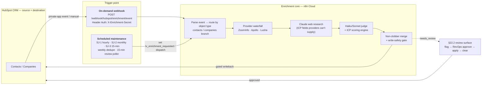

# Lightning Visuals — HubSpot Enrichment & ICP Scoring (n8n)

> **Proprietary & Confidential.** Copyright © 2026 **Australia Go To Market (AusGTM)** and **Dr. Robert Li**. Licensed for use by **Lightning Visuals**. See [LICENSE](LICENSE).

A HubSpot → n8n waterfall **enrichment + ICP-scoring** system for Lightning Visuals' RevOps/sales team. It enriches contacts and companies from multiple providers, scores them against a governing-body-first ICP rubric, and writes back to HubSpot under a strict **non-clobber** policy — with a **dry-run** path that emits the exact payload without touching the CRM.

The production orchestration runs **entirely in n8n Cloud** (out-of-box nodes + external APIs, no deployed service). A tested Python engine acts as the reference oracle for the JavaScript ported into n8n Code nodes.

## Architecture (high level)

Two ways in, one enrichment core, HubSpot as both source and destination. The **trigger point** is either the on-demand webhook or one of the scheduled workflows.



**Approach C:** the pipeline writes ICP *inputs* only (`lv_org_type`, `lv_produces_content`, revenue/employee bands, …) — HubSpot derives `lv_icp_fit_score` / `lv_icp_tier`. Node-level detail (every node + its properties, both workflows) is in [`n8n/README.md`](n8n/README.md).

## Status

| Area | State |
|---|---|
| ICP scoring engine (Python reference oracle) | ✅ |
| Contact ingestion (file → identity/dedupe → non-clobber merge) | ✅ |
| Company enrichment branch (waterfall + web research + judge + merge) | ✅ |
| Contact enrichment branch (waterfall + web research + judge + merge — mirrors companies) | ✅ built (Phase 16.2) |
| Per-request provider selection + credit reporting (`providers` payload, `remaining_credits`) | ✅ built (Phase 16.1) |
| n8n Cloud workflows (contact ingest, enrichment, scheduled maintenance) | ✅ **deployed + active on n8n Cloud**, write gates disarmed at rest |
| HubSpot `lv_*` properties (33 + SJ-3 control props) | ✅ migrated live (Phase 15) |
| Provider auth (Lusha / Apollo / ZoomInfo split-code-node) | ✅ credential-bound |
| Scheduled workflows (SJ-1/2/3 + dedupe + review) | ✅ built (template ships `active: false`; enabled live by operator) |
| §22.2 review-surface loop (flag → approve → apply → clear) | ✅ built |
| Cloud deploy + credential provisioning (Public API) | ✅ scripted + **live-proven** (idempotent redeploys) |
| Live write canaries | ✅ non-clobber, `contact:create` reachability, `company:create`, `company:update` — all proven in audited armed windows, restored disarmed |
| Normalization & producer fixes (numeric industry code, `lv_sponsorship_reliant`, `lv_persona_group`) | ✅ Phase 18, red-before-green |
| v0.3/v0.4 verification ledger | ✅ 6/6 discharged (`.planning/phases/19-verification-debt-closure/19-LEDGER.md`) |

Full test suite: `.venv/bin/python -m pytest -q` (Python oracle) + `node --test tests/n8n/*.test.mjs` (Code-node modules).

## Repository layout

```
config/        # scoring rubric, field-ownership policy, provider priority, source registry, HubSpot property manifest (YAML)
src/           # Python engine: schemas, scoring, normalizer, merge, ingest, HubSpot client (reference oracle)
tests/         # Python suite (pytest) + n8n JS module tests (node --test tests/n8n/*.test.mjs)
n8n/           # n8n workflow templates (Cloud + local replica) and inlined Code-node modules (n8n/code/*.js)
scripts/       # build_cloud_workflows.py (inliner) · deploy_n8n_workflows.py · provision_n8n_credentials.py · sync_hubspot_properties.py · replica proof scripts
docs/          # project documentation (see below)
.planning/     # GSD planning trail (roadmap, phases, decisions)
main.py        # local MVP entrypoint (company scoring + `--ingest <file>` contact ingestion)
CLAUDE.md      # canonical technical specification (also Claude Code project instructions)
```

## Documentation

- **Architecture / design** — [`docs/architecture/ENRICHMENT-WORKFLOW-PLAN.md`](docs/architecture/ENRICHMENT-WORKFLOW-PLAN.md) · canonical spec: [`CLAUDE.md`](CLAUDE.md)
- **System contract** — [`docs/SYSTEM-CONTRACT.md`](docs/SYSTEM-CONTRACT.md) (the standard the system is evaluated against)
- **Business** — [`docs/business/icp-scoring.md`](docs/business/icp-scoring.md) (ICP / Anti-ICP validation from closed deals)
- **n8n workflows** — [`n8n/README.md`](n8n/README.md) (node-level mermaid, import, credentials, deploy, Cloud-vs-local)
- **Changelog** — [`CHANGELOG.md`](CHANGELOG.md)

## Quick start (local)

```bash
python3 -m venv .venv
.venv/bin/pip install -q -r requirements.txt

.venv/bin/python -m pytest -q                     # Python suite (offline)
node --test tests/n8n/*.test.mjs                  # n8n Code-node tests (glob form — dir form fails on node ≥21)
.venv/bin/python main.py                          # company scoring (dry-run)
.venv/bin/python main.py --ingest tests/fixtures/uploads/contacts_e2e.csv   # contact ingestion (dry-run)
```

## Deploy to n8n Cloud

Deploy is scripted against the n8n **Public API** (`X-N8N-API-KEY`) — the n8n MCP server is authoring-only and cannot import these JSON workflows. Both scripts are dry-run by default and gated by two keys (`DRY_RUN=false` **and** `ALLOW_N8N_DEPLOY=true`):

```bash
set -a; . ./.env; set +a
# 1. credentials first — writes .n8n_credential_ids.json (name→id) that deploy binds per node
DRY_RUN=false ALLOW_N8N_DEPLOY=true .venv/bin/python scripts/provision_n8n_credentials.py
# 2. workflows — binds credentials, creates/updates the 3 wf_*_cloud.json workflows (idempotent)
DRY_RUN=false ALLOW_N8N_DEPLOY=true .venv/bin/python scripts/deploy_n8n_workflows.py
```

Activation (`POST /api/v1/workflows/{id}/activate`) is a deliberate separate step. All three workflows are **currently deployed and active** on n8n Cloud, disarmed at rest; write-enabling flags are baked in only through the `ENABLE_BAKED_FLAGS` overlay inside deliberate, allowlisted operator windows (ceremony: `.planning/phases/19-verification-debt-closure/19-OPERATOR-RUNBOOK.md`, which also encodes the `.env`-loading command form). See [`n8n/README.md`](n8n/README.md) for node-level detail.

Secrets live in a gitignored `.env` (see `.env.example`). In production they live in **n8n's credential store**, never in the repo. Nothing writes to HubSpot or n8n unless a write is explicitly enabled and gated.

## License

Proprietary. Copyright © 2026 Australia Go To Market (AusGTM) and Dr. Robert Li. Licensed for use by Lightning Visuals. See [LICENSE](LICENSE). Not for redistribution or use outside the AusGTM–Lightning Visuals engagement without written permission.
