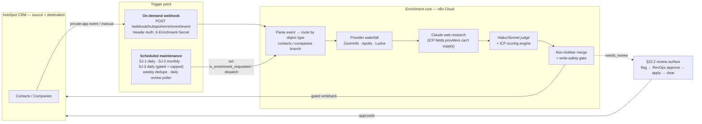

# Lightning Visuals — HubSpot Enrichment & ICP Scoring (n8n)

> **Proprietary & Confidential.** Copyright © 2026 **Australia Go To Market (AusGTM)** and **Dr. Robert Li**. Licensed for use by **Lightning Visuals**. See [LICENSE](LICENSE).

A HubSpot → n8n waterfall **enrichment + ICP-scoring** system for Lightning Visuals' RevOps/sales team. It enriches contacts and companies from multiple providers, scores them against a governing-body-first ICP rubric, and writes back to HubSpot under a strict **non-clobber** policy — with a **dry-run** path that emits the exact payload without touching the CRM.

The production orchestration runs **entirely in n8n Cloud** (out-of-box nodes + external APIs, no deployed service). A tested Python engine acts as the reference oracle for the JavaScript ported into n8n Code nodes.

## Architecture (high level)

Two ways in, one enrichment core, HubSpot as both source and destination. The **trigger point** is either the on-demand webhook or one of the scheduled workflows.



**Approach C:** the pipeline writes ICP *inputs* only (`lv_org_type`, `lv_produces_content`, revenue/employee bands, …) — HubSpot derives `lv_icp_fit_score` / `lv_icp_tier`. Node-level detail (every node + its properties, both workflows) is in [`n8n/README.md`](n8n/README.md).

## Status

| Area | State |
|---|---|
| ICP scoring engine (Python reference oracle) | ✅ |
| Contact ingestion (file → identity/dedupe → non-clobber merge) | ✅ |
| Company enrichment branch (waterfall + web research + judge + merge) | ✅ |
| Contact enrichment branch (waterfall + web research + judge + merge — mirrors companies) | ✅ built (Phase 16.2) |
| Per-request provider selection + credit reporting (`providers` payload, `remaining_credits`) | ✅ built (Phase 16.1) |
| n8n Cloud workflows (contact ingest, enrichment, scheduled maintenance, backend status, review decision) | ✅ **5 deployed on n8n Cloud** (4 active; `LV Review Decision` inactive at rest, activated only inside review windows), write gates disarmed at rest |
| Review decision endpoints (`hubspot/review/queue` read-only + `hubspot/review/decision`) | ✅ v0.6 Phase 30 — human approve proven live 2026-08-04 (RB-9 close: human provenance stamped, `manual_protected` withheld) |
| HubSpot enum validate-and-refuse (staging + both review paths) | ✅ v0.6 Phase 31 — BUGS 28/29/30 closed on live evidence |
| HubSpot `lv_*` properties (33 + SJ-3 control props) | ✅ migrated live (Phase 15) |
| Provider auth (Lusha / Apollo / ZoomInfo split-code-node) | ✅ credential-bound |
| Scheduled workflows (SJ-1/2/3 + dedupe + review) | ✅ built (template ships `active: false`; enabled live by an admin — see note below) |
| §22.2 review-surface loop (flag → approve → apply → clear) | ✅ built |
| Cloud deploy + credential provisioning (Public API) | ✅ scripted + **live-proven** (idempotent redeploys) |
| Live write canaries | ✅ non-clobber, `contact:create` reachability, `company:create`, `company:update` — all proven in audited armed windows, restored disarmed |
| Normalization & producer fixes (numeric industry code, `lv_sponsorship_reliant`, `lv_persona_group`) | ✅ Phase 18, red-before-green |
| v0.3/v0.4 verification ledger | ✅ 6/6 discharged (`.planning/phases/19-verification-debt-closure/19-LEDGER.md`) |
| Operator client (conversational front door + control plane) | ✅ **shipped — v0.6 sealed 2026-08-04** (49/49 requirements; armed canaries RB-3/7/8/9 all passed), [`operator-claude-plugin/`](operator-claude-plugin/README.md) |
| HubSpot-resident ICP scoring engine (4 workflows + calculated fit score) | ✅ **remediated — v0.7 sealed 2026-08-08** (16/16 requirements; F1–F10 all closed on live evidence) |
| Scoring parity harness (Python oracle vs live HubSpot) + standing drift guard | ✅ `scripts/run_scoring_parity.py` — PASS, 0 real findings; includes the blank-score detector |
| Validation population | ✅ 66 web-researched companies landed and scored with provenance (A:7 B:18 C:17 D:24), zero provider spend |
| Null-safe fit-score formula | ✅ 2026-08-08 — a bare sum blanked the whole score on any null term; now `coalesce()`-guarded, with `org_type_score` left bare as the "never scored" sentinel |
| Execution-budget safety (SJ-3 gate + drain + cap) | ✅ **v0.8 Phase 44, live-proven 2026-08-10** — a gate-closed tick costs 1 execution (was 1+N), drains its own queue, and dispatch is capped from `config/execution_budget.yaml` (2,500/month plan) |
| Burn-rate alarm + runtime cadence budget floor | ✅ **v0.8 Phase 45, sealed 2026-08-10** — the sweep samples a bounded recent execution rate and fires when it projects past the allowance, never claiming a monthly total n8n makes unknowable; a cadence change is refused when the whole schedule's floor would bust its configured share. **Ships inert** — installing the sweep schedule is an admin action, so this is unit-proven against synthetic history, not an observed scheduled fire |
| Operator usage guide | ✅ [`operator-claude-plugin/USAGE.md`](operator-claude-plugin/USAGE.md) — task-oriented guide for the non-technical operator |
| Autonomous batch runs (one grant per batch · confident rows proceed · unconfident rows HELD into one end-of-run review queue · async submit + progress read + resume, so a run is no longer bounded by n8n's ~100 s synchronous response window) | ✅ **v1.1 Phase 61, verified 2026-08-30** (12/12 must-haves; absorbed Phases 55 and 56 per D-61-08). A contact row carrying only a **LinkedIn URL** is now accepted, matched on that key and enriched; name-only rows still route to weak-key `needs_review`. Deployed and bounced 2026-08-30, **disarmed** — live evidence is disarmed executions `12040` and `12044`–`12047`. **The first live unattended, credit-spending batch has NOT run** — it is gated on Phase 57 (per-run ceilings, refusal-before-start, post-run proof), which is still unbuilt |

**"Operator" means two different people in this repo.** Everything above is administered from this
repository by a technical operator/admin (scripts, deploys, armed windows, runbooks in `docs/`). The
v0.6 client targets a *non-technical* operator who works only in Claude and never opens n8n or a
terminal; `docs/` runbooks and `scripts/` are admin surfaces, not theirs.

Full test suite: `.venv/bin/python -m pytest -q` (Python oracle) + `node --test tests/n8n/*.test.mjs` (Code-node modules). Current (2026-08-30): **3539 pytest / 844 node**, plus **1875** in `operator-claude-plugin/tests/` (root pytest collection includes those).

## Repository layout

```
config/        # scoring rubric, field-ownership policy, provider priority, source registry, HubSpot property manifest (YAML)
src/           # Python engine: schemas, scoring, normalizer, merge, ingest, HubSpot client (reference oracle)
tests/         # Python suite (pytest) + n8n JS module tests (node --test tests/n8n/*.test.mjs)
n8n/           # n8n workflow templates (Cloud + local replica) and inlined Code-node modules (n8n/code/*.js)
scripts/       # build_cloud_workflows.py (inliner) · deploy_n8n_workflows.py · provision_n8n_credentials.py · sync_hubspot_properties.py · replica proof scripts
docs/          # project documentation (see below)
operator-claude-plugin/  # operator-facing client (shipped, v0.6) — one front end over this backend, replaceable
.planning/     # GSD planning trail (roadmap, phases, decisions)
main.py        # local MVP entrypoint (company scoring + `--ingest <file>` contact ingestion)
CLAUDE.md      # canonical technical specification (also Claude Code project instructions)
```

## Documentation

- **Architecture / design** — [`docs/architecture/ENRICHMENT-WORKFLOW-PLAN.md`](docs/architecture/ENRICHMENT-WORKFLOW-PLAN.md) · canonical spec: [`CLAUDE.md`](CLAUDE.md)
- **System contract** — [`docs/SYSTEM-CONTRACT.md`](docs/SYSTEM-CONTRACT.md) (the standard the system is evaluated against)
- **Business** — [`docs/business/icp-scoring.md`](docs/business/icp-scoring.md) (ICP / Anti-ICP validation from closed deals)
- **n8n workflows** — [`n8n/README.md`](n8n/README.md) (node-level mermaid, import, credentials, deploy, Cloud-vs-local)
- **Operator usage guide** — [`operator-claude-plugin/USAGE.md`](operator-claude-plugin/USAGE.md) (task-oriented: what to say, what to expect)
- **Operator client** — [`operator-claude-plugin/README.md`](operator-claude-plugin/README.md) (conversational front end + control panel; a suggested default thin client, not the only possible one — the backend is plain HTTP, so other front ends can be built against the same contract)
- **Changelog** — [`CHANGELOG.md`](CHANGELOG.md)

## Quick start (local)

```bash
python3 -m venv .venv
.venv/bin/pip install -q -r requirements.txt

.venv/bin/python -m pytest -q                     # Python suite (offline)
node --test tests/n8n/*.test.mjs                  # n8n Code-node tests (glob form — dir form fails on node ≥21)
.venv/bin/python main.py                          # company scoring (dry-run)
.venv/bin/python main.py --ingest tests/fixtures/uploads/contacts_e2e.csv   # contact ingestion (dry-run)
```

## Deploy to n8n Cloud

Deploy is scripted against the n8n **Public API** (`X-N8N-API-KEY`) — the n8n MCP server is authoring-only and cannot import these JSON workflows. Both scripts are dry-run by default and gated by two keys (`DRY_RUN=false` **and** `ALLOW_N8N_DEPLOY=true`):

```bash
set -a; . ./.env; set +a
# 1. credentials first — writes .n8n_credential_ids.json (name→id) that deploy binds per node
DRY_RUN=false ALLOW_N8N_DEPLOY=true .venv/bin/python scripts/provision_n8n_credentials.py
# 2. workflows — binds credentials, creates/updates the 5 wf_*_cloud.json workflows (idempotent)
DRY_RUN=false ALLOW_N8N_DEPLOY=true .venv/bin/python scripts/deploy_n8n_workflows.py
```

Activation (`POST /api/v1/workflows/{id}/activate`) is a deliberate separate step, and the deploy script **never** activates — after any PUT, every active workflow must be bounced (deactivate→activate) or the running instance keeps serving its pre-PUT content (proven live 2026-08-03). All five workflows are **deployed** on n8n Cloud (four active; `LV Review Decision` inactive at rest), disarmed; write-enabling flags are baked in only through the `ENABLE_BAKED_FLAGS` overlay inside deliberate, allowlisted operator windows (current ceremony: `.planning/workstreams/plugin-entrypoint/OPERATOR-RUNBOOK.md`, which also encodes the `.env`-loading command form). See [`n8n/README.md`](n8n/README.md) for node-level detail.

Secrets live in a gitignored `.env` (see `.env.example`). In production they live in **n8n's credential store**, never in the repo. Nothing writes to HubSpot or n8n unless a write is explicitly enabled and gated.

## License

Proprietary. Copyright © 2026 Australia Go To Market (AusGTM) and Dr. Robert Li. Licensed for use by Lightning Visuals. See [LICENSE](LICENSE). Not for redistribution or use outside the AusGTM–Lightning Visuals engagement without written permission.
