# n8n Contact Ingest — Cloud template + local replica

Milestone 3 Wave B. A HubSpot contact-ingestion pipeline expressed as an n8n
workflow whose business logic is the Wave-A JS (`n8n/code/*.js`) **inlined into
Code nodes** — because n8n **Cloud Code nodes cannot `require()` sibling files
or npm**. Two artifacts, one source of truth:

| File | Purpose |
| ---- | ------- |
| `wf_contact_ingest_cloud.json` | Production-shaped template you import to n8n **Cloud**. Real HubSpot + HTTP nodes; you add credentials there. |
| `wf_contact_ingest_local.json` | Headless-executable variant. Same inlined JS; file input + HubSpot calls are mocked so it runs on the local container with **no** HubSpot creds. |

Both are generated from the Wave-A modules by `scripts/build_cloud_workflows.py`
(re-run it after editing any `n8n/code/*.js`). The inliner strips each module's
`require(...)` / `module.exports` lines and pastes the needed functions into each
Code-node body, then wraps them with the n8n Code I/O contract
(`$input.all()` → `return [{json:...}]`).

## Pipeline

```
Trigger → (file → rows) → Code:mapColumns → Code:normalizePhone
  → HTTP:verifyEmail(batch) → Code:applyEmail
  → HubSpot:searchByEmail → Code:resolveIdentity → Code:mergeContacts
  → IF(action) → HubSpot:update / HubSpot:create(gated) / Set:review
```

Per-row outcome → action:

| Outcome | When | Action |
| ------- | ---- | ------ |
| `match` | strong-key (email/LinkedIn) single hit | `update` |
| `net_new` | valid email, 0 hits | `create` **if `allow_create`**, else `review` |
| `ambiguous` | weak-key hit, multiple hits, or no-email/insufficient identity | `review` |
| `rejected` | fails required-identity gate (no email AND no firstname+lastname+company) | `skip` |

## Import to n8n Cloud

1. n8n Cloud → **Workflows → Import from File** → select
   `wf_contact_ingest_cloud.json`.
2. Add **HubSpot credentials** (a HubSpot private-app token) on the three
   HubSpot nodes: **HubSpot Search by Email**, **HubSpot Update**,
   **HubSpot Create**. The scopes are the ../CLAUDE.md minimum
   (`crm.objects.contacts.read` / `.write`).
3. The trigger is a **Webhook** (`POST /webhook/hubspot/contact-upload`) whose
   body carries the uploaded file; **Extract From File** parses CSV → rows.
   Point your upload form / HubSpot-side trigger at that webhook URL.
4. **`create` is gated OFF by default** (`Set Config → allow_create=false`).
   Flip it to `true` only after you've reviewed the dry-run behaviour.

No credentials are needed to *import* — import is the v2.4.4 validity gate and
succeeds without them; they're only needed when the HubSpot nodes execute.

## Run the local replica

```bash
bash scripts/n8n_contact_replica.sh
```

Imports `wf_contact_ingest_local.json` into the running `n8n` container
(v2.4.4), executes it headless, and asserts all four ingestion paths fired, the
**real** email verifier returned a status, and **no** HubSpot write occurred.
Actual output:

```
  Bob Smith        outcome=match      action=update   email_status=NO_MX_RECORDS
  Alice Anderson   outcome=net_new    action=review   email_status=NO_MX_RECORDS
  Carol Jones      outcome=ambiguous  action=review   email_status=NO_EMAIL
  Dave Nguyen      outcome=ambiguous  action=review   email_status=NO_EMAIL
  (no id)          outcome=rejected   action=skip     email_status=NO_EMAIL
```

(`NO_MX_RECORDS` is the live verifier's real status for the `example.com`
fixture addresses — no MX records — so the emails route to review while identity
still matches syntactically. See the email note below.)

## Cloud vs local differences

Only the edges differ; the inlined JS Code nodes are identical.

| Concern | Cloud template | Local replica |
| ------- | -------------- | ------------- |
| File input | Webhook upload → **Extract From File** | **Emit Fixture Rows** Code node (the 5-path fixture inline) |
| HubSpot search | real **HubSpot** node → **Adapt Search Results** Code node | **HubSpot Search (MOCK)** Code node (canned: bob→`200`, Carol→weak `300`, else 0) |
| HubSpot write | **IF(action)** → HubSpot **Update** / **Create** (gated) / **Set** review | **Decide Action** Code node ECHOES the dry-run PATCH/POST payload; no write |
| Email verify | **real** HTTP batch node | **real** HTTP batch node (unchanged) |

## Email verifier (real HTTP node)

Both workflows call the free
[`rapid-email-verifier`](https://rapid-email-verifier.fly.dev) batch endpoint
(`POST /api/validate/batch`, up to 100 emails/call). The node is **non-gating**:
if the verifier is unreachable, `onError: continueRegularOutput` lets the run
proceed and **Apply Email** falls back to `PROBABLY_VALID` (surfaced as
`email_verify_fallback: true`) so identity/merge still run.

Identity resolution uses the *syntactic* email check (`normalizeEmailBasic`),
**not** the verifier verdict — so a syntactically-valid-but-unverified address
(e.g. `NO_MX_RECORDS`) still matches/creates while carrying a review flag. To
hard-gate on deliverability, branch on `email_valid` before the HubSpot write.

## AU-phone disclaimer

`normalizePhone.js` is an **AU-only heuristic**, not `libphonenumber` — Code
nodes can't import npm. It recognises `0XXXXXXXXX` (10-digit national) and
`61XXXXXXXXX`, trusts a leading `+` as already-E.164, and returns **`null` for
anything non-AU or ambiguous**. Callers route `null` to review — never guess,
never silently drop. For global coverage, swap the phone node for a
phone-validation API.

---

# Enrichment workflow (quality-scored waterfall)

The second pipeline (`../docs/architecture/ENRICHMENT-WORKFLOW-PLAN.md`). It checks HubSpot first,
decides **create / enrich / skip**, then — instead of FIFO stop-on-first-match —
**scores every source per field**, cross-checks, and pushes the best value per
field into the same non-clobber merge. Same two-artifact pattern, same inliner
(`scripts/build_cloud_workflows.py`), same no-`require` constraint.

| File | Purpose |
| ---- | ------- |
| `wf_enrichment_cloud.json` | Production-shaped template (97 nodes / 90 functional + 7 sticky). Auth-gated Webhook + object-type router → **symmetric contacts and companies branches**, each running per-request provider selection (waterfall → web research → judge → merge) plus a credit-reporting lane. Credentials bound per node by `scripts/deploy_n8n_workflows.py`. |
| `wf_enrichment_local.json` | Headless-executable. Trigger emits 3 sample identities; HubSpot search + provider waterfall + writes are Code mocks; the scoring/gate/merge logic is real. |
| `wf_enrichment_local_live.json` | Local replica wired for **live** provider/HTTP calls (the reference build carrying the full company branch + research + judge). |
| `wf_scheduled_maintenance_cloud.json` | The background reconciliation layer (34 nodes), emitted **`active: false`** (Phase 16.1 — ships inactive; an operator enables each schedule deliberately): SJ-1/2/3 schedules + weekly dedupe + the §22.2 review loop. See its diagram below. |

## Workflow graph — enrichment (`wf_enrichment_cloud.json`, as-built)

Trigger point = the auth-gated webhook. `Route By Object Type` splits to the contacts branch or the full companies ICP branch. Every HubSpot Create/Update is governed by the `WRITE_SAFETY_DEFAULTS` gate (`ALLOW_HUBSPOT_RECORD_WRITES` default **false** + test-record allowlist), disjoint from the parity-guarded `CONFIG_FLAG_DEFAULTS`.

```mermaid
flowchart TD
  WH["Webhook Trigger — webhook<br/>POST /webhook/hubspot/enrichment/event<br/>authentication: headerAuth (X-Enrichment-Secret)"]
  PE["Parse HubSpot Event — code<br/>providers: all | list | none | blank/absent→none"]
  OTS{"IF Object Type Supported — if"}
  UO["Unsupported Object Type — set"]
  RT{"Route By Object Type — if"}
  WH --> PE --> OTS
  OTS -->|supported| RT
  OTS -->|unsupported| UO --> BR
  PE --> CRQ["Credit Request — code · one item/run"]

  subgraph C["Contact branch"]
    direction TB
    CB["Build Identity — code"] --> CS["HubSpot Search — hubspot · cred LV HubSpot"] --> CA["Adapt Search — code"] --> CG["Enrichment Gate — code · decideAction → create/enrich/skip"] --> CPP{"IF Provider Processing Needed — if · action≠skip"}
    CPP -->|skip| CK["Skip (NoOp) — set"]
    CPP -->|process| CLE{"IF Lusha Enabled"}
    CLE -->|yes| LU["Lusha Enrich — httpRequest · /v2/person · cred LV Lusha"]
    LU --> CAE{"IF Apollo Enabled"}
    CLE -->|no bypass| CAE
    CAE -->|yes| AP["Apollo Match — httpRequest · /v1/people/match · cred LV Apollo"]
    AP --> CZE{"IF ZoomInfo Enabled"}
    CAE -->|no bypass| CZE
    CZE -->|yes| ZTG["ZoomInfo Token Gate — code"] --> ZIF{"IF Needs Mint"}
    CZE -->|no bypass| CN
    ZIF -->|mint| ZM["ZoomInfo Mint — httpRequest · Basic · cred LV ZoomInfo"] --> ZC["ZoomInfo Cache Token — code"] --> ZE["ZoomInfo Enrich — code"]
    ZIF -->|cached| ZE
    ZE --> CN["Normalize + Score — code"] --> CRG["Contact Research Trigger Gate — code"] --> CRIF{"IF Contact Research Needed"}
    CRIF -->|yes| CRR["Build Contact Research Request — code"] --> CCW["Contact Web Research — httpRequest · cred LV Anthropic"] --> CVR["Validate Contact Research — code · row-recovery"] --> CJG["Contact Judge Gate — code"] --> CJIF{"IF Contact Needs Judge"}
    CRIF -->|no| CM
    CJIF -->|yes| CJR["Build Contact Judge Request — code"] --> CJC["Contact Judge Call — httpRequest · cred LV Anthropic"] --> CJV["Apply Contact Judge Verdict — code · row-recovery · chosen_field allowlist"] --> CM["Merge Winners — code · foldContactResearch write-safety"]
    CJIF -->|no| CM
    CM --> CDQ["Set Data Quality + Gap Flag — set"] --> CD["Decide Action — code"]
    CD --> C1{"IF Create"} -->|yes| CC["HubSpot Create — hubspot"]
    C1 -->|no| C2{"IF Enrich"} -->|yes| CU["HubSpot Update — hubspot"]
    C2 -->|no| BR
  end

  subgraph K["Company branch — full ICP pipeline"]
    direction TB
    KB["Build Company Identity — code"] --> KS["HubSpot Company Search — hubspot · cred LV HubSpot"] --> KA["Adapt Company Search — code · preserves hs_object_id"] --> KG["Company Gate — code · decideAction"] --> KREQ["Build Company Requests — code"] --> KLE{"IF Lusha Company Enabled"}
    KLE -->|yes| KLU["Lusha Company — httpRequest · /v2/company · cred LV Lusha"]
    KLU --> KAE{"IF Apollo Org Enabled"}
    KLE -->|no bypass| KAE
    KAE -->|yes| KAP["Apollo Org — httpRequest · /v1/organizations/enrich · cred LV Apollo"]
    KAP --> KZE{"IF ZoomInfo Company Enabled"}
    KAE -->|no bypass| KZE
    KZE -->|yes| KZTG["ZoomInfo Company Token Gate — code"] --> KZIF{"IF Company Needs Mint"}
    KZE -->|no bypass| KNS
    KZIF -->|mint| KZM["ZoomInfo Mint Company — httpRequest · Basic · cred LV ZoomInfo"] --> KZC["ZoomInfo Company Cache Token — code"] --> KZEN["ZoomInfo Company — code"]
    KZIF -->|cached| KZEN
    KZEN --> KNS["Normalize + Score Company — code"] --> KRG["Research Trigger Gate — code · RT-5 180d TTL"] --> KRIF{"IF Research Needed"}
    KRIF -->|yes| KRR["Build Research Request — code"] --> KCW["Claude Web Research — httpRequest · cred LV Anthropic"] --> KVR["Validate Research Output — code · row-recovery, tri-state, evidence-gated"] --> KJG["Judge Gate — code"] --> KJIF{"IF Needs Judge"}
    KRIF -->|no| KM
    KJIF -->|yes| KJR["Build Judge Request — code · restricted field list"] --> KJC["Judge Call — httpRequest · cred LV Anthropic"] --> KJV["Apply Judge Verdict — code · row-recovery"] --> KM["Merge Company — code · non-clobber + judge confidence"]
    KJIF -->|no| KM
    KM --> KD["Decide Company Action — code · holds canonical on needs_review"]
    KD --> K1{"IF Company Create"} -->|yes| KC["HubSpot Company Create — hubspot"]
    K1 -->|no| K2{"IF Company Enrich"} -->|yes| KU["HubSpot Company Update — hubspot"]
    K2 -->|no| BR
  end

  subgraph CR["Credit reporting — one call per requested provider"]
    direction TB
    CRQ --> CLC{"IF Lusha Credit Requested"} -->|yes| LUC["Lusha Usage — httpRequest"]
    CRQ --> CAC{"IF Apollo Credit Requested"} -->|yes| APC["Apollo Usage — httpRequest"]
    CRQ --> CZC{"IF ZoomInfo Credit Requested"} -->|yes| ZUTG["ZoomInfo Usage Token Gate — code"] --> ZUIF{"IF Usage Needs Mint"}
    ZUIF -->|mint| ZUM["ZoomInfo Usage Mint — httpRequest · Basic · cred LV ZoomInfo"] --> ZUC["ZoomInfo Usage Cache Token — code"] --> ZU["ZoomInfo Usage — code"]
    ZUIF -->|cached| ZU
  end

  RT -->|contact| CB
  RT -->|company| KB
  CC --> BR
  CU --> BR
  CK --> BR
  KC --> BR
  KU --> BR
  BR["Build Response — code · reads Lusha/Apollo/ZoomInfo Usage by node-name → remaining_credits"] --> RESP["Respond to Webhook — responseMode: responseNode"]
```

Contacts and companies are now **symmetric** pipelines: both run the provider waterfall (each provider behind an `IF <provider> Enabled` bypass gate — Phase 16.1 per-request `providers` selection), then a web-research → judge → merge chain (contacts gained theirs in Phase 16.2 via the parameterized `EnrichTarget` factories). A parallel credit-reporting lane assembles `remaining_credits` into the `Respond to Webhook` response. All terminals converge on `Build Response`.



> The credit `*Usage` nodes are terminal (no edge to `Build Response`); `Build Response` reads their outputs **by node name** to assemble `remaining_credits`. A provider absent from the request's `providers` list has its `IF <provider> Enabled` (and `IF <provider> Credit Requested`) evaluate false — the paid HTTP node never fires. `IF Research Needed` / `IF Contact Research Needed` false routes **directly to the merge node**, bypassing the judge chain.

## Workflow graph — scheduled maintenance (`wf_scheduled_maintenance_cloud.json`, as-built)

Five `scheduleTrigger` entry points. The workflow ships **`active: false`** (Phase 16.1) — deploy never activates it; an operator enables each schedule deliberately. SJ predicates key on **pipeline-owned inputs only** (Approach C — never `lv_icp_tier`/`lv_icp_scored_at`). SJ-1/SJ-2 flag records; SJ-3 dispatches flagged records into the enrichment workflow; the review poller closes the §22.2 loop.

```mermaid
flowchart TD
  subgraph S1["SJ-1 · input-gap scan"]
    A1["scheduleTrigger · daily"] --> B1["HubSpot Search · org_type/produces_content missing|unknown (3 OR groups)"] --> C1["Extract Rows · code"] --> D1["HubSpot Update · lv_enrichment_requested=true"]
  end
  subgraph S3["SJ-3 · requested poller (gated + capped, Phase 44)"]
    A3["scheduleTrigger · daily"] --> B3["HubSpot Search · lv_enrichment_requested=true AND status≠running"] --> C3["Extract Rows · code"] --> G3["Dispatch Gate · code · per-record write-safety"]
    G3 -->|permitted ≤ cap| D3["Execute Workflow → LV Enrichment (Cloud template)"]
    G3 -->|declined| DR3["Drain Gate → HubSpot Update<br/>requested=false · status=skipped<br/>ALLOW_SJ3_DRAIN_WRITES (default true, never armable)"]
    G3 --> O3["SJ-3 Tick Outcome · code<br/>gate_closed / capped_partial / dispatched + counts"]
  end
  subgraph S2["SJ-2 · stale refresh"]
    A2["scheduleTrigger · every 1 month"] --> E2["Epoch Cutoff 180d · code"] --> B2["HubSpot Search · _verified_at &lt; cutoff"] --> F2["Adapt Search · code"] --> G2["Company Gate · code"] --> H2{"IF Skip"}
    H2 -->|no| D2["HubSpot Update · lv_enrichment_requested=true"]
    H2 -->|yes| I2["Skip · NoOp"]
  end
  subgraph SD["Dedupe · weekly (classify-only)"]
    AD["scheduleTrigger · every 1 week"] --> BD["HubSpot Search · candidate contacts"] --> CD2["Extract Rows · code"] --> DD["Dedupe Sweep · code · dedupeSweep.js"] --> ED["HubSpot Update · lv_enrichment_needs_review"]
  end
  subgraph SR["§22.2 review loop · daily"]
    AR["scheduleTrigger · daily"] --> BR["HubSpot Search · lv_enrichment_review_approved=true"] --> CR2["Extract Rows · code"] --> DR["Apply Review · code · reviewApply.js<br/>refetch + compare-and-set + fail-closed JSON"] --> ER{"IF Stale"}
    ER -->|fresh| FR["Review Apply Update — hubspot<br/>updateFields:{} placeholder → operator wires the patch"]
    ER -->|stale| GR["Stale · NoOp (keep queued)"]
  end
```



## Pipeline

```
Trigger → Code:parseEvent (providers: all|list|none|blank→none)
  → IF objectTypeSupported → Route By Object Type → Code:buildIdentity → HubSpot:search
  → Code:enrichmentGate (decideAction → create | enrich | skip)
  → IF providerProcessingNeeded (action≠skip):
       process → IF Lusha Enabled  →(yes) HTTP:Lusha  →(bypass) IF Apollo Enabled
               → IF Apollo Enabled →(yes) HTTP:Apollo →(bypass) IF ZoomInfo Enabled
               → IF ZoomInfo Enabled →(yes) Code:ZoomInfo (cached-token enrich) →(bypass) normalize
               → Code:normalize+score (best-per-field, provenance)
               → Code:researchTriggerGate → IF researchNeeded →(yes) HTTP:webResearch
                     → Code:validate (row-recovery) → judgeGate → IF needsJudge
                     →(yes) HTTP:judgeCall → applyVerdict (chosen_field allowlist) → merge
                     →(no, either IF) → merge
               → Code:mergeWinners (foldContactResearch write-safety)
               → IF create → HubSpot:Create ; IF enrich → HubSpot:Update
       skip    → Set (NoOp)
  → Set: data-quality label + gap-flag → Build Response → Respond to Webhook
Credit lane (parallel off parseEvent): Credit Request → per-provider IF Credit Requested
  → HTTP:*Usage (terminal) → Build Response reads by node-name → remaining_credits in response
```

The companies branch mirrors this exactly (parameterized `EnrichTarget` factories keep the two in lockstep). Each disabled provider's HTTP node never fires — that is the per-request cost gate.

Gate branches (`ENRICHMENT-WORKFLOW-PLAN.md §3`):

| Action | When | Write |
| ------ | ---- | ----- |
| `create` | identity not in HubSpot | `POST` contact (gated) |
| `enrich` | found but a required field is missing / stale (`> stale_after_days`) / invalid | `PATCH` contact (gated) |
| `skip` | all required fields present, fresh, valid | none, no credits spent |

## Scoring model (best-of-breed, not FIFO)

Each **candidate value** (a field from a source) scores
`value_score = wA·A + wR·R + wG·G + wT·T`, and the pipeline picks `argmax`
**per field** — best email from one source, best phone from another.

| Term | Meaning | Source |
| ---- | ------- | ------ |
| `A` accuracy | provider's per-field quality signal | Apollo `email_status`, Lusha `A+/A`, ZoomInfo `contactAccuracyScore`, phone `valid_number`/type |
| `R` recency | `1 − min(age/stale_ceiling, 1)` | ZoomInfo `validDate`, Lusha `updateDate`, Apollo `updated_at` (no date → neutral 0.5) |
| `G` agreement | fraction of *other* sources whose **normalized** value matches (cross-check) | E.164 phone, lowercased email, revenue band, NAICS |
| `T` trust | source base rank (tiebreaker) | zoominfo .85, lusha .80, apollo .75 |

Default weights `wA=0.45, wR=0.20, wG=0.25, wT=0.10` (tunable). Default mode
`scored_all` calls every source for full cross-check; `scored_cost_aware` (in
`scoreEnrichment.js`) can early-exit once required fields clear a quality bar.
Each winner carries provenance `{value, source, score, components, agreedBy[]}`.

## Import to n8n Cloud

**Live state (2026-07-29):** all three Cloud workflows are **deployed and active** on n8n Cloud, credential-bound, write gates disarmed at rest; live write canaries (non-clobber, `contact:create` reachability, `company:create`, `company:update`) all proven in audited armed windows via the `ENABLE_BAKED_FLAGS` overlay, deployment restored disarmed and read back each time.

**Deploy is scripted (Phase 16) — do not hand-import.** n8n Cloud blocks `$env`
(`N8N_BLOCK_ENV_ACCESS_IN_NODE`) and doesn't license `$vars`, and Code nodes can
**never** read credentials. So secrets became **n8n credentials referenced by ID**
and config flags became **build-time inlined constants**. `scripts/provision_n8n_credentials.py`
creates the 6 credential objects via the Public API; `scripts/deploy_n8n_workflows.py`
binds them per node and pushes the workflow (see the root `README.md` → *Deploy to n8n Cloud*).

1. Provision credentials (writes `.n8n_credential_ids.json`): `LV HubSpot`
   (`hubspotAppToken`), `LV Lusha` / `LV Apollo` / `LV Anthropic` / `LV Enrichment Webhook`
   (`httpHeaderAuth`), `LV ZoomInfo` (`httpBasicAuth`).
2. **ZoomInfo = split-code-node** (Phase 16 decision): the **ZoomInfo Mint** HTTP
   node is the *only* node that touches `client_id`/`client_secret`, via the
   `LV ZoomInfo` Basic-auth credential. The **Token Gate → IF Needs Mint → Cache
   Token → Enrich** Code nodes are **secret-free** and preserve the cached-token /
   re-mint-on-401 behaviour (`zoominfoToken.js`) — no `$vars`/`$env`, no secret in
   any Code node.
3. Trigger is an **auth-gated Webhook** (`POST /webhook/hubspot/enrichment/event`,
   Header Auth `X-Enrichment-Secret` bound to `LV Enrichment Webhook`). Point your
   caller at it — see the root README note on caller/auth (HubSpot's native webhooks
   send `X-HubSpot-Signature`, not this header).
4. Writes are **GATED** by `WRITE_SAFETY_DEFAULTS` (`ALLOW_HUBSPOT_RECORD_WRITES`
   default `false` + a test-record allowlist) — review before enabling. Activation
   is a separate `POST /api/v1/workflows/{id}/activate` step.

**`lv_*` properties (live since Phase 15):** the 33 company/contact `lv_*`
properties + the SJ-3 control props (`lv_enrichment_requested` / `lv_enrichment_status`)
are created in the portal (`config/hubspot_properties.yaml`, `scripts/sync_hubspot_properties.py`).
The pipeline writes ICP **inputs** only — HubSpot derives `lv_icp_fit_score`/`lv_icp_tier` (Approach C).

**Apollo phone is async:** Apollo returns phone numbers via a **webhook
callback**, not inline. Production needs a second Webhook node + a Merge to join
the phone payload back. The template does the inline person/org match only.

## Run the local replica

```bash
bash scripts/n8n_enrichment_replica.sh
```

Imports `wf_enrichment_local.json` into the running `n8n` container, executes it
headless, and asserts all three gate branches fired, the scored waterfall
produced best-per-field winners **with provenance**, and **no** HubSpot write
occurred. Actual output:

```
  jamie.rivera@exampleracing.example       action=create   gap_flag=False
      email          -> apollo    score 0.84  agreedBy[lusha]
      mobilephone    -> apollo    score 0.96  agreedBy[lusha,zoominfo]
      jobtitle       -> zoominfo  score 0.7   agreedBy[-]
  alex.taylor@exampleco.example            action=enrich   gap_flag=False
      email          -> apollo    score 0.84  agreedBy[lusha]
      mobilephone    -> apollo    score 0.96  agreedBy[lusha,zoominfo]
      jobtitle       -> zoominfo  score 0.7   agreedBy[-]
  sam.fresh@examplemedia.example           action=skip     gap_flag=False
```

`email → apollo 0.84` beats Lusha's equally-accurate A+ address on **recency**
(Apollo's `updated_at` is newer), and both agree (`agreedBy[lusha]`) so ZoomInfo's
lone `j.rivera` variant loses. The `skip` identity spends no provider calls.

## Cloud vs local differences

Only the edges differ; the inlined Gate / Normalize+Score / Merge Code nodes are
identical.

| Concern | Cloud template | Local replica |
| ------- | -------------- | ------------- |
| Trigger | **Webhook** (event payload) | **Emit Sample Identities** Code node (3 identities) |
| HubSpot search | real **HubSpot** node → **Adapt Search** | **HubSpot Search (MOCK)** Code node (canned create/enrich/skip records) |
| Providers | 3 real **HTTP** nodes (Lusha/Apollo/ZoomInfo) | **Provider Waterfall (MOCK)** Code node (fixture shapes) |
| Routing | **Switch** + **IF** nodes | per-item `action` field; `Decide Action` echoes the dry-run payload |
| Writes | HubSpot **Create/Update** (gated) | **Decide Action** ECHOES PATCH/POST; no write |

## Other Cloud workflows (v0.6)

Two later workflows share the same build pipeline (`scripts/build_cloud_workflows.py`), the same
credential binding, and the same disarmed-at-rest posture; they were added for the v0.6 operator
plugin and are documented here so this README's inventory matches `n8n/*.json` on disk.

| File | Purpose |
| ---- | ------- |
| `wf_backend_status_cloud.json` | **`hubspot/backend-status`** — read-only backend health: workflows and their active states, recent executions, review-queue counts, provider credit balances (usage endpoints only, never a data endpoint). A value that cannot be read reports an explicit unreadable marker, never zero. Active at rest. |
| `wf_review_decision_cloud.json` | **`hubspot/review/queue`** (read-only backlog) + **`hubspot/review/decision`** (synchronous adjudication; `n8n/code/reviewDecision.js` calling the same `reviewApply` engine the scheduled backstop uses). Approve promotes the held candidate, clears the flags, and writes a human provenance entry (`source: human`, `human_approved`, timestamp, reason, `superseded_source`); reject records the reason and leaves the record queued; `manual_protected`/`review_required` classes are withheld on this endpoint. **Ships and rests inactive** — activated only inside audited review windows. |

**Enum guard (Phase 31).** Every candidate value bound for an enum-backed HubSpot company
property passes `n8n/code/hubspotEnums.js` over the generated option data
(`hubspotEnums.generated.js`, from the schema snapshot via `scripts/gen_hubspot_enums_js.py`) —
at enrichment staging AND on both review paths. Exact case-insensitive label→value match only;
anything else is refused explicitly (naming property, value, and closest accepted labels), never
mapped by guesswork. Preview and real submit return the identical refusal.

**Deploy note.** `scripts/deploy_n8n_workflows.py` PUTs but never activates. n8n keeps serving a
running workflow's pre-PUT content until a deactivate→activate bounce, so every deploy — armed
or disarmed — must bounce all active workflows before any read-back verdict is trusted
(`scripts/verify_live_write_safety.py` reads STORED content).
